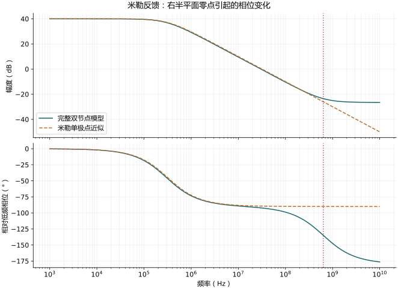

# 米勒电容：完整传输、反馈与右半平面零点

对应：0211、0212、0213。

<!-- physical-sfg:miller -->

原有公式推导与必要近似（展开查看）

## 从实际连接出发

源极接地；$R_S$ 串在信号源与栅极之间；$C_F$ 跨接栅极与漏极；输出只有 $r_o$，不另加 $C_L$。令 $G_S=1/R_S$。

两个 KCL：

$$
(G_S+sC_F)v_g-sC_Fv_o=G_Sv_i,
$$
$$
(g_m-sC_F)v_g+(g_o+sC_F)v_o=0.
$$

第二式中的 $-sC_Fv_g$ 是从输入向输出的**电容前馈**，不能在米勒输入等效后遗失。

## 解出完整模型

二式消元：

$$
a_v(s)=
\frac{r_o(sC_F-g_m)}
{1+sC_F[R_S+r_o+g_mR_Sr_o]}.
$$

定义 $A_0=g_mr_o$：

$$
a_v=-A_0\frac{1-s/\omega_z}{1+s/\omega_p},\quad
\omega_z=\frac{g_m}{C_F},\quad
\omega_p=\frac1{C_F[R_S+r_o+A_0R_S]}.
$$

零点在 $s=+g_m/C_F$，位于右半平面。它在幅度上增加 $+20$ dB/decade，却使相位**再延迟** $90^\circ$。
相对低频相位为

$$ \Delta\phi=-\tan^{-1}(\omega/\omega_p)-\tan^{-1}(\omega/\omega_z). $$

所以一个电容可以带来「一个极点加一个 右半平面 零点」的 $-180^\circ$ 相对延迟，并不代表有两个独立储能状态。

高频极限直接取最高端系数：

$$
a_v(\infty)=\frac{r_o}{R_S+r_o+g_mR_Sr_o}
=\frac1{1+g_mR_S+R_S/r_o}.
$$

这个值是正的；低频反相、高频前馈同相。教材的正值增益图没有呈现固定的低频负号。

## 米勒输入等效与教材近似的每一步

对已知 $a_{og}=v_o/v_g$，电容输入电流

$$ i_F=sC_F(v_g-v_o)=sC_F(1-a_{og})v_g. $$

低频 $a_{og}\simeq-A_0$，所以 $C_{FM}\simeq(1+A_0)C_F$。
这是输入端口等效，不是把跨接电容删掉后的完整二端口等效。

| 步骤 | 原式 → 简式 | 条件与理由 | 失效例 |
|---|---|---|---|
| M1 | $1+A_0\to A_0$ | $A_0\gg1$，忽略相对 $1/A_0$ 的 1 | 小增益 |
| M2 | $R_S+r_o+A_0R_S\to A_0R_S$ | $A_0\gg1$ **且** $g_mR_S\gg1$；分别压低 $R_S$、$r_o$ 项 | 理想低阻信号源 $R_S\to0$ |
| M3 | $1-s/\omega_z\to1$ | $\omega\ll\omega_z$ | 靠近零点时相位、增益均不对 |
| M4 | $1+g_mR_S+R_S/r_o\to1+g_mR_S$ | $R_S/r_o\ll1+g_mR_S$ | 很小 $r_o$ 且小跨导 |

经 M2、M3 才得到

$$ BW\simeq\frac1{2\pi R_SA_0C_F},\qquad
GBW\simeq\frac1{2\pi R_SC_F}. $$

若要进一步把此 GBW 当交越频率，还须大增益及交越远低于零点。未作 M2 时，$A_0 f_p$ 仍含器件参数。

## 数值核对

图上同时画精确模型、米勒单极点近似与相对相位；频带逼近零点后，单极点近似的相位偏差会显现。

例图参数：$g_m=2$ mS、$r_o=50$ kΩ、$R_S=10$ kΩ、$C_F=0.5$ pF。垂直虚线为 $f_z=g_m/(2\pi C_F)$；相位以低频反相值为基准。

