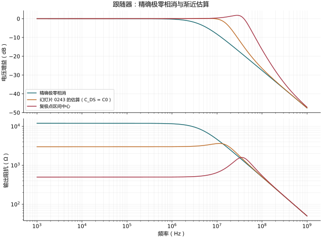

# 高频源极跟随器：二阶模型、峰化与真正的极零相消

对应：0241–0243。

<!-- physical-sfg:follower -->

原有公式推导与必要近似（展开查看）

## 电路与符号

漏极为 AC 地，衬底跟源极相连；$R_S$ 串在信号源和栅极间。定义

$$
C_g=C_{GS},\quad C_d=C_{GD},\quad C_0=C_L+C_{DS},\quad
g=g_o+G_B,\quad G_S=1/R_S.
$$

$C_g$ 跨栅极–源极；$C_d$ 因漏极接地，成为栅极对地电容。输出是源极，不能套用共源级米勒增益。

## 完整二节点方程

$$
[G_S+s(C_d+C_g)]v_g-sC_gv_o=G_Sv_i,
$$

$$
-(g_m+sC_g)v_g+[g_m+g+s(C_g+C_0)]v_o=0.
$$

令

$$
C_2=C_0C_d+C_0C_g+C_dC_g,
$$

$$
D(s)=g_m+g+s[C_g+C_0+R_Sg_mC_d+R_Sg(C_d+C_g)]
+s^2R_SC_2.
$$

则

$$
H(s)=\frac{v_o}{v_i}=\frac{g_m+sC_g}{D(s)},\qquad
Z_o(s)=\left.\frac{v_o}{i_{\rm test}}\right|_{v_i=0}
=\frac{1+sR_S(C_d+C_g)}{D(s)}.
$$

这两个传输共用同一分母，但分子不同，所以零点不同。

## 0241：化成教材形式

令 $g=0$，除以 $g_m$：

$$
H=\frac{1+sC_g/g_m}{1+sB+s^2R_SC_2/g_m},\quad
B=R_SC_d+\frac{C_g+C_0}{g_m}.
$$

教材另外保留 $R_SC_g/(g_mr_o)$，却省去常数 $1/(g_mr_o)$ 与
$R_SC_d/(g_mr_o)$。这是选择性的一阶修正；若需要有限 $r_o$ 的一致模型，应使用上面的完整 $D(s)$。

电压零点为 $s_{zv}=-g_m/C_g$（左半平面）。若令分母 $a_0+a_1s+a_2s^2$，则

$$
s_{p1,p2}=\frac{-a_1\pm\sqrt{a_1^2-4a_0a_2}}{2a_2}.
$$

复极点条件是 $a_1^2<4a_0a_2$。**复极点不必然造成可见的增益峰值**：零点及阻尼还会影响幅度，需要实际计算 $|H(j\omega)|$。

## 0242：复极点区域的精确边界

以下令 $g=0$，并在扫描 $g_m$ 时先把电容视为固定。设

$$
B_c=C_g+C_0,\quad
r=\frac{C_0C_g}{C_d(C_0+C_g)},\quad k=1+r,\quad
g_{mr}=\frac{B_c}{R_SC_d},\quad x=\frac{g_m}{g_{mr}}.
$$

将判别式除以 $B_c^2$：

$$
(x+1)^2-4kx<0.
$$

因此真正的边界为

$$
x_\pm=(\sqrt{k}\pm\sqrt{k-1})^2,\qquad
g_{m,\pm}=g_{mr}x_\pm,\qquad x_+x_-=1.
$$

教材的 $g_{mr}$ 正是两个边界的几何中心。但若把「宽度」定义成上下界比，

$$
W_g=\frac{g_{m,+}}{g_{m,-}}
=(\sqrt{k}+\sqrt{k-1})^4,
$$

就不是幻灯片列的 $\Delta g_{mr}=C_{DGt}/C_{DG}=r$。
原图的 $C_{DGt}=C_0C_g/(C_0+C_g)$ 可视为一个电容比参数，但不能不加定义地当作精确区域宽度，再套 $g_{mr}/\sqrt{\Delta g_{mr}}$ 求下界。

## 将零点代入分母：不能只看渐近线交叉

电压零点 $s=-g_m/C_g$ 代入：

$$
D(-g_m/C_g)=
\frac{C_0g_m}{C_g^2}
[R_Sg_m(C_d+C_g)-C_g].
$$

除去退化情况，精确相消条件是

$$
g_{m,\rm cancel}=\frac{C_g}{R_S(C_d+C_g)}
\simeq\frac1{R_S}\quad(C_d\ll C_g).
$$

这说明 0242 的 $1/R_S$ 是近似而非一般精确相消点。

输出阻抗零点是

$$
s_{zo}=-\frac1{R_S(C_d+C_g)}
\simeq-\frac1{R_SC_g}.
$$

把它代入同一分母得到**相同的精确相消条件**。在该点：

$$
Z_o(s)=\frac1{g_m+s[C_0+C_gC_d/(C_g+C_d)]},
$$

$$
H(s)=\frac{g_m}{g_m+s[C_0+C_gC_d/(C_g+C_d)]}.
$$

0243 的
$g_{mu}\simeq(C_g+C_{DS})/[R_S(C_g+C_d)]$
是把近似极点与零点位置对齐的估计；它只有在 $C_{DS}\ll C_g$ 等条件下接近上面的精确相消值。保留任意 $C_{DS}$ 时，代入完整分母不会得到零。

高 $g_m$ 时，一个极点趋向 $-1/(R_SC_d)$，因此可得到图中的
$f_{d,\rm high\,gm}\simeq1/(2\pi R_SC_d)$。输出阻抗先升后降的区段可呈感性。

## 近似与验算

| 原式 → 简式 | 条件 | 失效情况 |
|---|---|---|
| $g\to0$ | 不只 $g\ll g_m$，还须 $R_Sg(C_d+C_g)$ 对 $a_1$ 足够小 | 大 $R_S$ |
| $C_d+C_g\to C_g$ | $C_d\ll C_g$ | 补偿电容加大后 |
| $g_{m,\rm cancel}\to1/R_S$ | 同上 | 0242 的补偿恰好会改变此比值 |
| 极点渐近交点 → 精确相消 | 必须另外验 $D(s_z)=0$ | 复极点或电容比不小 |
| 固定电容扫 $g_m$ | 局部模型比较 | 真实偏置变动也改变电容 |

图中标出完整模型相消值与教材估计值。符号程序验证两个零点代入结果及相消后的一阶式。

例图固定 $R_S=10$ kΩ、$C_g=1$ pF、$C_d=0.2$ pF、$C_{DS}=3$ pF、$C_L=0$、$g=0$。完整相消值为 $83.33$ µS，0243 估式为 $333.33$ µS，复极点区域的几何中心为 $2$ mS。这是固定电容的模型比较，不是扫描真实器件偏置。

