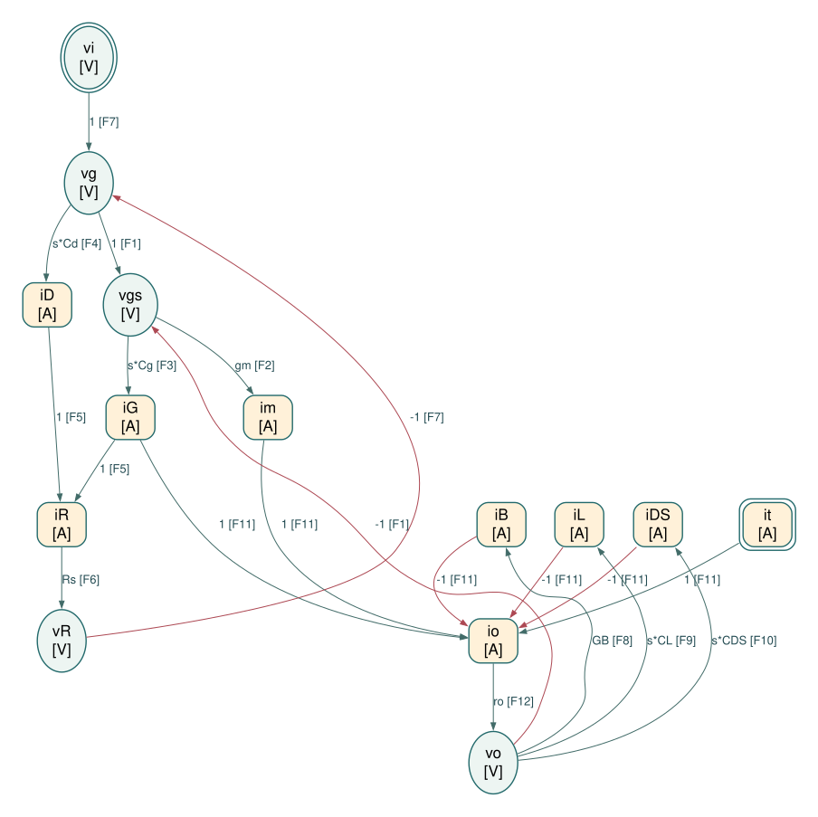

# 高频源极跟随器的 Physical / Causal SFG

## A. 选取的 SFG 节点及选择理由

漏极接交流地，衬底接源极；输入串联 Rs；保留 Cg = CGS、Cd = CGD、CL、CDS、有限 ro 和偏置支路输出电导 GB。iG 从栅极流向源极；im 注入源极；iB、iL、iDS、io 从源极流向地；测试电流 it 从外部注入输出，电压激励分析时令 it = 0。CL 与 CDS、go 与 GB 分开建模，不在边系数中预先合并。

所有量为工作点附近的小信号，电容采用零初始条件的拉普拉斯关系。按局部器件关系选择因果方向，不预先求整体传递函数，也不消元为最少节点图。

| 节点 | 类型 | 选择理由 |
|---|---|---|
| $v_i$（`vi`） | 电压 / V | 独立输入电压。 |
| $i_t$（`it`） | 电流 / A | 独立输出测试电流；可设为零，保留电流输入端口。 |
| $v_g$（`vg`） | 电压 / V | 实际栅极电压。 |
| $v_{gs}$（`vgs`） | 电压 / V | 跨导源与 Cg 共用的端电压。 |
| $i_m$（`im`） | 电流 / A | MOS 跨导源注入输出的电流。 |
| $i_G$（`iG`） | 电流 / A | Cg 从栅极到源极的电流。 |
| $i_D$（`iD`） | 电流 / A | Cd 从栅极到交流地的电流。 |
| $i_R$（`iR`） | 电流 / A | 输入电阻电流。 |
| $v_R$（`vR`） | 电压 / V | 输入电阻压降。 |
| $i_B$（`iB`） | 电流 / A | 偏置支路有限电导引起的输出电流。 |
| $i_L$（`iL`） | 电流 / A | 负载电容 CL 电流。 |
| $i_{DS}$（`iDS`） | 电流 / A | 器件 CDS 电流。 |
| $i_o$（`io`） | 电流 / A | 输出电阻 ro 电流。 |
| $v_o$（`vo`） | 电压 / V | 源极输出电压。 |

## B. 独立约束

每行是一个独立局部约束，整理为 $y=\sum_k a_kx_k$。右侧的每一项生成一条边；一行分成多条边不等于重复使用约束。

| 约束 | 物理来源 | 定向方程 |
|---|---|---|
| F1 | 栅源端电压定义（KVL） | $v_{gs} = v_g - v_o$ |
| F2 | MOS 跨导源的本构关系 | $i_m = g_m v_{gs}$ |
| F3 | Cg 的本构关系 | $i_G = s C_{GS} v_{gs}$ |
| F4 | Cd 的本构关系 | $i_D = s C_{GD} v_g$ |
| F5 | 栅极 KCL | $i_R = i_G + i_D$ |
| F6 | Rs 的本构关系 | $v_R = R_S i_R$ |
| F7 | 输入串联支路 KVL | $v_g = v_i - v_R$ |
| F8 | 偏置支路 GB 的本构关系 | $i_B = G_B v_o$ |
| F9 | CL 的本构关系 | $i_L = s C_L v_o$ |
| F10 | CDS 的本构关系 | $i_{DS} = s C_{DS} v_o$ |
| F11 | 源极输出节点 KCL | $i_o = i_m + i_G + i_t - i_B - i_L - i_{DS}$ |
| F12 | ro 的本构关系 | $v_o = r_o i_o$ |

电阻只使用 $v=Ri$ 这一方向，不再同时添加 $i=v/R$；同一电容的支路电流可以出现在两端节点的 KCL 中，但其本构关系只建一次。
本图保留有限输出电阻以采用“电流 → 电压”的电阻方向。若另取输出电导严格为零的理想模型，应重新分配约束方向，不能直接在图上使用无穷大的电阻。

## C. SFG edge list

```text
E01: vg --(1)--> vgs    [F1]
E02: vo --(-1)--> vgs    [F1]
E03: vgs --(gm)--> im    [F2]
E04: vgs --(s*Cg)--> iG    [F3]
E05: vg --(s*Cd)--> iD    [F4]
E06: iG --(1)--> iR    [F5]
E07: iD --(1)--> iR    [F5]
E08: iR --(Rs)--> vR    [F6]
E09: vi --(1)--> vg    [F7]
E10: vR --(-1)--> vg    [F7]
E11: vo --(GB)--> iB    [F8]
E12: vo --(s*CL)--> iL    [F9]
E13: vo --(s*CDS)--> iDS    [F10]
E14: im --(1)--> io    [F11]
E15: iG --(1)--> io    [F11]
E16: it --(1)--> io    [F11]
E17: iB --(-1)--> io    [F11]
E18: iL --(-1)--> io    [F11]
E19: iDS --(-1)--> io    [F11]
E20: io --(ro)--> vo    [F12]
```

## D. ASCII SFG

以下按目标节点分组绘制，重复出现的变量名指同一个节点；所有连接均列出。V 为电压节点，A 为电流节点。

```text
vg --(1)---+
           |
vo --(-1)--+--> vgs [V]  (F1)

vgs --(gm)--> im [A]  (F2)

vgs --(s*Cg)--> iG [A]  (F3)

vg --(s*Cd)--> iD [A]  (F4)

iG --(1)--+
          |
iD --(1)--+--> iR [A]  (F5)

iR --(Rs)--> vR [V]  (F6)

vi --(1)---+
           |
vR --(-1)--+--> vg [V]  (F7)

vo --(GB)--> iB [A]  (F8)

vo --(s*CL)--> iL [A]  (F9)

vo --(s*CDS)--> iDS [A]  (F10)

im --(1)----+
            |
iG --(1)----+
            |
it --(1)----+
            |
iB --(-1)---+
            |
iL --(-1)---+
            |
iDS --(-1)--+--> io [A]  (F11)

io --(ro)--> vo [V]  (F12)

```



图中椭圆为电压节点，圆角矩形为电流节点，双边框为独立输入。每条边显示系数和约束编号；按图中箭头读取方向。

[打开 SVG 矢量图](../assets/follower-sfg.svg) · [DOT 连接文本](../assets/follower-sfg.dot) · [机器可读边表](follower-edges.json)

## E. 主要正向通路与反馈环路

- 跨导正向通路：vi → vg → vgs → im → io → vo；并行的 Cg 前馈通路为 vgs → iG → io → vo。
- 主要局部负反馈：vo → vgs → im → io → vo，输出在 vgs 的端电压定义中取负号。
- 栅极电流反馈：vg → vgs → iG → iR → vR → vg；Cd 也通过 iD → iR 影响输入压降。输出的 GB、CL、CDS 各自形成 vo → 支路电流 → io → vo 的负号返回路径。
- it → io → vo 明确保留输出测试电流的物理端口，测试时将 vi 设为零即可；无需先求整体传递函数或另造反向器件约束。

## F. 逐边对应独立约束检查

| 边 | 起点 → 终点 | 系数 | 唯一来源约束 |
|---|---|---|---|
| E01 | $v_g\to v_{gs}$ | $1$ | F1：栅源端电压定义（KVL） |
| E02 | $v_o\to v_{gs}$ | $-1$ | F1：栅源端电压定义（KVL） |
| E03 | $v_{gs}\to i_m$ | $g_m$ | F2：MOS 跨导源的本构关系 |
| E04 | $v_{gs}\to i_G$ | $s C_{GS}$ | F3：Cg 的本构关系 |
| E05 | $v_g\to i_D$ | $s C_{GD}$ | F4：Cd 的本构关系 |
| E06 | $i_G\to i_R$ | $1$ | F5：栅极 KCL |
| E07 | $i_D\to i_R$ | $1$ | F5：栅极 KCL |
| E08 | $i_R\to v_R$ | $R_S$ | F6：Rs 的本构关系 |
| E09 | $v_i\to v_g$ | $1$ | F7：输入串联支路 KVL |
| E10 | $v_R\to v_g$ | $-1$ | F7：输入串联支路 KVL |
| E11 | $v_o\to i_B$ | $G_B$ | F8：偏置支路 GB 的本构关系 |
| E12 | $v_o\to i_L$ | $s C_L$ | F9：CL 的本构关系 |
| E13 | $v_o\to i_{DS}$ | $s C_{DS}$ | F10：CDS 的本构关系 |
| E14 | $i_m\to i_o$ | $1$ | F11：源极输出节点 KCL |
| E15 | $i_G\to i_o$ | $1$ | F11：源极输出节点 KCL |
| E16 | $i_t\to i_o$ | $1$ | F11：源极输出节点 KCL |
| E17 | $i_B\to i_o$ | $-1$ | F11：源极输出节点 KCL |
| E18 | $i_L\to i_o$ | $-1$ | F11：源极输出节点 KCL |
| E19 | $i_{DS}\to i_o$ | $-1$ | F11：源极输出节点 KCL |
| E20 | $i_o\to v_o$ | $r_o$ | F12：ro 的本构关系 |

共 14 个节点、12 个独立约束、20 条边。每个非输入节点只有一个定义方程；每条边属于唯一约束。边系数仅含单个器件的本构参数（包括理想受控源的常数增益）、电容导纳或带符号的 1。

本节输出止于 Physical / Causal SFG，不进一步化为 algebraic SFG。
