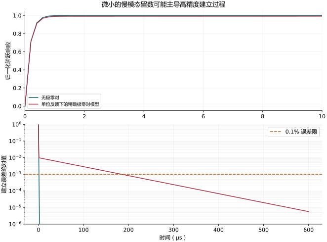

# 极零双重项与建立过程：必须保留留数和初始条件

对应：0265。

## 没有极零对的单位增益闭环

若主环路可近似开环积分器 $A(s)=\omega_u/s$，单位负反馈：

$$
H(s)=\frac{A}{1+A}=\frac{\omega_u}{s+\omega_u}.
$$

单位阶跃的输出与误差：

$$
y(t)=1-e^{-\omega_ut},\quad e(t)=e^{-\omega_ut}.
$$

$$
\tau_u=\frac1{\omega_u}=\frac1{2\pi GBW},\qquad
t_\epsilon=\tau_u\ln(1/\epsilon).
$$

$\epsilon=0.001$ 时 $t_{0.1\%}=6.90776\tau_u$，直接重现正文。

## 指定带极零对的开环模型

为了使结论可重现，而不是只从波特图猜时间式，明定

$$
A(s)=\frac{\omega_u}{s}\frac{s+z}{s+p},\quad p,z>0.
$$

高频仍有相同的 $\omega_u/s$ 渐近线。闭环：

$$
H(s)=\frac{\omega_u(s+z)}
{s^2+(p+\omega_u)s+\omega_uz}.
$$

若二次分母有两个实根，写成 $(s+\lambda_f)(s+\lambda_s)$，其中

$$
\lambda_{f,s}=\frac{p+\omega_u\pm
\sqrt{(p+\omega_u)^2-4\omega_uz}}2.
$$

阶跃误差的 Laplace 式：

$$
E(s)=\frac{1-H(s)}s
=\frac{s+p}{(s+\lambda_f)(s+\lambda_s)}.
$$

部分分式系数：

$$
A_s=\frac{p-\lambda_s}{\lambda_f-\lambda_s},\qquad
A_f=\frac{\lambda_f-p}{\lambda_f-\lambda_s},\qquad A_f+A_s=1.
$$

所以模型内精确的阶跃响应是

$$ y(t)=1-A_fe^{-\lambda_ft}-A_se^{-\lambda_st}. $$

这在 $t=0$ 精确为 0，且 $t\to\infty$ 为 1。

## 如何得到教材的小留数慢尾巴

若 $p,z\ll\omega_u$，并且 $p,z$ 接近：

$$
\lambda_f\simeq\omega_u+p-z,\quad \lambda_s\simeq z,\quad
A_s\simeq\frac{p-z}{\omega_u}.
$$

定义**有号** $\Delta f=(p-z)/(2\pi)$，可得

$$
y(t)\simeq
1-(1-\delta)e^{-t/\tau_u}-\delta e^{-t/\tau_{pz}},
\quad
\delta=\frac{\Delta f}{GBW},\quad \tau_{pz}\simeq1/z.
$$

教材把快项系数再近似成 1，成为
$1-e^{-t/\tau_u}-\delta e^{-t/\tau_{pz}}$。
这一式在 $t=0$ 会给 $-\delta$，所以只能作小留数／晚时间近似，不能当完整阶跃精确解。

**尾巴符号不是固定的。** 在此明定模型中，$p>z$ 时 $A_s>0$，输出从下方慢慢靠近终值；$p<z$ 时可从上方靠近。原图若只标双重项「宽度」而不定义 $p,z$ 的先后，不足以唯一决定时间曲线。

## 建立过程为何变慢

在快项衰减后，若 $|A_s|>\epsilon$：

$$
t_\epsilon\simeq\frac1{\lambda_s}
\ln\frac{|A_s|}{\epsilon}.
$$

更保守的充分条件是分别要求

$$
|A_f|e^{-\lambda_ft}\le\epsilon/2,\quad
|A_s|e^{-\lambda_st}\le\epsilon/2.
$$

如果 $|A_s|\le\epsilon$，则慢尾巴从一开始就小于误差容限，不必机械地宣称所有极零对都会毁掉建立过程。

## 必要近似与数值图

| 步骤 | 条件 | 失效情况 |
|---|---|---|
| 开环 $\omega_u/s$ | 穿越附近由主极点控制 | 多极点、前馈 |
| 两个实指数 | 判别式非负且极点稳定 | 复数根须改用阻尼振荡 |
| $\lambda_s\simeq z$ | $p,z\ll\omega_u$ | 极零对靠近交越 |
| $A_s\simeq(p-z)/\omega_u$ | 小间距、低频极零对 | 大间距 |
| 只保留慢尾巴 | 快项已小且 $|A_s|>\epsilon$ | 短时间与宽容限 |

不用 SFG：本节要解释的是极点留数与时间响应，部分分式比增添图节点直接。程序检查初值、终值、部分分式以及 0.1% 建立过程。

例图参数：$\omega_u/(2\pi)=1$ MHz、$p/(2\pi)=12$ kHz、$z/(2\pi)=2$ kHz。精确慢速留数约 $0.00994$；此例达到 $0.1\%$ 误差约需 $184.7$ µs，没有极零对的单极点模型约需 $1.10$ µs。数值依上述模型计算。

## 来源对照

| 幻灯片 | PDF 页 | 书本页 | 讲解所在 PDF 页 |
|---|---:|---:|---|
| [0265](../../extraction/index.html#SANSEN-0265) | 83 | 84 | 83 |
