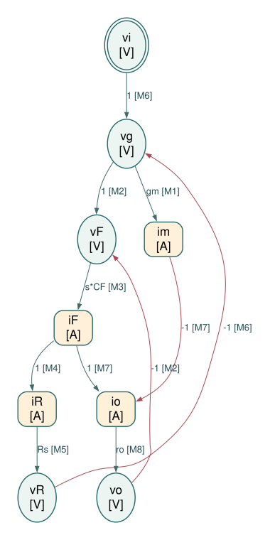
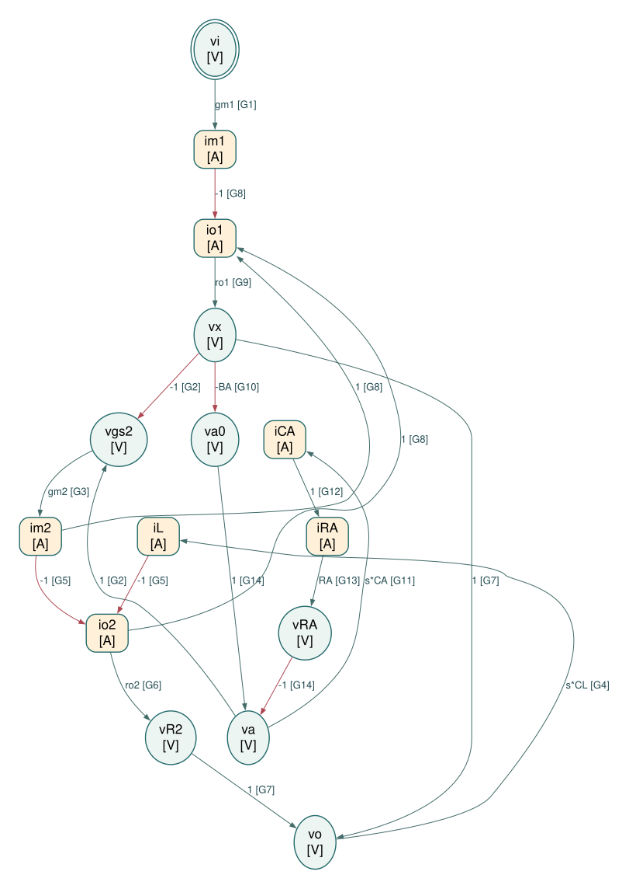

# 第二章：模型、符号与阅读方式

这一章的推导对照原书幻灯片 **021–0272**。重复的模型合并成 20 组，索引仍逐张保留。目标是从图上的器件与连接创建方程，再判断教材结论在哪些条件下成立。

## 三种不同的结论

- **模型内精确**：由指定的小信号等效电路解出的式子，仍受该等效模型限制。
- **有条件近似**：明列被忽略的项、必要不等式及失效情况。
- **教材差异／待厘清**：原式的系数、符号或定义无法与同页模型一致时，保留原式并说明；不把不一致的公式标成已证明。

各组末尾的符号验算会对照 KCL 或矩阵解。数值曲线是这些方程的计算结果，**不是 SPICE 或器件实验**。

## 全章共同约定

| 符号 | 意义 |
|---|---|
| $s=j\omega,\ \omega=2\pi f$ | $f$ 用 Hz，$\omega$ 用 rad/s；不可漏掉 $2\pi$ |
| $a_v=v_o/v_i$ | 有号电压传输；共源级的低频值为负 |
| $A_0=|a_v(0)|$ | 正值低频增益大小；教材部分 $A_v$ 实际采此定义 |
| $g_o=1/r_o$ | 与原书 $g_{DS},r_{DS}$ 同义 |
| $V_{OV}=V_{GS}-V_T$ | NMOS 过驱动；PMOS 使用 $V_{SG}-|V_{TP}|$ |
| $K',KP$ | 本书 $I_D=K'(W/L)V_{OV}^2$，而 $K'=KP/(2n)$；不能再多乘一次 $1/2$ |
| $V_A=V_E L$ | 本书 MOS 的有效厄利电压；避免与后文直接写成 $V_E$ 的记法混淆 |
| $G_m=g_{mn}+g_{mp}$ | CMOS 反相器的总跨导；匹配时 $G_m=2g_m$ |
| $R_S$ | 请依各图分清「信号源串联电阻」与「源极负反馈电阻」；两者不是同一拓扑 |

第一章幻灯片 0121–0122 已定义 $K'=KP/(2n)$ 与 $g_m=2I_D/V_{OV}$。第二章 029 的数值题必须使用这个定义。

## 每组推导共同继承的假设

| ID | 原始问题 → 采用模型 | 成立条件与理由 | 失效情况 |
|---|---|---|---|
| A0 | 非线性 $I_D(V)$ → 工作点的一阶微分 $i_d=g_mv_{gs}+g_{mb}v_{bs}+g_ov_{ds}$ | 扰动足够小；二阶以上项比一阶项小 | 大信号、截止、离开饱和、失真分析 |
| A1 | DC 电压源 → AC 地；理想 DC 电流源 → AC 开路 | 理想偏置模型 | 真实偏置源有限阻抗必须另加 $r_B$ 或其频率模型 |
| A2 | 任意器件模型 → 本书长沟道强反转平方律 | 强反转、饱和、固定 $K'$；推导 $g_m$ 时采局部近似 | 弱反转、速度饱和、短沟道或 $K'$ 随偏置显著变化 |
| A3 | 一般四端 MOS → $g_{mb}=0$ | 只有衬底接源极，或明确忽略体效应才可用 | 衬底固定、源极摆动；应保留 $g_{mb}$ |
| A4 | 完整寄生网络 → 该节明列的电容 | 被省略电容在关注频带的导纳足够小 | 隐藏极点、零点或前馈路径进入频带 |

「精确」均指 A0 等假设指定的模型内精确，不等同真实工艺的完全精确。

## Physical / Causal SFG 核心原则

先列独立的局部物理约束，再选择电压、电流中间变量，最后按约束的因果方向建边。**不先求整体传递函数，不默认全电压节点，也不消元为最少节点的 algebraic SFG。**

- MOS 跨导用电压 → 电流，电容用端电压差 → 电流，电阻／阻抗优先用电流 → 电压，电导用电压 → 电流。
- 每个独立约束只用一次，禁止同时使用一个方程及其反解制造反馈。一个约束有多项时，各项分别建边，但共用同一约束编号。
- 边系数优先保留独立器件的 $g_m$、$g_o$、$R$、$Z$、$sC$ 或带符号的 1，避免预先揉合多个元件。
- 输出固定为 A 节点与理由、B 独立约束、C 边表、D ASCII SFG、E 正向路径与反馈环路、F 逐边对应约束。
- 原有整体公式与近似分析作为单独折叠资料保留，不用于倒推 SFG。

只有在**反馈、前馈或局部环路**值得解释时才画信号流图。

本章只选三组：

1. 米勒电容：保留输入反馈及输出前馈，解释右半平面零点。
2. 高频源极跟随器：保留 $C_{GS}$ 的双向耦合与正向旁路，解释极点和峰化。
3. 增益增强：将辅助级明确展开为受控源、电阻和电容等效模型，保留局部负反馈与电容支路。

其余用微分、KCL、阻抗或二节点矩阵即可。SFG 采用 **独立物理约束 JSON → A–F Markdown／边表／DOT → Graphviz → SVG**；保留全部源文件和逐边约束编号。

## 理论推导与后续仿真的界线

本文档先完成理论推导与代数验算；各节原有数值图仍属方程计算。后续已另行运行 Spectre：包括 20 组的代表线性模型、MOS1 教学晶体管的 gm/Id 查表选尺寸、极零与瞬态。页面添加的「Spectre 仿真结果」入口提供实际波形与原始数据。尚未采用晶圆厂 PDK，因此尺寸不能作为工艺设计或制造依据。


## 来源对照

| 幻灯片 | PDF 页 | 书本页 | 讲解所在 PDF 页 |
|---|---:|---:|---|
| [021](../../extraction/index.html#SANSEN-021) | 50 | 51 | 50 |
| [022](../../extraction/index.html#SANSEN-022) | 50 | 51 | 50 |
| [023](../../extraction/index.html#SANSEN-023) | 51 | 52 | 50, 51 |
| [0235](../../extraction/index.html#SANSEN-0235) | 67 | 68 | 67 |
| [0248](../../extraction/index.html#SANSEN-0248) | 74 | 75 | 74 |
| [0272](../../extraction/index.html#SANSEN-0272) | 86 | 87 | 86 |


---

# 单管增益与 MOS／BJT 比较

对应：024、025、026。

## 电路与完整方程

NMOS 源极接地，栅极由理想小信号源驱动，漏极接理想偏置电流源。先保留有限负载 $R_L$；其导纳 $G_L=1/R_L$。

漏极 KCL：

$$
(g_o+G_L)v_o+g_m v_i=0.
$$

因此有号增益及增益大小为

$$
a_v=-\frac{g_m}{g_o+G_L}=-g_m(r_o\parallel R_L),\qquad
A_0=g_m(r_o\parallel R_L).
$$

理想电流源负载 $G_L=0$ 时，模型内精确得到 $A_0=g_mr_o$。

## 从器件电流重新得到教材式

本书平方律与厄利电压模型：

$$
I_D=K'\frac WL V_{OV}^{2},\quad
g_m=\left.\frac{\partial I_D}{\partial V_{GS}}\right|_Q
=2K'\frac WL V_{OV}=\frac{2I_D}{V_{OV}},
\quad r_o\simeq\frac{V_A}{I_D}.
$$

代入而不是直接引用结论：

$$
A_0\simeq
\underbrace{\frac{2I_D}{V_{OV}}}_{g_m}
\;\underbrace{\frac{V_A}{I_D}}_{r_o}
=\frac{2V_A}{V_{OV}}=\frac{2V_E L}{V_{OV}}.
$$

等价的乘法式为

$$ A_0\simeq (2I_D/V_{OV})(V_A/I_D). $$

电流消掉不表示任何改变电流的操作都不影响增益：固定 $W/L$ 时，改变 $I_D$ 也会改变 $V_{OV}$。只有在比较时固定 $V_{OV}$、以尺寸调整电流，才有此形式的电流独立性。

BJT 由 $I_C=I_S e^{V_{BE}/U_T}$ 得

$$
g_m=I_C/U_T,\qquad r_o\simeq V_A/I_C,\qquad
A_0\simeq V_A/U_T,\quad U_T=kT/q.
$$

教材数值：MOS $V_A=10$ V、$V_{OV}=0.2$ V 得 100；BJT $V_A=26$ V、$U_T=26$ mV 得 1000。忽略级间负载时，$100^3=1000^2=10^6$，解释 026 的三级与两级比较。

## 必要近似

| 步骤 | 原式 → 简式 | 条件／理由 | 何时失效 |
|---|---|---|---|
| 负载忽略 | $r_o\parallel R_L\to r_o$ | $R_L\gg r_o$；相对于简式的差异为 $r_o/(R_L+r_o)$ | 电阻负载或有限电流源阻抗 |
| 输出电阻 | $g_o=\partial I_D/\partial V_{DS}\to I_D/V_A$ | 线性的沟道长度调制近似 | $V_A$ 随偏置显著改变 |
| 尺寸结论 | $2V_A/V_{OV}\to2V_E L/V_{OV}$ | $V_A\propto L$，且 $V_E$ 在比较范围近似固定 | 短沟道效应 |
| 级联乘积 | $a_1a_2\cdots$ | 后级不负载前级、各级线性 | 有限输入阻抗、寄生电容 |

025 的「小 $V_{OV}$、大 $L$」是上述模型的方向性结论，不能延伸成无限制降低 $V_{OV}$；A2 会先失效，且带宽、面积与噪声限制尚未加入。

## 方法与验算

不用 SFG：一条 KCL 已直接显示跨导与输出电阻的乘积。符号检查验证 KCL 解与含 $R_L$ 的增益式相同。


## 来源对照

| 幻灯片 | PDF 页 | 书本页 | 讲解所在 PDF 页 |
|---|---:|---:|---|
| [024](../../extraction/index.html#SANSEN-024) | 51 | 52 | 51 |
| [025](../../extraction/index.html#SANSEN-025) | 52 | 53 | 51, 52 |
| [026](../../extraction/index.html#SANSEN-026) | 52 | 53 | 52 |


---

# 单极点、GBW 与尺寸练习

对应：027–0210；027–028 共用同一电路。

## 输出电容主导：027–028

令 $R=r_o\parallel R_L$，只保留输出 $C_L$。由 KCL

$$
\left(\frac1R+sC_L\right)v_o=-g_mv_i
\quad\Rightarrow\quad
a_v(s)=\frac{-g_mR}{1+sRC_L}.
$$

因此

$$ A_0=g_mR,\quad \omega_p=\frac1{RC_L},\quad BW=\frac1{2\pi RC_L}. $$

幅度与相对低频的相位：

$$
|a_v(j\omega)|=\frac{A_0}{\sqrt{1+(\omega/\omega_p)^2}},
\qquad \Delta\phi=-\tan^{-1}(\omega/\omega_p).
$$

在 $\omega_p$ 幅度下降 $20\log_{10}(1/\sqrt2)=-3.0103$ dB，相对相位为 $-45^\circ$。高频幅度正比 $1/\omega$，所以每十倍频下降 20 dB。

由定义相乘可精确消去 $R$：

$$ GBW\equiv A_0BW=\frac{g_m}{2\pi C_L}. $$

但单位增益交越频率另由 $|a_v|=1$ 解得

$$ f_u=BW\sqrt{A_0^2-1}=GBW\sqrt{1-A_0^{-2}}\qquad(A_0>1). $$

所以图上把 $f_u$ 标成 GBW，还用了 $A_0\gg1$。图中的相位是**相对相位**；共源级的固定反相不可遗忘。

## 029：依教材定义逐步重算

规格 $GBW=100$ MHz、$C_L=3$ pF，故

$$
g_m=2\pi(100\times10^6)(3\times10^{-12})
=1.88496\ {\rm mS}.
$$

选择而非推导出 $V_{OV}=0.2$ V，则

$$
\frac{g_m}{I_D}=\frac2{V_{OV}}=10\ {\rm V}^{-1},\quad
I_D=\frac{g_mV_{OV}}2=188.50\ \mu{\rm A}.
$$

本书 $K'_n=50\ \mu{\rm A/V^2}$，没有额外 $1/2$：

$$
\frac WL=\frac{I_D}{K'_n V_{OV}^2}=94.248.
$$

再**选择** $L=4L_{\min}=2\ \mu$m，可得 $W=188.50\ \mu$m。
若按教材先把 $g_m$ 取整为 2 mS，就得到 $I_D=0.2$ mA、$W/L=100$、$W=200\ \mu$m。这些是取整差异，不是模型不一致。

$$
FOM=\frac{GBW\,C_L}{I_D}
=1591.55\ {\rm MHz\cdot pF/mA}
\simeq1500\quad\text{（采 0.2 mA 的取整电流）}.
$$

## 0210：只有输入电容

信号源经 $R_S$ 驱动栅极，$C_{GS}$ 接地，输出没有电容：

$$
\frac{v_g-v_i}{R_S}+sC_{GS}v_g=0,\qquad v_o=-g_mr_o v_g.
$$

$$
a_v=\frac{-g_mr_o}{1+sR_SC_{GS}},\quad
BW=\frac1{2\pi R_SC_{GS}},\quad
GBW=\frac{g_m}{2\pi C_{GS}}\frac{r_o}{R_S}.
$$

在此电容模型中定义 $f_T=g_m/(2\pi C_{GS})$，便是教材 $f_Tr_o/R_S$。
若再采 $C_{GS}\simeq\alpha C_{ox}WL$（长沟道常用 $\alpha\simeq2/3$），则

$$
GBW\simeq\frac{V_E}{\pi\alpha R_S C_{ox}W V_{OV}}.
$$

所以图上的 $1/(WC_{ox}V_{OV})$ 是省略固定系数的**比例关系**，不是量纲完整的等式。

## 必要近似与失效条件

| 步骤 | 原式 → 简式 | 必要条件 | 失效时 |
|---|---|---|---|
| 单极点 | 完整寄生网络 → 一个 $C_L$ 或 $C_{GS}$ | 其他极点高于关注频带 | 不能再从 $A_0BW$ 预测实际交越 |
| 交越 | $\sqrt{A_0^2-1}\to A_0$ | $A_0\gg1$ | $A_0$ 接近 1 时误差很大 |
| 电容尺度 | $C_{GS}\to\alpha C_{ox}WL$ | 忽略 交叠电容、边缘电容，强反转 | 短沟道、小尺寸 |
| 设计电压 | 指定 $V_{OV}=0.2$ V | 教材的设计选择，须另查工艺 | 不能把这个选择当规格唯一解 |

## 方法与验算

不用 SFG：两个互不反馈的一阶关系直接相乘最清楚。数值检查包括未取整及取整的 029 解，以及 GBW 与实际 $f_u$ 的差异。


## 来源对照

| 幻灯片 | PDF 页 | 书本页 | 讲解所在 PDF 页 |
|---|---:|---:|---|
| [027](../../extraction/index.html#SANSEN-027) | 53 | 54 | 53 |
| [028](../../extraction/index.html#SANSEN-028) | 53 | 54 | 53 |
| [029](../../extraction/index.html#SANSEN-029) | 54 | 55 | 54 |
| [0210](../../extraction/index.html#SANSEN-0210) | 54 | 55 | 54 |


---

# 米勒电容：完整传输、反馈与右半平面零点

对应：0211、0212、0213。


[独立 Physical / Causal SFG Markdown](physical_sfg/miller.md)


## A. 选取的 SFG 节点及选择理由

源极和衬底接交流地；输入串联 Rs，CF 跨接栅极与漏极，输出保留有限 ro，不添加 CL。iF 从栅极流向漏极，im 和 io 从漏极流向地，iR 从输入源流向栅极。ro = 1/go 只是同一输出电阻的参数换写，不另建 go 支路。

所有量为工作点附近的小信号，电容采用零初始条件的拉普拉斯关系。按局部器件关系选择因果方向，不预先求整体传递函数，也不消元为最少节点图。

| 节点 | 类型 | 选择理由 |
|---|---|---|
| $v_i$（`vi`） | 电压 / V | 独立输入电压。 |
| $v_g$（`vg`） | 电压 / V | 实际栅极电压，是跨导的控制量。 |
| $v_F$（`vF`） | 电压 / V | CF 两端电压，保留器件的差分控制量。 |
| $i_m$（`im`） | 电流 / A | MOS 跨导电流，保留电压到电流的器件方向。 |
| $i_F$（`iF`） | 电流 / A | CF 支路电流，同时参与两个节点的 KCL。 |
| $i_R$（`iR`） | 电流 / A | 输入电阻电流，由栅极 KCL 确定。 |
| $v_R$（`vR`） | 电压 / V | 输入电阻压降，由电流经 Rs 产生。 |
| $i_o$（`io`） | 电流 / A | 输出电阻 ro 的电流，由漏极 KCL 确定。 |
| $v_o$（`vo`） | 电压 / V | 输出电压，由 ro 将支路电流转换为电压。 |

## B. 独立约束

每行是一个独立局部约束，整理为 $y=\sum_k a_kx_k$。右侧的每一项生成一条边；一行分成多条边不等于重复使用约束。

| 约束 | 物理来源 | 定向方程 |
|---|---|---|
| M1 | MOS 跨导源的本构关系 | $i_m = g_m v_g$ |
| M2 | CF 端电压定义（KVL） | $v_F = v_g - v_o$ |
| M3 | CF 的本构关系 | $i_F = s C_F v_F$ |
| M4 | 栅极 KCL | $i_R = i_F$ |
| M5 | Rs 的本构关系 | $v_R = R_S i_R$ |
| M6 | 输入串联支路 KVL | $v_g = v_i - v_R$ |
| M7 | 漏极 KCL | $i_o = i_F - i_m$ |
| M8 | ro 的本构关系 | $v_o = r_o i_o$ |

电阻只使用 $v=Ri$ 这一方向，不再同时添加 $i=v/R$；同一电容的支路电流可以出现在两端节点的 KCL 中，但其本构关系只建一次。
本图保留有限输出电阻以采用“电流 → 电压”的电阻方向。若另取输出电导严格为零的理想模型，应重新分配约束方向，不能直接在图上使用无穷大的电阻。

## C. SFG edge list

```text
E01: vg --(gm)--> im    [M1]
E02: vg --(1)--> vF    [M2]
E03: vo --(-1)--> vF    [M2]
E04: vF --(s*CF)--> iF    [M3]
E05: iF --(1)--> iR    [M4]
E06: iR --(Rs)--> vR    [M5]
E07: vi --(1)--> vg    [M6]
E08: vR --(-1)--> vg    [M6]
E09: iF --(1)--> io    [M7]
E10: im --(-1)--> io    [M7]
E11: io --(ro)--> vo    [M8]
```

## D. ASCII SFG

以下按目标节点分组绘制，重复出现的变量名指同一个节点；所有连接均列出。V 为电压节点，A 为电流节点。

```text
vg --(gm)--> im [A]  (M1)

vg --(1)---+
           |
vo --(-1)--+--> vF [V]  (M2)

vF --(s*CF)--> iF [A]  (M3)

iF --(1)--> iR [A]  (M4)

iR --(Rs)--> vR [V]  (M5)

vi --(1)---+
           |
vR --(-1)--+--> vg [V]  (M6)

iF --(1)---+
           |
im --(-1)--+--> io [A]  (M7)

io --(ro)--> vo [V]  (M8)

```



图中椭圆为电压节点，圆角矩形为电流节点，双边框为独立输入。每条边显示系数和约束编号；按图中箭头读取方向。

[打开 SVG 矢量图](assets/miller-sfg.svg) · [DOT 连接文本](assets/miller-sfg.dot) · [机器可读边表](physical_sfg/miller-edges.json)

## E. 主要正向通路与反馈环路

- 主要跨导通路：vi → vg → im → io → vo。漏极 KCL 对 im 取负号，因此这条通路反相。
- 电容前馈：vi → vg → vF → iF → io → vo。同一个 CF 电流在栅极流出、在漏极流入，两处 KCL 的符号必须一致。
- 输入电流引起的电阻压降环路：vg → vF → iF → iR → vR → vg，最后一条边为 −1。输出返回 CF 的路径 vo → vF → iF 再影响 io 及输入压降；这是局部物理约束的闭合，不是把电容方程及其反解重复使用。

## F. 逐边对应独立约束检查

| 边 | 起点 → 终点 | 系数 | 唯一来源约束 |
|---|---|---|---|
| E01 | $v_g\to i_m$ | $g_m$ | M1：MOS 跨导源的本构关系 |
| E02 | $v_g\to v_F$ | $1$ | M2：CF 端电压定义（KVL） |
| E03 | $v_o\to v_F$ | $-1$ | M2：CF 端电压定义（KVL） |
| E04 | $v_F\to i_F$ | $s C_F$ | M3：CF 的本构关系 |
| E05 | $i_F\to i_R$ | $1$ | M4：栅极 KCL |
| E06 | $i_R\to v_R$ | $R_S$ | M5：Rs 的本构关系 |
| E07 | $v_i\to v_g$ | $1$ | M6：输入串联支路 KVL |
| E08 | $v_R\to v_g$ | $-1$ | M6：输入串联支路 KVL |
| E09 | $i_F\to i_o$ | $1$ | M7：漏极 KCL |
| E10 | $i_m\to i_o$ | $-1$ | M7：漏极 KCL |
| E11 | $i_o\to v_o$ | $r_o$ | M8：ro 的本构关系 |

共 9 个节点、8 个独立约束、11 条边。每个非输入节点只有一个定义方程；每条边属于唯一约束。边系数仅含单个器件的本构参数（包括理想受控源的常数增益）、电容导纳或带符号的 1。

本节输出止于 Physical / Causal SFG，不进一步化为 algebraic SFG。


<details>
<summary>原有公式推导与必要近似（展开查看）</summary>

## 从实际连接出发

源极接地；$R_S$ 串在信号源与栅极之间；$C_F$ 跨接栅极与漏极；输出只有 $r_o$，不另加 $C_L$。令 $G_S=1/R_S$。

两个 KCL：

$$
(G_S+sC_F)v_g-sC_Fv_o=G_Sv_i,
$$
$$
(g_m-sC_F)v_g+(g_o+sC_F)v_o=0.
$$

第二式中的 $-sC_Fv_g$ 是从输入向输出的**电容前馈**，不能在米勒输入等效后遗失。

## 解出完整模型

二式消元：

$$
a_v(s)=
\frac{r_o(sC_F-g_m)}
{1+sC_F[R_S+r_o+g_mR_Sr_o]}.
$$

定义 $A_0=g_mr_o$：

$$
a_v=-A_0\frac{1-s/\omega_z}{1+s/\omega_p},\quad
\omega_z=\frac{g_m}{C_F},\quad
\omega_p=\frac1{C_F[R_S+r_o+A_0R_S]}.
$$

零点在 $s=+g_m/C_F$，位于右半平面。它在幅度上增加 $+20$ dB/decade，却使相位**再延迟** $90^\circ$。
相对低频相位为

$$ \Delta\phi=-\tan^{-1}(\omega/\omega_p)-\tan^{-1}(\omega/\omega_z). $$

所以一个电容可以带来「一个极点加一个 右半平面 零点」的 $-180^\circ$ 相对延迟，并不代表有两个独立储能状态。

高频极限直接取最高端系数：

$$
a_v(\infty)=\frac{r_o}{R_S+r_o+g_mR_Sr_o}
=\frac1{1+g_mR_S+R_S/r_o}.
$$

这个值是正的；低频反相、高频前馈同相。教材的正值增益图没有呈现固定的低频负号。

## 米勒输入等效与教材近似的每一步

对已知 $a_{og}=v_o/v_g$，电容输入电流

$$ i_F=sC_F(v_g-v_o)=sC_F(1-a_{og})v_g. $$

低频 $a_{og}\simeq-A_0$，所以 $C_{FM}\simeq(1+A_0)C_F$。
这是输入端口等效，不是把跨接电容删掉后的完整二端口等效。

| 步骤 | 原式 → 简式 | 条件与理由 | 失效例 |
|---|---|---|---|
| M1 | $1+A_0\to A_0$ | $A_0\gg1$，忽略相对 $1/A_0$ 的 1 | 小增益 |
| M2 | $R_S+r_o+A_0R_S\to A_0R_S$ | $A_0\gg1$ **且** $g_mR_S\gg1$；分别压低 $R_S$、$r_o$ 项 | 理想低阻信号源 $R_S\to0$ |
| M3 | $1-s/\omega_z\to1$ | $\omega\ll\omega_z$ | 靠近零点时相位、增益均不对 |
| M4 | $1+g_mR_S+R_S/r_o\to1+g_mR_S$ | $R_S/r_o\ll1+g_mR_S$ | 很小 $r_o$ 且小跨导 |

经 M2、M3 才得到

$$ BW\simeq\frac1{2\pi R_SA_0C_F},\qquad
GBW\simeq\frac1{2\pi R_SC_F}. $$

若要进一步把此 GBW 当交越频率，还须大增益及交越远低于零点。未作 M2 时，$A_0 f_p$ 仍含器件参数。


## 数值核对


图上同时画精确模型、米勒单极点近似与相对相位；频带逼近零点后，单极点近似的相位偏差会显现。

例图参数：$g_m=2$ mS、$r_o=50$ kΩ、$R_S=10$ kΩ、$C_F=0.5$ pF。垂直虚线为 $f_z=g_m/(2\pi C_F)$；相位以低频反相值为基准。

</details>


## 来源对照

| 幻灯片 | PDF 页 | 书本页 | 讲解所在 PDF 页 |
|---|---:|---:|---|
| [0211](../../extraction/index.html#SANSEN-0211) | 55 | 56 | 55 |
| [0212](../../extraction/index.html#SANSEN-0212) | 55 | 56 | 55 |
| [0213](../../extraction/index.html#SANSEN-0213) | 56 | 57 | 56 |


---

# 电阻、电感与 MOS 源极负反馈

对应：0214–0216。这里 $R_S$ 或 $L_S$ 位于源极与地之间，不是栅极前的信号源电阻。

## 0214：先保留 $r_o$ 的低频模型

设源极电压 $v_x$、负反馈阻抗 $Z_S$，且衬底跟源极相连：

$$
i_d=g_m(v_i-v_x)+g_o(v_o-v_x),\qquad v_x=Z_Si_d.
$$

代回并收集：

$$
i_d[1+(g_m+g_o)Z_S]=g_mv_i+g_ov_o.
$$

因此短路输出跨导与输出电阻为

$$
G_{mS}=\left.\frac{i_d}{v_i}\right|_{v_o=0}
=\frac{g_m}{1+(g_m+g_o)Z_S},\qquad
Z_{\rm out}=\left.\frac{v_o}{i_d}\right|_{v_i=0}
=r_o+(1+g_mr_o)Z_S.
$$

取 $Z_S=R_S$ 并依序近似：

$$
G_{mR}\simeq\frac{g_m}{1+g_mR_S}\simeq\frac1{R_S},
\qquad R_{\rm out}\simeq r_o(1+g_mR_S)\simeq g_mr_oR_S.
$$

低频、输出短路时 $v_x/v_i=g_mR_S/[1+(g_m+g_o)R_S]$。由 $i_g=sC_{GS}(v_i-v_x)$，得到一阶输入电容系数

$$
C_{\rm in}=C_{GS}\frac{1+g_oR_S}{1+(g_m+g_o)R_S}
\simeq\frac{C_{GS}}{1+g_mR_S}.
$$

这不是任意输出负载下通用的输入电容。$v_x/v_i$ 会随漏极终端改变。

## 0215：源极电感负反馈

忽略 $r_o$、$C_{GD}$，但保留 $C_{GS}$。令 $v_{gs}=v_i-v_x$：

$$
i_g=sC_{GS}v_{gs},\quad
i_s=(g_m+sC_{GS})v_{gs},\quad v_x=sL_Si_s.
$$

所以

$$
Z_{\rm in}=\frac{v_{gs}+sL_S(g_m+sC_{GS})v_{gs}}{sC_{GS}v_{gs}}
=\frac1{sC_{GS}}+sL_S+\frac{g_mL_S}{C_{GS}}.
$$

定义 $\omega_T=g_m/C_{GS}$，电阻项为 $L_S\omega_T$。只有在
$\omega_0=1/\sqrt{L_SC_{GS}}$ 附近，容性与感性虚部相消，输入才近似纯电阻。

若在求跨导时省略 $C_{GS}$，上一节给

$$
G_{mL}\simeq\frac{g_m}{1+sg_mL_S},\qquad
Z_{\rm out}\simeq r_o(1+sg_mL_S).
$$

若保留 $C_{GS}$，短路跨导则是

$$ G_{mL}=\frac{g_m}{1+sg_mL_S+s^2L_SC_{GS}}. $$

因此教材的 $G_{mL}$ 与 $Z_{\rm in}$ 使用不同层级的电容保留方式，必须分清。

## 0216：用 线性区 MOS 当负反馈电阻

两只 NMOS 的栅极同接 $v_i$；M1 源极接 M2 漏极（节点 $x$），M2 源极接地。DC 几何关系：

$$ V_{DS2}=V_{GS2}-V_{GS1}. $$

M2 的 线性区 近似：

$$
I_2=KP\frac{W_2}{L_2}
\left[(V_{GS2}-V_T)V_{DS2}-\frac{V_{DS2}^2}{2}\right].
$$

分别微分：

$$
g_{o2}=KP\frac{W_2}{L_2}(V_{GS2}-V_T-V_{DS2}),\quad
g_{m2}=KP\frac{W_2}{L_2}V_{DS2}.
$$

只有 $V_{DS2}\ll V_{GS2}-V_T$ 才有

$$
r_{o2}\simeq[KP(W_2/L_2)(V_{GS2}-V_T)]^{-1},\qquad g_{m2}\ll g_{o2}.
$$

两管电流相等给出

$$
(g_{m1}+g_{o1}+g_{o2})v_x
=(g_{m1}-g_{m2})v_i+g_{o1}v_o.
$$

因此

$$
R_{\rm out}=r_{o1}+r_{o2}+g_{m1}r_{o1}r_{o2},
$$

$$
G_{m,\rm eff}
=\frac{g_{m1}g_{o2}+g_{m2}(g_{m1}+g_{o1})}
{g_{m1}+g_{o1}+g_{o2}}.
$$

**教材差异：输入电容。** M2 源极接地，其 $C_{GS2}$ 没有被源极跟随所自举。只计两个 $C_{GS}$ 时，

$$
C_{\rm in}=C_{GS1}(1-H_x)+C_{GS2},\qquad
H_x=\left.\frac{v_x}{v_i}\right|_{v_o=0}.
$$

不能从此连接得到幻灯片的 $(C_{GS1}+C_{GS2})/(1+g_{m1}r_{o2})$。若另计 M2 的 $C_{GD2}$，它应与 $C_{GS1}$ 一样乘 $1-H_x$。

## 必要近似

| 原式 → 简式 | 条件 | 失效情况 |
|---|---|---|
| $g_m+g_o\to g_m$ | $g_mr_o\gg1$ | 低本征增益 |
| $r_o+(1+g_mr_o)R_S\to r_o(1+g_mR_S)$ | 被省的 $R_S\ll r_o(1+g_mR_S)$ | 串联项显著 |
| $g_m/(1+g_mR_S)\to1/R_S$ | $g_mR_S\gg1$ | 反馈深度不足 |
| $C_{\rm in}$ 分子 $1+g_oR_S\to1$ | $R_S\ll r_o$ | 只用 $g_mr_o\gg1$ 不够 |
| 忽略 $s^2L_SC_{GS}$ | $\omega^2L_SC_{GS}\ll|1+j\omega g_mL_S|$ | 共振附近 |
| 理想电感无额外热噪声 | 损耗电阻为零 | 真实 ESR／基板损耗 |
| M2 视为固定电阻 | $g_{m2}$ 项相对保留项足够小 | 「0.2 V 很小」不是充分条件 |

不用 SFG：一个源极电压的消元已明确显示负反馈作用。


## 来源对照

| 幻灯片 | PDF 页 | 书本页 | 讲解所在 PDF 页 |
|---|---:|---:|---|
| [0214](../../extraction/index.html#SANSEN-0214) | 56 | 57 | 56, 57 |
| [0215](../../extraction/index.html#SANSEN-0215) | 57 | 58 | 57 |
| [0216](../../extraction/index.html#SANSEN-0216) | 57 | 58 | 57 |


---

# 二极管连接与低阻抗负载放大器

对应：0217–0222。

## 0217–0219：栅极与漏极短接

NMOS $V_{DS}=V_{GS}=V$，源极与衬底接地。导通时 $V>V_T$；对正阈值有 $V\ge V-V_T$，因此在长沟道饱和区：

$$ I_D=K'\frac WL(V-V_T)^2. $$

同一端口的小电压使 $v_{gs}=v_{ds}=v$：

$$ i=(g_m+g_o)v,\quad r_d=\frac1{g_m+g_o}=(1/g_m)\parallel r_o. $$

加入 $C_{GS}+C_{DS}$；$C_{GD}$ 两端短接：

$$
Z_d(s)=\frac1{g_m+g_o+s(C_{GS}+C_{DS})},\qquad
BW=\frac{g_m+g_o}{2\pi(C_{GS}+C_{DS})}.
$$

先用 $g_o\ll g_m$，再用 $C_{DS}\simeq C_{GS}$，才得到 $BW\simeq f_T/2$，其中 $f_T\simeq g_m/(2\pi C_{GS})$。两个电容接近相等是教材的额外数值假设。

## 0220：上方 NMOS 二极管负载

M1 源极接地；M2 栅极、漏极接 AC 地的 $V_{DD}$，源极接输出。从输出看 M2 的导纳为 $g_{m2}+g_{mb2}+g_{o2}$：

$$
[g_{o1}+g_{o2}+g_{m2}+g_{mb2}]v_o=-g_{m1}v_i.
$$

$$
a_v=-\frac{g_{m1}}{g_{m2}+g_{mb2}+g_{o1}+g_{o2}},\quad
R_{\rm out}=\frac1{g_{m2}+g_{mb2}+g_{o1}+g_{o2}}.
$$

忽略体效应与 $g_o$ 才得到增益大小 $g_{m1}/g_{m2}$。在两管**同电流、同 $K'$**时：

$$
\frac{g_{m1}}{g_{m2}}
=\sqrt{\frac{(W/L)_1}{(W/L)_2}}
=\frac{V_{OV2}}{V_{OV1}}.
$$

DC 有 $V_O=V_{DD}-V_{GS2}(V_O)$。M2 衬底接地时，$V_{T2}$ 随 $V_O$ 变化；DC 与 AC 的体效应都不能凭空消失。

## 0221：两管源极接地，电流源供应总电流

M1 漏极与二极管连接 M2 的栅极/漏极同接输出；总电流源为 $2I_B$：

$$
I_1+I_2=2I_B,\quad
(g_{o1}+g_{o2}+g_{m2})v_o=-g_{m1}v_i.
$$

所以小信号式等于上一节移除 $g_{mb2}$。一般跨导比为

$$
\frac{g_{m1}}{g_{m2}}=
\sqrt{\frac{K'_1(W/L)_1 I_1}{K'_2(W/L)_2 I_2}}.
$$

只有选 $I_1=I_2=I_B$，才化为尺寸比平方根。若同时要求 $V_{O,DC}=V_{I,DC}$ 且阈值相同，则两管 $V_{OV}$ 相同；再要求等电流，便必须尺寸相同，增益大小为 1。

**教材对照：**「同 DC 输入输出、任意尺寸比增益、等电流」不能全部当成独立且同时成立的条件。

用平方律还可直接解 0221 的 DC 曲线：

$$ V_O=V_T+\sqrt{\frac{2I_B-k_1(V_I-V_T)^2}{k_2}}. $$

只要根号内为正且两管维持饱和，对它微分就得到
$a_v=-k_1(V_I-V_T)/[k_2(V_O-V_T)]=-g_{m1}/g_{m2}$。
若 $V_O=V_I$，此时增益大小为 $k_1/k_2$；只有另选等电流时才采平方根尺寸比。名字中的「linear」不代表整条 DC 曲线严格线性。

## 0222：M2 栅极改接输入

两管源极、漏极、栅极分别相接，等效跨导相加：

$$
G_m=g_{m1}+g_{m2},\quad
a_v=-G_m(r_{o1}\parallel r_{o2}),\quad
R_{\rm out}=r_{o1}\parallel r_{o2}.
$$

教材的 $g_mR_{\rm out}$ 若要成立，$g_m$ 必须表示合并后的**总跨导**。

## 必要近似

| 原式 → 简式 | 条件 | 失效情况 |
|---|---|---|
| $1/(g_m+g_o)\to1/g_m$ | $g_mr_o\gg1$ | 低增益器件 |
| $C_{GS}+C_{DS}\to2C_{GS}$ | 两个电容接近，其他电容可忽略 | 不同偏置／尺寸 |
| 负载导纳 $\to g_{m2}$ | $g_{mb2},g_{o1},g_{o2}\ll g_{m2}$ | 上方 NMOS 的体效应 |
| 跨导比 → 尺寸比平方根 | $I_1=I_2$、同 $K'$ | 0221 一般会不等分流 |

不用 SFG：短接已直接化成端口导纳，KCL 更简单。


## 来源对照

| 幻灯片 | PDF 页 | 书本页 | 讲解所在 PDF 页 |
|---|---:|---:|---|
| [0217](../../extraction/index.html#SANSEN-0217) | 58 | 59 | 58 |
| [0218](../../extraction/index.html#SANSEN-0218) | 58 | 59 | 58 |
| [0219](../../extraction/index.html#SANSEN-0219) | 59 | 60 | 58, 59 |
| [0220](../../extraction/index.html#SANSEN-0220) | 59 | 60 | 59 |
| [0221](../../extraction/index.html#SANSEN-0221) | 60 | 61 | 60 |
| [0222](../../extraction/index.html#SANSEN-0222) | 60 | 61 | 60 |


---

# CMOS 反相器的工作点与大信号电流

对应：0223–0227、0234。

## 连接与 KCL

NMOS 源极接地，PMOS 源极接 $V_{DD}$；两栅极接 $V_I$，两漏极接 $V_O$。正值 $I_n,I_p$ 分别代表吸入地与从电源供出的电流：

$$
V_{GSn}=V_I,\quad V_{DSn}=V_O,\quad
V_{SGp}=V_{DD}-V_I,\quad V_{SDp}=V_{DD}-V_O.
$$

$$ C_L\frac{dV_O}{dt}=I_p-I_n. $$

DC 时 $I_n=I_p$；瞬态中差值就是电容充放电电流。

## 由电流相等解切换中心

令 $k_n=K'_n(W/L)_n,\ k_p=K'_p(W/L)_p$。两管饱和且忽略沟道长度调制：

$$
I_n=k_n(V_I-V_{Tn})^2,\quad
I_p=k_p(V_{DD}-V_I-|V_{Tp}|)^2.
$$

取正平方根并解出：

$$
V_M=\frac{\sqrt{k_p}(V_{DD}-|V_{Tp}|)+\sqrt{k_n}V_{Tn}}
{\sqrt{k_n}+\sqrt{k_p}}.
$$

若 $V_{Tn}=|V_{Tp}|=V_T$ 且要求 $V_M=V_{DD}/2$，得到 $k_n=k_p$：

$$
K'_n\frac{W_n}{L_n}=K'_p\frac{W_p}{L_p},\qquad
I_{DQ}=k_n(V_{DD}/2-V_T)^2.
$$

但忽略 $g_o$ 的平方律在双饱和区**不能唯一决定 $V_O$**。输出满足

$$ V_I-V_{Tn}\le V_O\le V_I+|V_{Tp}| $$

即可维持两管饱和。要真正解出 $V_O=V_{DD}/2$，须保留有限输出导纳、对称性或偏置反馈；不能只靠 $k_n=k_p$ 宣称该输出唯一。

## 0225–0226 的完整曲线如何求

对每个输入，按 cutoff、线性区、saturation 选电流式，再解 $I_n(V_I,V_O)=I_p(V_I,V_O)$：

- 低输入：NMOS 截止，输出接近 $V_{DD}$。
- 高输入：PMOS 截止，输出接近 0。
- 中间：两管导通，局部斜率由下一组的小信号式求出。

理想模型的两端 DC 电流为零；真实漏电不在此模型中。教材把完整 DC 曲线交由 SPICE 处理；本轮没有宣称平方律能还原实际工艺所有细节。

## 0223、0234：Class A 与 Class AB

PMOS 栅极固定且理想电流源近似成立时，供出电流约为偏置值。两栅极同驱动时，两管分别增加／减少供出与吸入电流：

$$
\frac{dV_O}{dt}=\frac{I_p-I_n}{C_L}.
$$

若其中一管电流远大于另一管，充电斜率才可近似 $I_p/C_L$，放电斜率大小才近似 $I_n/C_L$。不能将线性 $v_o=a_vv_i$ 外推至整个 rail-to-rail 范围。

## 条件与设计选择

| 步骤 | 条件 | 失效情况 |
|---|---|---|
| $V_M=V_{DD}/2$ | 相同阈值、匹配 $k$；对称设计选择 | mismatch |
| $W_p/L_p\simeq2W_n/L_n$ | 采本书 $K'_n/K'_p\simeq2$ | 不是跨工艺常数 |
| PMOS 电流固定 | 高输出阻抗且在饱和区 | 接近 rail |
| $i_L$ 近似单管电流 | 另一管可忽略 | 交越区 |

不用 SFG：DC 与大信号分区不适合强行使用线性信号流图。


## 来源对照

| 幻灯片 | PDF 页 | 书本页 | 讲解所在 PDF 页 |
|---|---:|---:|---|
| [0223](../../extraction/index.html#SANSEN-0223) | 61 | 62 | 61 |
| [0224](../../extraction/index.html#SANSEN-0224) | 61 | 62 | 61 |
| [0225](../../extraction/index.html#SANSEN-0225) | 62 | 63 | 61, 62 |
| [0226](../../extraction/index.html#SANSEN-0226) | 62 | 63 | 62 |
| [0227](../../extraction/index.html#SANSEN-0227) | 63 | 64 | 63 |
| [0234](../../extraction/index.html#SANSEN-0234) | 66 | 67 | 66 |


---

# CMOS 反相器的增益、两极点与米勒限制

对应：0228–0233。

## 用总跨导避免倍数混淆

$$ G_m=g_{mn}+g_{mp},\quad G_o=g_{on}+g_{op},\quad R_o=1/G_o. $$

输入上升，NMOS 吸入增大、PMOS 供出减小，两项都使输出下降：

$$
(G_o+sC_L)v_o=-G_mv_i,\quad
a_v=-\frac{G_mR_o}{1+sR_oC_L}.
$$

$$
A_0=G_mR_o,\quad BW=\frac1{2\pi R_oC_L},\quad GBW=\frac{G_m}{2\pi C_L}.
$$

匹配且两管同 $I_D,V_{OV},V_A$：

$$
G_m=2g_m,\quad G_o=2g_o,\quad R_o=r_o/2,\quad
a_v(0)=-g_mr_o\simeq-\frac{2V_A}{V_{DD}/2-V_T}.
$$

这解释 current reuse：同一 DC 电流产生两个 AC 跨导。0229 正文将 $r_o/2$ 说成 $2/g_o$ 是倒数错误；应为 $1/(2g_o)$。

## 0231：只有输入、输出对地电容

令 $C_i=C_{GSn}+C_{GSp}$，栅极前有 $R_S$：

$$ a_v=\frac{-G_mR_o}{(1+sR_SC_i)(1+sR_oC_L)}. $$

两极点为 $1/(R_SC_i)$、$1/(R_oC_L)$。若 $R_SC_i\gg R_oC_L$，输入极点主导。若还要把主极点 GBW 当交越频率，另一极点须高于交越，光是高于主极点仍不足。

$$ GBW_i\simeq\frac{G_mR_o}{2\pi R_SC_i}. $$

匹配时 $C_i=2C_{GS}$，单管 $f_T=g_m/(2\pi C_{GS})$：

$$ GBW_i=\frac{f_Tr_o}{2R_S}. $$

**教材差异：** 0231 写 $f_Tr_{DS}/R_S$，主导条件写 $R_SC_{GSt}>r_{DS}C_L$。按同章 $r_{DS}$ 是单管阻抗的定义，这两处都少了系数 $1/2$。若改定义成总 $R_o$，必须明示。

## 0232–0233：加入 $C_F=C_{GDn}+C_{GDp}$

完整矩阵：

$$
\begin{bmatrix}
G_S+s(C_i+C_F)&-sC_F\\
G_m-sC_F&G_o+s(C_L+C_F)
\end{bmatrix}
\begin{bmatrix}v_g\\v_o\end{bmatrix}
=\begin{bmatrix}G_Sv_i\\0\end{bmatrix}.
$$

展开：

$$ a_v(s)=\frac{-A_0(1-sC_F/G_m)}{1+a_1s+a_2s^2}, $$

$$ a_1=R_o(C_L+C_F)+R_S(C_i+C_F)+A_0R_SC_F, $$

$$ a_2=R_SR_o(C_iC_L+C_iC_F+C_FC_L). $$

$$
s_{p1,p2}=\frac{-a_1\pm\sqrt{a_1^2-4a_2}}{2a_2},\qquad
s_z=\frac{G_m}{C_F}.
$$

匹配时零点为 $2g_m/C_F$。0232 若写 $1-sC_F/g_m$，其中 $g_m$ 必须是总跨导，否则零点差一倍。

## 逐步化成教材分母

先令 $C_i=0$，再忽略 $C_F(R_o+R_S)$：

$$
a_v\simeq\frac{-A_0(1-sC_F/G_m)}
{1+s(R_oC_L+A_0R_SC_F)+s^2R_SR_oC_FC_L}.
$$

| 近似 | 必要条件 | 失效时 |
|---|---|---|
| 忽略 $C_i$ | 对 $a_1,a_2$ 贡献均远小于保留项 | 用完整矩阵 |
| 省 $C_F(R_o+R_S)$ | $C_F(R_o+R_S)\ll R_oC_L+A_0R_SC_F$ | 大 $A_0$ 本身不保证可省 |
| 根分离 | $a_1^2\gg4a_2$ | 用完整二次方程 |
| 米勒主导 | $G_mR_SC_F\gg C_L$ | 交界处保留两个时间常数 |
| GBW 近似交越 | 大 $A_0$、交越远离零点和次极点 | 不可只乘低频增益与 BW |

根分离时 $\omega_d\simeq1/a_1,\ \omega_{nd}\simeq a_1/a_2$。0233 的条件因此为

$$
R_SC_F\gg\frac{C_L}{G_m}=\frac1{2\pi GBW_{\rm load}},
\qquad GBW_{\rm Miller}\simeq\frac1{2\pi R_SC_F}.
$$

SFG 机制与 03 组相同，只需换成总 $G_m$ 并加入对地电容，不再画重复图。矩阵行列式、零点及匹配因子均由符号程序检查。


## 来源对照

| 幻灯片 | PDF 页 | 书本页 | 讲解所在 PDF 页 |
|---|---:|---:|---|
| [0228](../../extraction/index.html#SANSEN-0228) | 63 | 64 | 63 |
| [0229](../../extraction/index.html#SANSEN-0229) | 64 | 65 | 63, 64 |
| [0230](../../extraction/index.html#SANSEN-0230) | 64 | 65 | 64 |
| [0231](../../extraction/index.html#SANSEN-0231) | 65 | 66 | 65 |
| [0232](../../extraction/index.html#SANSEN-0232) | 65 | 66 | 65, 66 |
| [0233](../../extraction/index.html#SANSEN-0233) | 66 | 67 | 66 |


---

# Source／射极跟随器的 DC、增益与阻抗

对应：0236–0240；亦供 0266–0268 的总表引用。

## MOS：固定电流如何产生跟随

漏极接 AC 地，输出在源极。若衬底跟源极相连、理想偏置电流固定且忽略 $r_o$：

$$
I_B=K'(W/L)(V_{GS}-V_{T0})^2
\Rightarrow V_{GS}=V_{T0}+\sqrt{I_B/[K'(W/L)]}.
$$

$V_{GS}$ 在这个模型中固定，所以 $V_O=V_I-V_{GS}$，微分后 $a_v=1$。

若保留 $g_o$、固定衬底的 $g_{mb}$、负载／偏置导纳 $G_B$，源极 KCL 是

$$
[g_m+g_{mb}+g_o+G_B+sC_L]v_o=g_mv_i.
$$

因此

$$
a_v(s)=\frac{g_m}{g_m+g_{mb}+g_o+G_B+sC_L},\qquad
R_{\rm out,amp}=\frac1{g_m+g_{mb}+g_o}.
$$

若把偏置支路也包含在测量内，$R_{\rm out}$ 还要与 $1/G_B$ 并联。

## 0238–0239：衬底固定的微分

固定 $K'$、固定电流时

$$
V_I=V_O+V_{T0}+\gamma[\sqrt{\Phi+V_O}-\sqrt{\Phi}]+V_{OV},
\quad \Phi=|2\phi_F|.
$$

对 $V_O$ 微分：

$$
\frac{dV_I}{dV_O}=1+\frac{\gamma}{2\sqrt{\Phi+V_O}}
=1+\frac{g_{mb}}{g_m}\equiv n.
$$

所以

$$ a_v=\frac1n,\quad R_{\rm out}\simeq\frac1{ng_m}<\frac1{g_m}. $$

$n$ 是**工作点局部值**，不能当固定全域斜率。再微分可得此固定电流模型的曲率：

$$
\frac{d^2V_O}{dV_I^2}
=\frac{\gamma}{4(\Phi+V_O)^{3/2}n^3}.
$$

0239 的曲线可说明「体效应使增益小于 1 且非线性」，不应将示意曲线的具体曲率当成此简化模型的数值结果。负载电流或 $K'$ 随偏置改变时，上面的固定电流曲率也会改变。

## 0240：BJT 的有限基极电流

先忽略 $r_o$，令 $r_\pi=\beta/g_m$，外部基极电阻为 $r_b$。由
$i_e=(\beta+1)i_b,\ v_{be}=r_\pi i_b$：

若发射极负载为 $R_E$，

$$
R_{\rm in,base}=r_b+r_\pi+(\beta+1)R_E,
$$

$$
\frac{v_o}{v_i}
=\frac{(\beta+1)R_E}
{R_S+r_b+r_\pi+(\beta+1)R_E}.
$$

输入置零、向发射极注入测试电流：

$$
R_{\rm out}=\frac{R_S+r_b+r_\pi}{\beta+1}
=\frac{\beta}{\beta+1}\frac1{g_m}
+\frac{R_S+r_b}{\beta+1}.
$$

用 $\beta\gg1$ 才得到教材
$R_{\rm out}\simeq1/g_m+(R_S+r_b)/(\beta+1)$，进一步可把 $\beta+1$ 换成 $\beta$。

## 近似记录

| 原式 → 简式 | 必要条件 | 失效情况 |
|---|---|---|
| MOS $a_v\to1$ | $g_{mb}+g_o+G_B\ll g_m$ | 体效应、重负载 |
| $R_{\rm out}\to1/g_m$ | 同上但需区分是否包含外置负载 | 理想电流源不代表器件 $r_o=\infty$ |
| 体效应 $a_v=1/n$ | 固定电流、固定 $K'$；忽略 $g_o,G_B$ | 有限偏置阻抗 |
| BJT $a_v\to1$ | $(\beta+1)R_E\gg R_S+r_b+r_\pi$ | 小发射极负载 |
| $\beta/(\beta+1)\to1$ | $\beta\gg1$ | 低电流或高频 $\beta$ 下降 |

不用 SFG：此处 DC 微分与单节点 KCL 已足够。高频跨接电容留到下一组才使用 SFG。


## 来源对照

| 幻灯片 | PDF 页 | 书本页 | 讲解所在 PDF 页 |
|---|---:|---:|---|
| [0236](../../extraction/index.html#SANSEN-0236) | 67 | 68 | 67 |
| [0237](../../extraction/index.html#SANSEN-0237) | 68 | 69 | 68 |
| [0238](../../extraction/index.html#SANSEN-0238) | 68 | 69 | 68, 69 |
| [0239](../../extraction/index.html#SANSEN-0239) | 69 | 70 | 69 |
| [0240](../../extraction/index.html#SANSEN-0240) | 69 | 70 | 69, 70 |


---

# 高频源极跟随器：二阶模型、峰化与真正的极零相消

对应：0241–0243。


[独立 Physical / Causal SFG Markdown](physical_sfg/follower.md)


## A. 选取的 SFG 节点及选择理由

漏极接交流地，衬底接源极；输入串联 Rs；保留 Cg = CGS、Cd = CGD、CL、CDS、有限 ro 和偏置支路输出电导 GB。iG 从栅极流向源极；im 注入源极；iB、iL、iDS、io 从源极流向地；测试电流 it 从外部注入输出，电压激励分析时令 it = 0。CL 与 CDS、go 与 GB 分开建模，不在边系数中预先合并。

所有量为工作点附近的小信号，电容采用零初始条件的拉普拉斯关系。按局部器件关系选择因果方向，不预先求整体传递函数，也不消元为最少节点图。

| 节点 | 类型 | 选择理由 |
|---|---|---|
| $v_i$（`vi`） | 电压 / V | 独立输入电压。 |
| $i_t$（`it`） | 电流 / A | 独立输出测试电流；可设为零，保留电流输入端口。 |
| $v_g$（`vg`） | 电压 / V | 实际栅极电压。 |
| $v_{gs}$（`vgs`） | 电压 / V | 跨导源与 Cg 共用的端电压。 |
| $i_m$（`im`） | 电流 / A | MOS 跨导源注入输出的电流。 |
| $i_G$（`iG`） | 电流 / A | Cg 从栅极到源极的电流。 |
| $i_D$（`iD`） | 电流 / A | Cd 从栅极到交流地的电流。 |
| $i_R$（`iR`） | 电流 / A | 输入电阻电流。 |
| $v_R$（`vR`） | 电压 / V | 输入电阻压降。 |
| $i_B$（`iB`） | 电流 / A | 偏置支路有限电导引起的输出电流。 |
| $i_L$（`iL`） | 电流 / A | 负载电容 CL 电流。 |
| $i_{DS}$（`iDS`） | 电流 / A | 器件 CDS 电流。 |
| $i_o$（`io`） | 电流 / A | 输出电阻 ro 电流。 |
| $v_o$（`vo`） | 电压 / V | 源极输出电压。 |

## B. 独立约束

每行是一个独立局部约束，整理为 $y=\sum_k a_kx_k$。右侧的每一项生成一条边；一行分成多条边不等于重复使用约束。

| 约束 | 物理来源 | 定向方程 |
|---|---|---|
| F1 | 栅源端电压定义（KVL） | $v_{gs} = v_g - v_o$ |
| F2 | MOS 跨导源的本构关系 | $i_m = g_m v_{gs}$ |
| F3 | Cg 的本构关系 | $i_G = s C_{GS} v_{gs}$ |
| F4 | Cd 的本构关系 | $i_D = s C_{GD} v_g$ |
| F5 | 栅极 KCL | $i_R = i_G + i_D$ |
| F6 | Rs 的本构关系 | $v_R = R_S i_R$ |
| F7 | 输入串联支路 KVL | $v_g = v_i - v_R$ |
| F8 | 偏置支路 GB 的本构关系 | $i_B = G_B v_o$ |
| F9 | CL 的本构关系 | $i_L = s C_L v_o$ |
| F10 | CDS 的本构关系 | $i_{DS} = s C_{DS} v_o$ |
| F11 | 源极输出节点 KCL | $i_o = i_m + i_G + i_t - i_B - i_L - i_{DS}$ |
| F12 | ro 的本构关系 | $v_o = r_o i_o$ |

电阻只使用 $v=Ri$ 这一方向，不再同时添加 $i=v/R$；同一电容的支路电流可以出现在两端节点的 KCL 中，但其本构关系只建一次。
本图保留有限输出电阻以采用“电流 → 电压”的电阻方向。若另取输出电导严格为零的理想模型，应重新分配约束方向，不能直接在图上使用无穷大的电阻。

## C. SFG edge list

```text
E01: vg --(1)--> vgs    [F1]
E02: vo --(-1)--> vgs    [F1]
E03: vgs --(gm)--> im    [F2]
E04: vgs --(s*Cg)--> iG    [F3]
E05: vg --(s*Cd)--> iD    [F4]
E06: iG --(1)--> iR    [F5]
E07: iD --(1)--> iR    [F5]
E08: iR --(Rs)--> vR    [F6]
E09: vi --(1)--> vg    [F7]
E10: vR --(-1)--> vg    [F7]
E11: vo --(GB)--> iB    [F8]
E12: vo --(s*CL)--> iL    [F9]
E13: vo --(s*CDS)--> iDS    [F10]
E14: im --(1)--> io    [F11]
E15: iG --(1)--> io    [F11]
E16: it --(1)--> io    [F11]
E17: iB --(-1)--> io    [F11]
E18: iL --(-1)--> io    [F11]
E19: iDS --(-1)--> io    [F11]
E20: io --(ro)--> vo    [F12]
```

## D. ASCII SFG

以下按目标节点分组绘制，重复出现的变量名指同一个节点；所有连接均列出。V 为电压节点，A 为电流节点。

```text
vg --(1)---+
           |
vo --(-1)--+--> vgs [V]  (F1)

vgs --(gm)--> im [A]  (F2)

vgs --(s*Cg)--> iG [A]  (F3)

vg --(s*Cd)--> iD [A]  (F4)

iG --(1)--+
          |
iD --(1)--+--> iR [A]  (F5)

iR --(Rs)--> vR [V]  (F6)

vi --(1)---+
           |
vR --(-1)--+--> vg [V]  (F7)

vo --(GB)--> iB [A]  (F8)

vo --(s*CL)--> iL [A]  (F9)

vo --(s*CDS)--> iDS [A]  (F10)

im --(1)----+
            |
iG --(1)----+
            |
it --(1)----+
            |
iB --(-1)---+
            |
iL --(-1)---+
            |
iDS --(-1)--+--> io [A]  (F11)

io --(ro)--> vo [V]  (F12)

```


图中椭圆为电压节点，圆角矩形为电流节点，双边框为独立输入。每条边显示系数和约束编号；按图中箭头读取方向。

[打开 SVG 矢量图](assets/follower-sfg.svg) · [DOT 连接文本](assets/follower-sfg.dot) · [机器可读边表](physical_sfg/follower-edges.json)

## E. 主要正向通路与反馈环路

- 跨导正向通路：vi → vg → vgs → im → io → vo；并行的 Cg 前馈通路为 vgs → iG → io → vo。
- 主要局部负反馈：vo → vgs → im → io → vo，输出在 vgs 的端电压定义中取负号。
- 栅极电流反馈：vg → vgs → iG → iR → vR → vg；Cd 也通过 iD → iR 影响输入压降。输出的 GB、CL、CDS 各自形成 vo → 支路电流 → io → vo 的负号返回路径。
- it → io → vo 明确保留输出测试电流的物理端口，测试时将 vi 设为零即可；无需先求整体传递函数或另造反向器件约束。

## F. 逐边对应独立约束检查

| 边 | 起点 → 终点 | 系数 | 唯一来源约束 |
|---|---|---|---|
| E01 | $v_g\to v_{gs}$ | $1$ | F1：栅源端电压定义（KVL） |
| E02 | $v_o\to v_{gs}$ | $-1$ | F1：栅源端电压定义（KVL） |
| E03 | $v_{gs}\to i_m$ | $g_m$ | F2：MOS 跨导源的本构关系 |
| E04 | $v_{gs}\to i_G$ | $s C_{GS}$ | F3：Cg 的本构关系 |
| E05 | $v_g\to i_D$ | $s C_{GD}$ | F4：Cd 的本构关系 |
| E06 | $i_G\to i_R$ | $1$ | F5：栅极 KCL |
| E07 | $i_D\to i_R$ | $1$ | F5：栅极 KCL |
| E08 | $i_R\to v_R$ | $R_S$ | F6：Rs 的本构关系 |
| E09 | $v_i\to v_g$ | $1$ | F7：输入串联支路 KVL |
| E10 | $v_R\to v_g$ | $-1$ | F7：输入串联支路 KVL |
| E11 | $v_o\to i_B$ | $G_B$ | F8：偏置支路 GB 的本构关系 |
| E12 | $v_o\to i_L$ | $s C_L$ | F9：CL 的本构关系 |
| E13 | $v_o\to i_{DS}$ | $s C_{DS}$ | F10：CDS 的本构关系 |
| E14 | $i_m\to i_o$ | $1$ | F11：源极输出节点 KCL |
| E15 | $i_G\to i_o$ | $1$ | F11：源极输出节点 KCL |
| E16 | $i_t\to i_o$ | $1$ | F11：源极输出节点 KCL |
| E17 | $i_B\to i_o$ | $-1$ | F11：源极输出节点 KCL |
| E18 | $i_L\to i_o$ | $-1$ | F11：源极输出节点 KCL |
| E19 | $i_{DS}\to i_o$ | $-1$ | F11：源极输出节点 KCL |
| E20 | $i_o\to v_o$ | $r_o$ | F12：ro 的本构关系 |

共 14 个节点、12 个独立约束、20 条边。每个非输入节点只有一个定义方程；每条边属于唯一约束。边系数仅含单个器件的本构参数（包括理想受控源的常数增益）、电容导纳或带符号的 1。

本节输出止于 Physical / Causal SFG，不进一步化为 algebraic SFG。


<details>
<summary>原有公式推导与必要近似（展开查看）</summary>

## 电路与符号

漏极为 AC 地，衬底跟源极相连；$R_S$ 串在信号源和栅极间。定义

$$
C_g=C_{GS},\quad C_d=C_{GD},\quad C_0=C_L+C_{DS},\quad
g=g_o+G_B,\quad G_S=1/R_S.
$$

$C_g$ 跨栅极–源极；$C_d$ 因漏极接地，成为栅极对地电容。输出是源极，不能套用共源级米勒增益。

## 完整二节点方程

$$
[G_S+s(C_d+C_g)]v_g-sC_gv_o=G_Sv_i,
$$

$$
-(g_m+sC_g)v_g+[g_m+g+s(C_g+C_0)]v_o=0.
$$

令

$$
C_2=C_0C_d+C_0C_g+C_dC_g,
$$

$$
D(s)=g_m+g+s[C_g+C_0+R_Sg_mC_d+R_Sg(C_d+C_g)]
+s^2R_SC_2.
$$

则

$$
H(s)=\frac{v_o}{v_i}=\frac{g_m+sC_g}{D(s)},\qquad
Z_o(s)=\left.\frac{v_o}{i_{\rm test}}\right|_{v_i=0}
=\frac{1+sR_S(C_d+C_g)}{D(s)}.
$$

这两个传输共用同一分母，但分子不同，所以零点不同。

## 0241：化成教材形式

令 $g=0$，除以 $g_m$：

$$
H=\frac{1+sC_g/g_m}{1+sB+s^2R_SC_2/g_m},\quad
B=R_SC_d+\frac{C_g+C_0}{g_m}.
$$

教材另外保留 $R_SC_g/(g_mr_o)$，却省去常数 $1/(g_mr_o)$ 与
$R_SC_d/(g_mr_o)$。这是选择性的一阶修正；若需要有限 $r_o$ 的一致模型，应使用上面的完整 $D(s)$。

电压零点为 $s_{zv}=-g_m/C_g$（左半平面）。若令分母 $a_0+a_1s+a_2s^2$，则

$$
s_{p1,p2}=\frac{-a_1\pm\sqrt{a_1^2-4a_0a_2}}{2a_2}.
$$

复极点条件是 $a_1^2<4a_0a_2$。**复极点不必然造成可见的增益峰值**：零点及阻尼还会影响幅度，需要实际计算 $|H(j\omega)|$。

## 0242：复极点区域的精确边界

以下令 $g=0$，并在扫描 $g_m$ 时先把电容视为固定。设

$$
B_c=C_g+C_0,\quad
r=\frac{C_0C_g}{C_d(C_0+C_g)},\quad k=1+r,\quad
g_{mr}=\frac{B_c}{R_SC_d},\quad x=\frac{g_m}{g_{mr}}.
$$

将判别式除以 $B_c^2$：

$$
(x+1)^2-4kx<0.
$$

因此真正的边界为

$$
x_\pm=(\sqrt{k}\pm\sqrt{k-1})^2,\qquad
g_{m,\pm}=g_{mr}x_\pm,\qquad x_+x_-=1.
$$

教材的 $g_{mr}$ 正是两个边界的几何中心。但若把「宽度」定义成上下界比，

$$
W_g=\frac{g_{m,+}}{g_{m,-}}
=(\sqrt{k}+\sqrt{k-1})^4,
$$

就不是幻灯片列的 $\Delta g_{mr}=C_{DGt}/C_{DG}=r$。
原图的 $C_{DGt}=C_0C_g/(C_0+C_g)$ 可视为一个电容比参数，但不能不加定义地当作精确区域宽度，再套 $g_{mr}/\sqrt{\Delta g_{mr}}$ 求下界。

## 将零点代入分母：不能只看渐近线交叉

电压零点 $s=-g_m/C_g$ 代入：

$$
D(-g_m/C_g)=
\frac{C_0g_m}{C_g^2}
[R_Sg_m(C_d+C_g)-C_g].
$$

除去退化情况，精确相消条件是

$$
g_{m,\rm cancel}=\frac{C_g}{R_S(C_d+C_g)}
\simeq\frac1{R_S}\quad(C_d\ll C_g).
$$

这说明 0242 的 $1/R_S$ 是近似而非一般精确相消点。

输出阻抗零点是

$$
s_{zo}=-\frac1{R_S(C_d+C_g)}
\simeq-\frac1{R_SC_g}.
$$

把它代入同一分母得到**相同的精确相消条件**。在该点：

$$
Z_o(s)=\frac1{g_m+s[C_0+C_gC_d/(C_g+C_d)]},
$$

$$
H(s)=\frac{g_m}{g_m+s[C_0+C_gC_d/(C_g+C_d)]}.
$$

0243 的
$g_{mu}\simeq(C_g+C_{DS})/[R_S(C_g+C_d)]$
是把近似极点与零点位置对齐的估计；它只有在 $C_{DS}\ll C_g$ 等条件下接近上面的精确相消值。保留任意 $C_{DS}$ 时，代入完整分母不会得到零。

高 $g_m$ 时，一个极点趋向 $-1/(R_SC_d)$，因此可得到图中的
$f_{d,\rm high\,gm}\simeq1/(2\pi R_SC_d)$。输出阻抗先升后降的区段可呈感性。


## 近似与验算

| 原式 → 简式 | 条件 | 失效情况 |
|---|---|---|
| $g\to0$ | 不只 $g\ll g_m$，还须 $R_Sg(C_d+C_g)$ 对 $a_1$ 足够小 | 大 $R_S$ |
| $C_d+C_g\to C_g$ | $C_d\ll C_g$ | 补偿电容加大后 |
| $g_{m,\rm cancel}\to1/R_S$ | 同上 | 0242 的补偿恰好会改变此比值 |
| 极点渐近交点 → 精确相消 | 必须另外验 $D(s_z)=0$ | 复极点或电容比不小 |
| 固定电容扫 $g_m$ | 局部模型比较 | 真实偏置变动也改变电容 |


图中标出完整模型相消值与教材估计值。符号程序验证两个零点代入结果及相消后的一阶式。

例图固定 $R_S=10$ kΩ、$C_g=1$ pF、$C_d=0.2$ pF、$C_{DS}=3$ pF、$C_L=0$、$g=0$。完整相消值为 $83.33$ µS，0243 估式为 $333.33$ µS，复极点区域的几何中心为 $2$ mS。这是固定电容的模型比较，不是扫描真实器件偏置。

</details>


## 来源对照

| 幻灯片 | PDF 页 | 书本页 | 讲解所在 PDF 页 |
|---|---:|---:|---|
| [0241](../../extraction/index.html#SANSEN-0241) | 70 | 71 | 70 |
| [0242](../../extraction/index.html#SANSEN-0242) | 71 | 72 | 70, 71 |
| [0243](../../extraction/index.html#SANSEN-0243) | 71 | 72 | 71 |


---

# BJT 高频输出阻抗：有限 β 与扩散电容

对应：0244。

## 先指定足够完整的模型

集电极接 AC 地；基极经 $R_S$ 接地（测量输出阻抗时输入置零），忽略基区扩展电阻时：

$$
g_\pi=1/r_\pi=g_m/\beta,\quad
Y_\pi=g_\pi+sC_\pi,\quad
C_\pi=C_{jE}+g_m\tau_F.
$$

$C_\mu$ 是基极–集电极电容，$C_{CE}$ 是发射极对 AC 地电容。若要保留 $r_b$，将外部 $R_S$ 换成 $R_S+r_b$。

由基极与发射极 KCL：

$$
\begin{bmatrix}
G_S+Y_\pi+sC_\mu&-Y_\pi\\
-(g_m+Y_\pi)&g_m+Y_\pi+g_o+sC_{CE}
\end{bmatrix}
\begin{bmatrix}v_b\\v_e\end{bmatrix}
=\begin{bmatrix}0\\i_t\end{bmatrix}.
$$

因此

$$
Z_e(s)=\frac{N(s)}{D(s)},\quad
N=G_S+Y_\pi+sC_\mu,
$$

$$
D=N(g_m+Y_\pi+g_o+sC_{CE})-Y_\pi(g_m+Y_\pi).
$$

这是本模型内完整式；用其二次多项式的判别式求复极点，用 $D(s_z)$ 检查相消。

## 零点与教材对照

$$
s_z=-\frac{G_S+g_\pi}{C_\pi+C_\mu},\qquad
f_z=\frac1{2\pi(R_S\parallel r_\pi)(C_\pi+C_\mu)}.
$$

这一式直接重现 0244 的零点。$\beta\to\infty$ 才能把 $R_S\parallel r_\pi$ 改成 $R_S$。

在 $g_o=0$ 下，常见的非退化相消条件来自
$g_m+Y_\pi(s_z)=0$：

$$
g_m(C_\pi+C_\mu)+g_\pi C_\mu-G_SC_\pi=0.
$$

代入 $C_\pi=C_{jE}+g_m\tau_F$、$g_\pi=g_m/\beta$：

$$
\tau_Fg_m^2+
g_m(C_{jE}+C_\mu+C_\mu/\beta-G_S\tau_F)
-G_SC_{jE}=0.
$$

令括号系数为 $b$，可用正根

$$
g_{m,\rm cancel}=\frac{-b+\sqrt{b^2+4\tau_FG_SC_{jE}}}{2\tau_F}.
$$

若扩散电容可忽略、$\beta\gg1$，才化为

$$ g_{m,\rm cancel}\simeq\frac{C_{jE}}{R_S(C_{jE}+C_\mu)}. $$

## 哪些原图公式不能直接当精确值

0244 的 $g_{mu}\simeq(C_{jE}+C_{CE})/[R_S(C_{jE}+C_\mu)]$ 在
$C_{CE}\ll C_{jE}$、$g_m\tau_F\ll C_{jE}$、$\beta\gg1$ 时接近上式；任意保留 $C_{CE}$ 时并非完整模型的相消解。

原图的 $g_{mr}=(C_\pi+C_{CE})/[R_S(C_\pi+C_\mu)]$ 也不能直接视为精确复极点区域中心。若冻结所有电容且取 $\beta\to\infty,g_o=0$，上一组推导的中心应为

$$ g_{mr,\rm frozen}=\frac{C_\pi+C_{CE}}{R_SC_\mu}. $$

这与原式分母不同。若让 $C_\pi$ 随 $g_m$ 变动，则需指定 $\tau_F,C_{jE},\beta$ 再解判别式，不能只替换字母。**此原图中心式列为模型／符号待厘清，未标成已证明。**

## 感性阻抗

再忽略 $g_\pi,g_o,C_\mu,C_{CE}$，可得

$$ Z_e=\frac{1+sR_SC_\pi}{g_m+sC_\pi}. $$

在 $\omega\ll\omega_T=g_m/C_\pi$ 展开：

$$
Z_e\simeq\frac1{g_m}
+s\frac{C_\pi}{g_m}\left(R_S-\frac1{g_m}\right).
$$

若 $g_mR_S\gg1$，等效电感 $L\simeq R_S/\omega_T$，重现原图。

## 方法与限制

不另画 SFG：它是上一组模型增加 $g_\pi$ 的版本，矩阵最容易核对。不能用「BJT 类似 MOS」而省掉有限电流增益 β、扩散电容及原图未交代的跨导扫描条件。符号检查涵盖矩阵、零点与相消条件，未确认的 $g_{mr}$ 式明列于差异表。


## 来源对照

| 幻灯片 | PDF 页 | 书本页 | 讲解所在 PDF 页 |
|---|---:|---:|---|
| [0244](../../extraction/index.html#SANSEN-0244) | 72 | 73 | 71, 72 |


---

# 有源电感、频率范围与差分两倍因子

对应：0245–0247。

## 0245：从输出测试电流解阻抗

测量源极输出阻抗时，栅极经 $R_S$ 接 AC 地。只保留 $C_{GS}=C$、$g_m$，暂时移除外置 $C_L$：

$$
(G_S+sC)v_g-sCv_o=0,\qquad
i_t=(g_m+sC)(v_o-v_g).
$$

先解 $v_g=sR_SCv_o/(1+sR_SC)$，代入：

$$
Z_o=\frac{1+sR_SC}{g_m+sC}.
$$

低频与高频极限为

$$ Z_o(0)=1/g_m,\qquad Z_o(\infty)=R_S. $$

以 $\omega_T=g_m/C$，精确重写：

$$
Z_o=\frac1{g_m}+
\frac{sL_{\rm eff}}{1+s/\omega_T},\qquad
L_{\rm eff}=\frac{R_S-1/g_m}{\omega_T}.
$$

在 $\omega\ll\omega_T$ 且 $g_mR_S\gg1$ 时，

$$ Z_o\simeq\frac1{g_m}+sL,\qquad L\simeq R_S/\omega_T=R_S/(2\pi f_T). $$

感性项显著的频带约为

$$ \frac{\omega_T}{g_mR_S}\ll\omega\ll\omega_T. $$

因此教材「up to $f_T$」应理解为尺度上限，并非在 $f_T$ 处仍能无误差使用纯电感近似。$R_S$ 是高频平台，不是低频串联电阻；低频串联电阻是 $1/g_m$。

若原图保留外置 $C_L$，总阻抗还要取

$$ Z_{\rm loaded}=[Z_o^{-1}+sC_L]^{-1}. $$

不能一面保留 $C_L$，一面宣称上面的无负载 $Z_o$ 是总阻抗。

## 0246：用 MOS 电阻代替 $R_S$

二极管连接 PMOS 若为 AC 地参考且 $g_{mp}\gg g_{op}$，其电阻约为 $1/g_{mp}$：

$$ L\simeq\frac1{g_{mp}\omega_{Tn}}. $$

采右侧低压配置时，源极跟随器的近单位跟随使 PMOS 的栅极/漏极小信号近似短接，才可沿用相同电阻。这要求中间跟随增益接近 1、内部极点高于使用频带；不能在任意频率把复合反馈支路当成理想电阻。

依图上的 DC 节点电压：

- 电阻反馈的基本配置：$V_{DSn}=V_{GSn}$。
- 中间 PMOS 二极管配置：$V_{DSn}=V_{GSn}+V_{SGp}$。
- 右侧低压配置：$V_{DSn}=V_{SGp}$。

以上 PMOS 电压使用正值 $V_{SGp}$，避免原图 $V_{GSp}$ 的符号混用。

## 0247：差分半电路

左右匹配，tail 电流源对差模形成虚地；每边的上管阻抗近似

$$ Z_h\simeq r_h+sL_h,\quad r_h=1/g_{m2},\quad L_h=R_{\rm tune}/\omega_{T2}. $$

两个 output 之间量到的阻抗是 **$2Z_h$**。所以若图右画的是跨两端的实体等效电感，其值为

$$ L_{\rm diff}=2L_h=\frac{2R_{\rm tune}}{\omega_{T2}}. $$

教材标 $L=R_{\rm tune}/\omega_{T2}$ 可当半电路电感，但不能同时把它当完整两端差分电感，否则差一倍。

跨输出的电容 $C$ 在半电路等效为 $2C$，因而

$$
a_{vd}(s)\simeq\frac{g_{m1}(r_h+sL_h)}
{1+2sCr_h+2s^2CL_h}.
$$

低频 $|a_{vd}(0)|=g_{m1}/g_{m2}$，重现教材；无阻尼共振尺度则为
$\omega_0=1/\sqrt{2L_hC}$。峰化由二阶分母及一个零点共同决定。

## 近似与验算

| 近似 | 条件 | 失效情况 |
|---|---|---|
| $Z_o$ 忽略其他寄生 | $g_o,C_{GD},C_{DS}$、负载效应小 | 真实高频 |
| $L_{\rm eff}\to R_S/\omega_T$ | $g_mR_S\gg1$ | $g_mR_S\le1$ 不呈此感性 |
| $1/(1+s/\omega_T)\to1$ | $\omega\ll\omega_T$ | 接近截止 |
| PMOS $\to1/g_{mp}$ | $g_{mp}r_{op}\gg1$，频率远低于其极点 | 电阻也变成频率函数 |
| 差分半电路 | 左右匹配、纯差模 | 共模、mismatch |

不用额外 SFG：从上一组二节点模型直接取极限即可。$L$ 的系数及差分阻抗因子在符号与数值检查中分开验证。


## 来源对照

| 幻灯片 | PDF 页 | 书本页 | 讲解所在 PDF 页 |
|---|---:|---:|---|
| [0245](../../extraction/index.html#SANSEN-0245) | 72 | 73 | 72, 73 |
| [0246](../../extraction/index.html#SANSEN-0246) | 73 | 74 | 73 |
| [0247](../../extraction/index.html#SANSEN-0247) | 73 | 74 | 73 |


---

# 共栅级的跨阻、输入阻抗与有限偏置电阻

对应：0249–0252、0269、0271。

## 电流方向与连接

栅极接 AC 地；漏极接 $R_L$，源极接注入信号电流 $i_{\rm in}$ 及偏置源输出电阻 $R_B$。本节 $i_{\rm in}$ 定义为**注入源极节点**，因此与 0271 的向下电流箭头相反；比较有号结果时须反号。

令 $v_x$ 是源极电压，$G_L=1/R_L,\ G_B=1/R_B$，不含体效应：

$$
(G_B+g_m+g_o)v_x-g_ov_o=i_{\rm in},
$$

$$
-(g_m+g_o)v_x+(G_L+g_o)v_o=0.
$$

## 直接解 KCL

令 $Q=1+g_mr_o$，乘开导纳分母后：

$$
A_R=\frac{v_o}{i_{\rm in}}
=\frac{Q R_BR_L}{R_L+r_o+Q R_B},
$$

$$
R_{\rm in}=\frac{v_x}{i_{\rm in}}
=\frac{R_B(R_L+r_o)}{R_L+r_o+Q R_B}.
$$

流入负载的电流比为

$$ \frac{i_L}{i_{\rm in}}=\frac{A_R}{R_L}
=\frac{Q R_B}{R_L+r_o+Q R_B}. $$

受控源电流的大小比为 $g_mR_{\rm in}$。它可能大于 1，但真正输送到负载的电流比仍由上一式决定；不可混淆受控源内部循环电流与外部负载电流。

## 渐近区域与教材 $R_{Lc}$

实际分母的转折尺度为

$$ R_{\rm crit}=r_o+Q R_B. $$

若 $g_mr_o\gg1,\ g_mR_B\gg1$，则

$$ R_{\rm crit}\simeq R_{Lc}=g_mr_oR_B. $$

| 区域 | $A_R$ | $R_{\rm in}$ | 条件 |
|---|---|---|---|
| 小负载 | $\simeq R_L$ | $\simeq1/g_m$ | $R_L\ll r_o$ 且 $Q R_B\gg r_o$ |
| 中间 | $\simeq R_L$ | $\simeq R_L/(g_mr_o)$ | $r_o\ll R_L\ll Q R_B$ |
| 大负载 | $\to Q R_B$ | $\to R_B$ | $R_L\gg r_o+Q R_B$ |

大负载时，$i_L/i_{\rm in}\to0$，而内部受控源电流比趋近 $g_mR_B$，解释 0251 图的两条不同曲线。

## 0271：理想输出电流源负载

取 $R_L\to\infty$：

$$ v_x=R_Bi_{\rm in},\quad
v_o=(1+g_mr_o)v_x,\quad
A_R=(1+g_mr_o)R_B\simeq g_mr_oR_B.
$$

若采原图向下的 $i_{\rm in}$，两个电压与 $A_R$ 都反号。教材的正值 $A_R$ 是大小。

## 输出阻抗必须说明是否包含负载

将输入信号电流源开路、注入漏极测试电流，放大器本体阻抗为

$$ R_{\rm out,amp}=r_o+(1+g_mr_o)R_B. $$

若测量端包含外置 $R_L$，则 $R_{\rm out,loaded}=R_{\rm out,amp}\parallel R_L$。0269 表中含 $R_L$ 却列很大的 $R_{\rm out}$，是**排除外置负载的放大器本体值**；必须先讲清楚端口定义。

$R_B\to\infty$ 而 $R_L$ 有限时：$A_R=R_L$，$R_{\rm in}=(R_L+r_o)/(1+g_mr_o)$。若 $R_B,R_L$ 都理想无限，注入非零 DC 小信号电流没有有限的静态解；不能把表格的「—」当成 0。

不用 SFG：二节点矩阵与三个极限已完整解释图形。符号程序验证两个阻抗、跨阻及端点极限。


## 来源对照

| 幻灯片 | PDF 页 | 书本页 | 讲解所在 PDF 页 |
|---|---:|---:|---|
| [0249](../../extraction/index.html#SANSEN-0249) | 74 | 75 | 74 |
| [0250](../../extraction/index.html#SANSEN-0250) | 75 | 76 | 75 |
| [0251](../../extraction/index.html#SANSEN-0251) | 75 | 76 | 75, 76 |
| [0252](../../extraction/index.html#SANSEN-0252) | 76 | 77 | 76 |
| [0269](../../extraction/index.html#SANSEN-0269) | 85 | 86 | 85 |
| [0271](../../extraction/index.html#SANSEN-0271) | 86 | 87 | 86 |


---

# 二管共源共栅级的增益、输出电阻与 GBW

对应：0253–0255。

## 连接与精确低频模型

M1 源极接地、栅极是输入；M2 源极接 M1 漏极（$x$）、栅极 AC 接地；M2 漏极为输出。先不含体效应、寄生电容，只保留输出 $C_L$ 和负载 $G_L$。

令 $Q_2=g_{m2}+g_{o2}$，$D_x=g_{o1}+Q_2$：

$$
D_xv_x-g_{o2}v_o=-g_{m1}v_i,
$$

$$
-Q_2v_x+(g_{o2}+G_L+sC_L)v_o=0.
$$

由此得到

$$
a_v(s)=\frac{-g_{m1}Q_2}
{g_{o1}g_{o2}+D_xG_L+sD_xC_L}.
$$

先从两端口关系读出 诺顿 参数：

$$
G_{\rm eff}=\frac{g_{m1}Q_2}{D_x},\qquad
R_{\rm casc}=\frac{D_x}{g_{o1}g_{o2}}
=r_{o1}+r_{o2}+g_{m2}r_{o1}r_{o2}.
$$

所以

$$
a_v=-\frac{G_{\rm eff}(R_{\rm casc}\parallel R_L)}
{1+s(R_{\rm casc}\parallel R_L)C_L}.
$$

## 逐步得到教材增益乘积

理想电流源负载时：

$$
a_v(0)=-g_{m1}r_{o1}(1+g_{m2}r_{o2})
\simeq-(g_{m1}r_{o1})(g_{m2}r_{o2}).
$$

注意精确 $a_v$ 并不等于 $-g_{m1}R_{\rm casc}$，因为 $G_{\rm eff}$ 比 $g_{m1}$ 略小。只有 $Q_2\gg g_{o1}$ 才可令 $G_{\rm eff}\simeq g_{m1}$。

$$
R_{\rm casc}\simeq g_{m2}r_{o1}r_{o2}
$$

要求 $g_{m2}r_{o1}\gg1$ 且 $g_{m2}r_{o2}\gg1$，才能同时忽略两个独立的 $r_o$。

## 带宽与曲线结论

$$
BW=\frac1{2\pi(R_{\rm casc}\parallel R_L)C_L},\qquad
GBW=\frac{G_{\rm eff}}{2\pi C_L}
\simeq\frac{g_{m1}}{2\pi C_L}.
$$

与单管相比，共源共栅级提高低频增益，同时降低输出主极点；在上述近似下两条高频渐近线重合。这不是「所有频率的实际交越与相位相同」，因为中间节点寄生尚未加入。

小负载 $R_L\ll r_{o1},R_{\rm casc}$ 时，两者增益都约 $g_{m1}R_L$，输出极点约 $1/(R_LC_L)$。因此并非任何负载下加共源共栅级都能提高增益。

## 近似与方法

| 近似 | 条件 | 失效情况 |
|---|---|---|
| $G_{\rm eff}\to g_{m1}$ | $g_{o1}\ll g_{m2}+g_{o2}$ | 上管跨导小 |
| $1+g_{m2}r_{o2}\to g_{m2}r_{o2}$ | $g_{m2}r_{o2}\gg1$ | 短沟道低增益 |
| 两管阻抗只保留乘积 | 两个 $g_{m2}r_o\gg1$ | 器件尺寸或电流差太大 |
| 单输出极点 | 中间节点极点高于关注频带 | 下一组的寄生情况 |

不用 SFG：两个节点的 KCL 足够，且本组的物理机制是 诺顿 输出阻抗的增加。


## 来源对照

| 幻灯片 | PDF 页 | 书本页 | 讲解所在 PDF 页 |
|---|---:|---:|---|
| [0253](../../extraction/index.html#SANSEN-0253) | 76 | 77 | 76, 77 |
| [0254](../../extraction/index.html#SANSEN-0254) | 77 | 78 | 77 |
| [0255](../../extraction/index.html#SANSEN-0255) | 77 | 78 | 77 |


---

# 共源共栅级中的米勒效应与信号源阻抗

对应：0256。原图的 $C_M$ 跨接输入栅极与中间节点；不是接地电容。

## 完整三节点矩阵

节点为栅极 $v_g$、中间 $v_x$、输出 $v_o$。令
$G_S=1/R_S$、$Q_2=g_{m2}+g_{o2}$、$D_x=g_{o1}+Q_2$。理想输出电流源负载，只保留 $C_M,C_L$：

$$
\begin{bmatrix}
G_S+sC_M&-sC_M&0\\
g_{m1}-sC_M&D_x+sC_M&-g_{o2}\\
0&-Q_2&g_{o2}+sC_L
\end{bmatrix}
\begin{bmatrix}v_g\\v_x\\v_o\end{bmatrix}
=\begin{bmatrix}G_Sv_i\\0\\0\end{bmatrix}.
$$

直接求解：

$$
a_v=\frac{Q_2(sC_M-g_{m1})}{d_0+d_1s+d_2s^2},
$$

$$ d_0=g_{o1}g_{o2}, $$

$$ d_1=C_LD_x+C_Mg_{o2}[1+R_S(g_{o1}+g_{m1})], $$

$$ d_2=C_MC_L[1+R_S(D_x+g_{m1})]. $$

虽然有三个节点，只有两个独立电容状态，分母仍为二阶。零点为 $+g_{m1}/C_M$；图中没有画出不表示它不存在。

## 为何共源共栅级仍可能有米勒放大

低频、理想输出电流源负载使

$$ v_x/v_g=-g_{m1}r_{o1}. $$

因此输入所见 $C_M$ 仍可能被 $1+g_{m1}r_{o1}$ 放大。不能把「共源共栅级」当成米勒效应永远为零的保证。

在 $g_{m2}\gg g_{o1},g_{o2}$、$g_{m1}\gg g_{o1}$ 且 $g_{m1}R_S\gg1$ 时，
$d_1$ 主要两项为

$$ C_Lg_{m2}\quad\text{与}\quad R_SC_Mg_{o2}g_{m1}. $$

令两者相等得到

$$ R_{St}\simeq r_{o2}\frac{C_L}{C_M}\frac{g_{m2}}{g_{m1}}. $$

所以原图的「No 米勒 if $R_S<R_{St}$」应解读为**米勒输入时间常数不主导**，不是电容的反馈与前馈作用消失。

## 两侧主极点

若根分离 $d_1^2\gg4d_0d_2$：

$$ \omega_d\simeq d_0/d_1,\qquad \omega_{nd}\simeq d_1/d_2. $$

输出主导时：

$$ \omega_d\simeq1/(g_{m2}r_{o1}r_{o2}C_L). $$

米勒主导时：

$$ \omega_d\simeq1/(g_{m1}r_{o1}R_SC_M). $$

次极点须由 $d_1/d_2$ 求。教材的 $1/(R_SC_M)$、$1/(r_{o2}C_L)$ 是比例尺度线；在 $g_{m1}\sim g_{m2}$ 时可能有接近 2 的系数差，不能把图的折线位置视为精确根。

## 近似与方法

- $d_1$ 省项的条件分别为 $g_{m2}\gg g_{o1}+g_{o2}$、$R_Sg_{m1}\gg1+R_Sg_{o1}$。
- 转折附近两项都要保留；若根不分离，直接求二次根。
- 若关注频率接近 $g_{m1}/C_M$，必须保留 右半平面 零点。
- 不另画 SFG：反馈／前馈与 03 组同源，此处用实际三节点矩阵保留共源共栅级的输出耦合即可。

符号程序检查三阶矩阵行列式化成上述二阶多项式，并验证 DC 与 $C_M\to0$ 极限。


## 来源对照

| 幻灯片 | PDF 页 | 书本页 | 讲解所在 PDF 页 |
|---|---:|---:|---|
| [0256](../../extraction/index.html#SANSEN-0256) | 78 | 79 | 78 |


---

# 共源共栅级中间节点对地电容

对应：0257。小写 $C_m$ 从中间节点接地，与上一组跨接的 $C_M$ 不同。

## 节点方程与完整式

沿用 $Q_2=g_{m2}+g_{o2}$、$D_x=g_{o1}+Q_2$，输入栅极理想驱动：

$$
(D_x+sC_m)v_x-g_{o2}v_o=-g_{m1}v_i,
$$

$$ -Q_2v_x+(g_{o2}+sC_L)v_o=0. $$

因此

$$
a_v(s)=\frac{-g_{m1}Q_2}
{g_{o1}g_{o2}+s(C_LD_x+C_mg_{o2})+s^2C_mC_L}.
$$

此简化模型没有有限零点。两个极点由分母直接求根。

## 教材的转折电容从何而来

以 $D_x\simeq g_{m2}$，线性系数两项相等：

$$ C_Lg_{m2}=C_mg_{o2}
\Rightarrow C_{mt}\simeq g_{m2}r_{o2}C_L=A_{v2}C_L. $$

根分离时：

| 区域 | 主极点 $\omega_d$ | 次极点 $\omega_{nd}$ |
|---|---|---|
| $C_m\ll C_{mt}$ | $1/(g_{m2}r_{o1}r_{o2}C_L)$ | $g_{m2}/C_m$ |
| $C_m\gg C_{mt}$ | $1/(r_{o1}C_m)$ | $1/(r_{o2}C_L)$ |

这重现原图的两条折线及转折方向。

## 必要近似

1. $D_x\to g_{m2}$ 要求 $g_{m2}\gg g_{o1}+g_{o2}$。
2. 只保留线性系数中的较大项，要求电容比远离 $C_{mt}$；「大于」但接近不能当成「远大于」。
3. 用主／次极点乘积分解，须满足
$(C_LD_x+C_mg_{o2})^2\gg4g_{o1}g_{o2}C_mC_L$。
4. 宣称 GBW 仍为 $g_{m1}/(2\pi C_L)$，须输出主导且次极点高于交越。仅说 $C_m$ 很小仍不充分。

不用 SFG：两个对地电容的矩阵最直观。相较上组，没有 $C_M$ 前馈支路，正好说明同名近似电容不能混用。


## 来源对照

| 幻灯片 | PDF 页 | 书本页 | 讲解所在 PDF 页 |
|---|---:|---:|---|
| [0257](../../extraction/index.html#SANSEN-0257) | 78 | 79 | 78, 79 |


---

# 套筒式与折叠式共源共栅级

对应：0258–0259。

## 0258：上下两个共源共栅级阻抗并联

下方 NMOS 堆栈的阻抗

$$ R_N=r_{o1}+r_{o2}+(g_{m2}+g_{mb2})r_{o1}r_{o2}. $$

上方 PMOS 堆栈同理为 $R_P$（使用相应器件参数及正值跨导）。输出看到

$$ R_{\rm out}=R_N\parallel R_P. $$

只有 $R_N=R_P$ 才有 $R_{\rm out}=R_N/2$；再忽略体效应与独立 $r_o$ 项，才到教材

$$ R_{\rm out}\simeq\tfrac12g_{m2}r_{o1}r_{o2}. $$

输入电流传递跨导 $G_{\rm eff}$ 由 13 组求出，通常近似 $g_{m1}$：

$$
a_v\simeq-\frac{g_{m1}R_{\rm out}}{1+sR_{\rm out}C_L},\quad
BW=\frac1{2\pi R_{\rm out}C_L},\quad
GBW\simeq\frac{g_{m1}}{2\pi C_L}.
$$

理想 long-channel 饱和要求的输出范围：

$$
V_{OV1}+V_{OV2}\lesssim V_O
\lesssim V_{DD}-V_{OV3}-V_{OV4}.
$$

每管 $V_{OV}\simeq0.2$ V 时，可用范围约 $V_{DD}-0.8$ V。这是给定偏置的电压裕量估计，不是跨工艺常数。

## 0259：折叠电流路径

M1 漏极接节点 $x$；上方电流源提供 $I_{B1}$；PMOS M2 从 $x$ 把电流送往输出，输出另由 $I_{B2}$ 吸走偏置。

$$ I_{D1}+I_{D2}=I_{B1},\quad I_{D2}=I_{B2}
\Rightarrow I_{D1}=I_{B1}-I_{B2}. $$

若选 $I_{B1}=2I_{B2}$，两管电流相同；$I_{B1}/2$ 是设计选择，不是拓扑必然。

有限偏置源下，$x$ 点原始阻抗

$$ R_x=r_{o1}\parallel r_{B1}. $$

从 M2 漏极看入的共源共栅级支路

$$ R_{\rm branch}=r_{o2}+[1+(g_{m2}+g_{mb2})r_{o2}]R_x. $$

输出还要与下方电流源阻抗并联：

$$ R_{\rm out}=R_{\rm branch}\parallel r_{B2}. $$

理想 $r_{B1},r_{B2}\to\infty$、$g_{mb2}=0$、高本征增益时，才得到原图
$R_{\rm out}\simeq g_{m2}r_{o1}r_{o2}$。

输入变大会让 M1 多吸电流，使供到输出的 PMOS 电流变少，故本图电压增益仍反相。把输入电流有效传递率近似为 1 后：

$$
a_v\simeq-\frac{g_{m1}R_{\rm out}}{1+sR_{\rm out}C_L},\qquad
GBW\simeq\frac{g_{m1}}{2\pi C_L}.
$$

## 比较条件

- 同输入管电流时，等电流分配的折叠式支路要求供电电流约两倍；不是任意 sizing 下都精确两倍。
- 原书说折叠式与套筒式摆幅相近，还依赖偏置源用几颗管实现，不能由两个理想电流源图唯一决定。
- 忽略体效应、有限偏置源阻抗、内部电容，均需分别验证。
- 不用 SFG：逐支路计阻抗及电流守恒已清楚呈现折叠的意义。


## 来源对照

| 幻灯片 | PDF 页 | 书本页 | 讲解所在 PDF 页 |
|---|---:|---:|---|
| [0258](../../extraction/index.html#SANSEN-0258) | 79 | 80 | 79 |
| [0259](../../extraction/index.html#SANSEN-0259) | 80 | 81 | 79, 80 |


---

# 共源共栅级与两级 cascade：为何 GBW 的电容不同

对应：0260–0261。

## 没有补偿的两级串接

每级都是反相共源级，忽略级间 DC／AC 负载而保留各自对地电容：

$$
a_v(s)=\frac{g_{m1}r_{o1}g_{m2}r_{o2}}
{(1+sr_{o1}C_1)(1+sr_{o2}C_L)}.
$$

DC 增益大小等于两个本征增益的乘积，与共源共栅级的近似大小相同；但有两个高阻抗节点、两个极点，且两次反相使输出相位不同。

## 0261：跨第二级加入 $C_c$

第一级输出为 $v_x$，第二级输出为 $v_o$。$C_c$ 跨接两者：

$$
[g_{o1}+s(C_1+C_c)]v_x-sC_cv_o=-g_{m1}v_i,
$$

$$
(g_{m2}-sC_c)v_x+[g_{o2}+s(C_L+C_c)]v_o=0.
$$

由行列式：

$$
a_v(s)=\frac{g_{m1}(g_{m2}-sC_c)}{d_0+d_1s+d_2s^2},
$$

$$ d_0=g_{o1}g_{o2}, $$

$$ d_1=g_{o1}(C_L+C_c)+g_{o2}(C_1+C_c)+g_{m2}C_c, $$

$$ d_2=C_1C_L+C_1C_c+C_cC_L. $$

若 $g_{m2}C_c$ 主导 $d_1$，且根分离：

$$
\omega_d\simeq\frac{g_{o1}g_{o2}}{g_{m2}C_c},\quad
A_0=g_{m1}r_{o1}g_{m2}r_{o2},
$$

$$ GBW=A_0\omega_d/(2\pi)\simeq\frac{g_{m1}}{2\pi C_c}. $$

这一步清楚显示：cascade 的增益由两个高阻抗节点累积，米勒补偿则把主极点拉低，最后留下 $C_c$。共源共栅级的输出单极点结果则留下 $C_L$。

## 不能省掉的第二极点与零点

$$
\omega_{nd}\simeq\frac{g_{m2}C_c}{C_1C_L+C_1C_c+C_cC_L},
\qquad s_z=+\frac{g_{m2}}{C_c}.
$$

若 $C_1\ll C_c$、$C_1\ll C_L$，可进一步得 $\omega_{nd}\simeq g_{m2}/C_L$。
但要把 $g_{m1}/(2\pi C_c)$ 当作实际交越，还须交越低于这个次极点及 右半平面 零点。

## 近似顺序

| 原式 → 简式 | 成立条件 | 失效时 |
|---|---|---|
| 每级 DC 增益乘积 | 后级栅极不负载前级，两管工作点有效 | 偏置不兼容、器件进 线性区 |
| $d_1\to g_{m2}C_c$ | 其他两项相对小 | 负载太大或第二级跨导不足 |
| $\omega_d=d_0/d_1$ | $d_1^2\gg4d_0d_2$ | 用二次根 |
| $\omega_{nd}\to g_{m2}/C_L$ | $C_cC_L$ 主导 $d_2$ | $C_1$ 不小 |
| GBW 近似交越 | 其他极点及零点远离交越 | 补偿电容本身不保证足够相位裕度 |

不用额外 SFG：米勒前馈已由 03 组解释，此处矩阵把两个高阻抗节点保留得更直接。


## 来源对照

| 幻灯片 | PDF 页 | 书本页 | 讲解所在 PDF 页 |
|---|---:|---:|---|
| [0260](../../extraction/index.html#SANSEN-0260) | 80 | 81 | 80 |
| [0261](../../extraction/index.html#SANSEN-0261) | 81 | 82 | 80, 81 |


---

# 调节型共源共栅级与增益增强的动态模型

对应：0262–0264。


[独立 Physical / Causal SFG Markdown](physical_sfg/gainboost.md)


## A. 选取的 SFG 节点及选择理由

本图对应本项目已运行的 gainboost_slow / gainboost_fast Spectre 等效电路：M1 源极接地，M2 源极为 vx、栅极为 va、漏极为 vo，输出接 CL。忽略体效应、中间节点电容和其余寄生，保留有限 ro1、ro2。辅助级由理想反相 VCVS、串联 RA 和输出对地 CA 构成；VA0 是受控源输出，va 是 RC 节点。BA 是这个独立受控源的常数增益参数，不是整体传递函数，不以未知内部 MOS 拓扑代替该受控源。im1、io1 从 vx 流向地；im2、io2 从 vo 流向 vx；iL 从 vo 流向地；iRA 从 va0 经 RA 流向 va，iCA 从 va 流向地。

所有量为工作点附近的小信号，电容采用零初始条件的拉普拉斯关系。按局部器件关系选择因果方向，不预先求整体传递函数，也不消元为最少节点图。

| 节点 | 类型 | 选择理由 |
|---|---|---|
| $v_i$（`vi`） | 电压 / V | 独立输入电压。 |
| $i_{m1}$（`im1`） | 电流 / A | 输入管 M1 的跨导电流。 |
| $i_{o1}$（`io1`） | 电流 / A | M1 输出电阻 ro1 的电流。 |
| $v_x$（`vx`） | 电压 / V | 真实中间节点，辅助级的采样电压。 |
| $v_{a0}$（`va0`） | 电压 / V | 已有网表中理想 VCVS 的输出，保留受控源自身的电压因果方向。 |
| $i_{CA}$（`iCA`） | 电流 / A | 辅助级电容电流。 |
| $i_{RA}$（`iRA`） | 电流 / A | 辅助级串联电阻电流，由输出节点 KCL 决定。 |
| $v_a$（`va`） | 电压 / V | 辅助级 RC 节点，驱动 M2 栅极。 |
| $v_{gs2}$（`vgs2`） | 电压 / V | M2 栅源端电压。 |
| $i_{m2}$（`im2`） | 电流 / A | M2 从输出注入中间节点的跨导电流。 |
| $i_L$（`iL`） | 电流 / A | 输出负载电容电流。 |
| $i_{o2}$（`io2`） | 电流 / A | ro2 支路电流，由输出 KCL 决定。 |
| $v_{R2}$（`vR2`） | 电压 / V | ro2 从漏极到源极的压降。 |
| $v_o$（`vo`） | 电压 / V | 真实输出节点电压。 |
| $v_{RA}$（`vRA`） | 电压 / V | 辅助级串联 RA 的压降，显式保留 i → v。 |

## B. 独立约束

每行是一个独立局部约束，整理为 $y=\sum_k a_kx_k$。右侧的每一项生成一条边；一行分成多条边不等于重复使用约束。

| 约束 | 物理来源 | 定向方程 |
|---|---|---|
| G1 | M1 跨导源的本构关系 | $i_{m1} = g_{m1} v_i$ |
| G2 | M2 栅源端电压定义（KVL） | $v_{gs2} = v_a - v_x$ |
| G3 | M2 跨导源的本构关系 | $i_{m2} = g_{m2} v_{gs2}$ |
| G4 | CL 的本构关系 | $i_L = s C_L v_o$ |
| G5 | 输出节点 KCL | $i_{o2} = - i_{m2} - i_L$ |
| G6 | ro2 的本构关系 | $v_{R2} = r_{o2} i_{o2}$ |
| G7 | M2 漏源支路 KVL | $v_o = v_x + v_{R2}$ |
| G8 | 中间节点 vx 的 KCL | $i_{o1} = i_{m2} + i_{o2} - i_{m1}$ |
| G9 | ro1 的本构关系 | $v_x = r_{o1} i_{o1}$ |
| G10 | 理想 VCVS 的本构关系 | $v_{a0} = - B_A v_x$ |
| G11 | CA 的本构关系 | $i_{CA} = s C_A v_a$ |
| G12 | 辅助级 RC 输出节点 KCL | $i_{RA} = i_{CA}$ |
| G13 | RA 的本构关系 | $v_{RA} = R_A i_{RA}$ |
| G14 | 辅助级串联支路 KVL | $v_a = v_{a0} - v_{RA}$ |

电阻只使用 $v=Ri$ 这一方向，不再同时添加 $i=v/R$；同一电容的支路电流可以出现在两端节点的 KCL 中，但其本构关系只建一次。
本图保留有限输出电阻以采用“电流 → 电压”的电阻方向。若另取输出电导严格为零的理想模型，应重新分配约束方向，不能直接在图上使用无穷大的电阻。

## C. SFG edge list

```text
E01: vi --(gm1)--> im1    [G1]
E02: va --(1)--> vgs2    [G2]
E03: vx --(-1)--> vgs2    [G2]
E04: vgs2 --(gm2)--> im2    [G3]
E05: vo --(s*CL)--> iL    [G4]
E06: im2 --(-1)--> io2    [G5]
E07: iL --(-1)--> io2    [G5]
E08: io2 --(ro2)--> vR2    [G6]
E09: vx --(1)--> vo    [G7]
E10: vR2 --(1)--> vo    [G7]
E11: im2 --(1)--> io1    [G8]
E12: io2 --(1)--> io1    [G8]
E13: im1 --(-1)--> io1    [G8]
E14: io1 --(ro1)--> vx    [G9]
E15: vx --(-BA)--> va0    [G10]
E16: va --(s*CA)--> iCA    [G11]
E17: iCA --(1)--> iRA    [G12]
E18: iRA --(RA)--> vRA    [G13]
E19: va0 --(1)--> va    [G14]
E20: vRA --(-1)--> va    [G14]
```

## D. ASCII SFG

以下按目标节点分组绘制，重复出现的变量名指同一个节点；所有连接均列出。V 为电压节点，A 为电流节点。

```text
vi --(gm1)--> im1 [A]  (G1)

va --(1)---+
           |
vx --(-1)--+--> vgs2 [V]  (G2)

vgs2 --(gm2)--> im2 [A]  (G3)

vo --(s*CL)--> iL [A]  (G4)

im2 --(-1)--+
            |
iL --(-1)---+--> io2 [A]  (G5)

io2 --(ro2)--> vR2 [V]  (G6)

vx --(1)---+
           |
vR2 --(1)--+--> vo [V]  (G7)

im2 --(1)---+
            |
io2 --(1)---+
            |
im1 --(-1)--+--> io1 [A]  (G8)

io1 --(ro1)--> vx [V]  (G9)

vx --(-BA)--> va0 [V]  (G10)

va --(s*CA)--> iCA [A]  (G11)

iCA --(1)--> iRA [A]  (G12)

iRA --(RA)--> vRA [V]  (G13)

va0 --(1)---+
            |
vRA --(-1)--+--> va [V]  (G14)

```



图中椭圆为电压节点，圆角矩形为电流节点，双边框为独立输入。每条边显示系数和约束编号；按图中箭头读取方向。

[打开 SVG 矢量图](assets/gainboost-sfg.svg) · [DOT 连接文本](assets/gainboost-sfg.dot) · [机器可读边表](physical_sfg/gainboost-edges.json)

## E. 主要正向通路与反馈环路

- 输入作用先经 vi → im1 → io1 → vx；vx 再通过 M2 的端电压与支路电流影响 vo。输出电阻支路的方向由电流 io2 → 压降 vR2 → vo 保留，不将其压缩成多器件电压增益。
- 增益增强局部负反馈：vx → va0 → va → vgs2 → im2 → io1 → vx。其中 vx → va0 的系数为 −BA，因此 vx 增大使辅助级输出降低，再使注入 vx 的 im2 减小。
- 辅助级电容返回路径为 va → iCA → iRA → vRA → va；输出负载路径为 vo → iL → io2 → vR2 → vo。前者的负号来自 KVL，后者来自 KCL；各电容仅使用一次电压到电流的本构约束。
- 本图保留已有网表中的理想受控源及其 RA、CA，不把它们合并成 −B(s)，也不使用 gm2/(go2+sCL) 一类组合边。若之后获得辅助运放内部电路，应按其独立器件约束替换 VCVS 节点。

## F. 逐边对应独立约束检查

| 边 | 起点 → 终点 | 系数 | 唯一来源约束 |
|---|---|---|---|
| E01 | $v_i\to i_{m1}$ | $g_{m1}$ | G1：M1 跨导源的本构关系 |
| E02 | $v_a\to v_{gs2}$ | $1$ | G2：M2 栅源端电压定义（KVL） |
| E03 | $v_x\to v_{gs2}$ | $-1$ | G2：M2 栅源端电压定义（KVL） |
| E04 | $v_{gs2}\to i_{m2}$ | $g_{m2}$ | G3：M2 跨导源的本构关系 |
| E05 | $v_o\to i_L$ | $s C_L$ | G4：CL 的本构关系 |
| E06 | $i_{m2}\to i_{o2}$ | $-1$ | G5：输出节点 KCL |
| E07 | $i_L\to i_{o2}$ | $-1$ | G5：输出节点 KCL |
| E08 | $i_{o2}\to v_{R2}$ | $r_{o2}$ | G6：ro2 的本构关系 |
| E09 | $v_x\to v_o$ | $1$ | G7：M2 漏源支路 KVL |
| E10 | $v_{R2}\to v_o$ | $1$ | G7：M2 漏源支路 KVL |
| E11 | $i_{m2}\to i_{o1}$ | $1$ | G8：中间节点 vx 的 KCL |
| E12 | $i_{o2}\to i_{o1}$ | $1$ | G8：中间节点 vx 的 KCL |
| E13 | $i_{m1}\to i_{o1}$ | $-1$ | G8：中间节点 vx 的 KCL |
| E14 | $i_{o1}\to v_x$ | $r_{o1}$ | G9：ro1 的本构关系 |
| E15 | $v_x\to v_{a0}$ | $-B_A$ | G10：理想 VCVS 的本构关系 |
| E16 | $v_a\to i_{CA}$ | $s C_A$ | G11：CA 的本构关系 |
| E17 | $i_{CA}\to i_{RA}$ | $1$ | G12：辅助级 RC 输出节点 KCL |
| E18 | $i_{RA}\to v_{RA}$ | $R_A$ | G13：RA 的本构关系 |
| E19 | $v_{a0}\to v_a$ | $1$ | G14：辅助级串联支路 KVL |
| E20 | $v_{RA}\to v_a$ | $-1$ | G14：辅助级串联支路 KVL |

共 15 个节点、14 个独立约束、20 条边。每个非输入节点只有一个定义方程；每条边属于唯一约束。边系数仅含单个器件的本构参数（包括理想受控源的常数增益）、电容导纳或带符号的 1。

本节输出止于 Physical / Causal SFG，不进一步化为 algebraic SFG。


<details>
<summary>原有公式推导与必要近似（展开查看）</summary>

## 连接与负号

M1 源极接地，M2 源极接中间节点 $x$。辅助放大器的正端接 AC 地参考，负端接 $x$，输出驱动 M2 栅极：

$$ v_a=-B(s)v_x. $$

因此 $x$ 上升会使 M2 栅极下降，是此局部环路的负反馈。先忽略体效应与中间节点电容，保留 M1、M2 的 $g_o$ 和输出 $C_L$。

定义 $Q=g_{m2}+g_{o2}$、$D_x=g_{o1}+Q$，KCL：

$$
D_xv_x-g_{o2}v_o-g_{m2}v_a=-g_{m1}v_i,
$$

$$
(g_{o2}+sC_L)v_o-Qv_x+g_{m2}v_a=0.
$$

代入 $v_a=-Bv_x$，得到

$$
a_v(s)=
\frac{-g_{m1}[g_{o2}+g_{m2}(1+B)]}
{g_{o1}g_{o2}+sC_L[g_{o1}+g_{o2}+g_{m2}(1+B)]}.
$$

此式在 $B$ 是任意已指定的传输函数时成立，但仍不包含辅助放大器输出阻抗及额外寄生。

## DC 增益增加的每一步

输入置零的漏极测试给

$$
R_{\rm out}=r_{o1}+r_{o2}+g_{m2}r_{o1}r_{o2}(1+B_0).
$$

DC 电压增益：

$$
a_v(0)=-g_{m1}r_{o1}[1+g_{m2}r_{o2}(1+B_0)].
$$

依序省去两个 1，才得到教材：

$$
A_0\simeq B_0(g_{m1}r_{o1})(g_{m2}r_{o2}).
$$

0262 若用一个 M3 共源级作辅助放大器，理想偏置源负载下
$B_0\simeq g_{m3}r_{o3}$，便出现三个本征增益的乘积。

中间节点阻抗的叙述须指定输出终端。输出被固定在 AC 地时，
$Z_x=1/[D_x+g_{m2}B_0]$，确实降低。若输出在 DC 完全开路且只有理想电流源，输入 $x$ 的电流最终仍经 $r_{o1}$ 流走，$Z_x=r_{o1}$。不能省略终端条件而把「中点阻抗降低」当成所有情况的定律。

## 保留辅助放大器的一个极点

取

$$ B(s)=\frac{B_0}{1+s/\omega_b}. $$

乘掉公共分母后：

$$
a_v=
\frac{-g_{m1}[Q(1+s/\omega_b)+g_{m2}B_0]}
{g_{o1}g_{o2}(1+s/\omega_b)
+sC_L[D_x(1+s/\omega_b)+g_{m2}B_0]}.
$$

分母系数：

$$
d_0=g_{o1}g_{o2},\quad
d_1=\frac{g_{o1}g_{o2}}{\omega_b}+C_L(D_x+g_{m2}B_0),\quad
d_2=\frac{C_LD_x}{\omega_b}.
$$

辅助放大器引入的零点为

$$
s_z=-\omega_b\left(1+\frac{g_{m2}B_0}{Q}\right)
\simeq-(1+B_0)\omega_b.
$$

它在左半平面，不能与米勒 右半平面 零点混淆。两个极点由 $d_0+d_1s+d_2s^2=0$ 求。

## 0264 的带宽对齐不是通用等式

将此零点代入完整分母，精确相消要求

$$
\omega_b\left(1+\frac{g_{m2}B_0}{Q}\right)=\frac{g_{o2}}{C_L}.
$$

右侧是 $1/(r_{o2}C_L)$，不是未增益提升共源共栅级的主极点
$g_{o1}g_{o2}/(D_xC_L)$。

所以原文「辅助 GBW 必须恰好等于原共源共栅级 BW」不能由本页的单极点 $B(s)$ 模型普遍推出。它属特定设计图的简化说明，完整设计仍须指定所有内部极点、检查环路稳定性和阶跃响应。本轮不把这句话标成已证明的设计准则。


## 必要近似

- $B_0\gg1$ 才可把 $1+B_0$ 换成 $B_0$。
- $g_{m2}r_{o2}(1+B_0)\gg1$ 才可省去 DC 增益最外层的 1。
- 用单管 M3 的 $g_mr_o$ 代表 $B_0$，须忽略其负载并保留有效偏置。
- 「GBW 不变」要求主电路交越附近仍由输入有效跨导与 $C_L$ 支配，辅助环路没有新共振或额外高频限制。
- 一个极点的 $B(s)$ 是指定模型，不是所有辅助运放的精确描述。

符号检查验证 DC 阻抗、SFG、二阶式及极零相消条件。

</details>


## 来源对照

| 幻灯片 | PDF 页 | 书本页 | 讲解所在 PDF 页 |
|---|---:|---:|---|
| [0262](../../extraction/index.html#SANSEN-0262) | 81 | 82 | 81 |
| [0263](../../extraction/index.html#SANSEN-0263) | 82 | 83 | 82 |
| [0264](../../extraction/index.html#SANSEN-0264) | 82 | 83 | 82 |


---

# 极零双重项与建立过程：必须保留留数和初始条件

对应：0265。

## 没有极零对的单位增益闭环

若主环路可近似开环积分器 $A(s)=\omega_u/s$，单位负反馈：

$$
H(s)=\frac{A}{1+A}=\frac{\omega_u}{s+\omega_u}.
$$

单位阶跃的输出与误差：

$$
y(t)=1-e^{-\omega_ut},\quad e(t)=e^{-\omega_ut}.
$$

$$
\tau_u=\frac1{\omega_u}=\frac1{2\pi GBW},\qquad
t_\epsilon=\tau_u\ln(1/\epsilon).
$$

$\epsilon=0.001$ 时 $t_{0.1\%}=6.90776\tau_u$，直接重现正文。

## 指定带极零对的开环模型

为了使结论可重现，而不是只从波特图猜时间式，明定

$$
A(s)=\frac{\omega_u}{s}\frac{s+z}{s+p},\quad p,z>0.
$$

高频仍有相同的 $\omega_u/s$ 渐近线。闭环：

$$
H(s)=\frac{\omega_u(s+z)}
{s^2+(p+\omega_u)s+\omega_uz}.
$$

若二次分母有两个实根，写成 $(s+\lambda_f)(s+\lambda_s)$，其中

$$
\lambda_{f,s}=\frac{p+\omega_u\pm
\sqrt{(p+\omega_u)^2-4\omega_uz}}2.
$$

阶跃误差的 Laplace 式：

$$
E(s)=\frac{1-H(s)}s
=\frac{s+p}{(s+\lambda_f)(s+\lambda_s)}.
$$

部分分式系数：

$$
A_s=\frac{p-\lambda_s}{\lambda_f-\lambda_s},\qquad
A_f=\frac{\lambda_f-p}{\lambda_f-\lambda_s},\qquad A_f+A_s=1.
$$

所以模型内精确的阶跃响应是

$$ y(t)=1-A_fe^{-\lambda_ft}-A_se^{-\lambda_st}. $$

这在 $t=0$ 精确为 0，且 $t\to\infty$ 为 1。

## 如何得到教材的小留数慢尾巴

若 $p,z\ll\omega_u$，并且 $p,z$ 接近：

$$
\lambda_f\simeq\omega_u+p-z,\quad \lambda_s\simeq z,\quad
A_s\simeq\frac{p-z}{\omega_u}.
$$

定义**有号** $\Delta f=(p-z)/(2\pi)$，可得

$$
y(t)\simeq
1-(1-\delta)e^{-t/\tau_u}-\delta e^{-t/\tau_{pz}},
\quad
\delta=\frac{\Delta f}{GBW},\quad \tau_{pz}\simeq1/z.
$$

教材把快项系数再近似成 1，成为
$1-e^{-t/\tau_u}-\delta e^{-t/\tau_{pz}}$。
这一式在 $t=0$ 会给 $-\delta$，所以只能作小留数／晚时间近似，不能当完整阶跃精确解。

**尾巴符号不是固定的。** 在此明定模型中，$p>z$ 时 $A_s>0$，输出从下方慢慢靠近终值；$p<z$ 时可从上方靠近。原图若只标双重项「宽度」而不定义 $p,z$ 的先后，不足以唯一决定时间曲线。

## 建立过程为何变慢

在快项衰减后，若 $|A_s|>\epsilon$：

$$
t_\epsilon\simeq\frac1{\lambda_s}
\ln\frac{|A_s|}{\epsilon}.
$$

更保守的充分条件是分别要求

$$
|A_f|e^{-\lambda_ft}\le\epsilon/2,\quad
|A_s|e^{-\lambda_st}\le\epsilon/2.
$$

如果 $|A_s|\le\epsilon$，则慢尾巴从一开始就小于误差容限，不必机械地宣称所有极零对都会毁掉建立过程。

## 必要近似与数值图

| 步骤 | 条件 | 失效情况 |
|---|---|---|
| 开环 $\omega_u/s$ | 穿越附近由主极点控制 | 多极点、前馈 |
| 两个实指数 | 判别式非负且极点稳定 | 复数根须改用阻尼振荡 |
| $\lambda_s\simeq z$ | $p,z\ll\omega_u$ | 极零对靠近交越 |
| $A_s\simeq(p-z)/\omega_u$ | 小间距、低频极零对 | 大间距 |
| 只保留慢尾巴 | 快项已小且 $|A_s|>\epsilon$ | 短时间与宽容限 |


不用 SFG：本节要解释的是极点留数与时间响应，部分分式比增添图节点直接。程序检查初值、终值、部分分式以及 0.1% 建立过程。

例图参数：$\omega_u/(2\pi)=1$ MHz、$p/(2\pi)=12$ kHz、$z/(2\pi)=2$ kHz。精确慢速留数约 $0.00994$；此例达到 $0.1\%$ 误差约需 $184.7$ µs，没有极零对的单极点模型约需 $1.10$ µs。数值依上述模型计算。


## 来源对照

| 幻灯片 | PDF 页 | 书本页 | 讲解所在 PDF 页 |
|---|---:|---:|---|
| [0265](../../extraction/index.html#SANSEN-0265) | 83 | 84 | 83 |


---

# 全章端口参数总表：端接、有限 β 与适用极限

对应：0266–0270；0269 的完整 MOS 共栅推导见 12 组。表中的 $R_{\rm out,amp}$ 排除外加负载；含负载时还要并联该负载。

## 0266–0267：MOS 四种基本用法

在低频、衬底跟源极相连、忽略栅极漏电下：

| 配置 | 完整模型或前节引用 | 教材极限 |
|---|---|---|
| 共源，源极接地 | $G_m=g_m,\ R_{\rm in}=\infty,\ R_{\rm out}=r_o$ | 同左 |
| 共源，源极接 $R_B$ | $G_m=g_m/[1+(g_m+g_o)R_B]$ | $1/R_B$，须 $g_mR_B\gg1,g_o\ll g_m$ |
| 同上输出阻抗 | $r_o+(1+g_mr_o)R_B$ | $g_mr_oR_B$，须可省两个独立阻抗项 |
| 源极跟随器，理想偏置源 | $a_v=g_m/(g_m+g_o)$ | $1$，须 $g_mr_o\gg1$ |
| follower，源极负载 $R_B$ | $a_v=g_m/(g_m+g_o+1/R_B)$ | $1$，另须 $g_mR_B\gg1$ |
| follower 输出阻抗 | $1/(g_m+g_o)$，有偏置电阻则再并联 | $1/g_m$ |

电压 follower 的 $\infty$ 输入电阻只限 DC／低频栅极无电流模型；高频已有 09 组的电容电流。

## 0268：BJT 增加基极电阻与输入电流

定义 intrinsic $r_\pi=\beta/g_m$、基极 spreading $r_b$。

若忽略 $r_o$，发射极负载为 $R_E$：

$$
R_{\rm in}=r_b+r_\pi+(\beta+1)R_E,
$$

$$
G_{m,\rm ext}=
\frac{\beta}{r_b+r_\pi+(\beta+1)R_E}.
$$

$R_E=0$ 且 $r_b\ll r_\pi$ 时 $G_{m,\rm ext}\simeq g_m$。
深度负反馈时 $G_{m,\rm ext}\simeq1/R_E$ 还要求 $\beta\gg1$。

对输入置零的输出阻抗，令基极到外部 AC 地的电阻为 $R_b$（可含信号源电阻及 $r_b$），且

$$
R_* = R_E\parallel(r_\pi+R_b),\qquad
g_* = g_m\frac{r_\pi}{r_\pi+R_b}.
$$

由发射极 KCL $v_e=i_tR_*$ 和集电极电流式可得

$$ R_{\rm out,amp}=r_o+(1+g_*r_o)R_*. $$

所以教材 $g_mr_oR_E$ 还隐含 $R_E\ll r_\pi+R_b$、$R_b\ll r_\pi$。如果发射极偏置源理想，$R_E\to\infty$，输出阻抗饱和至约 $\beta r_o$，不会像 MOS 那样无界增加。

Follower 的精确低频输出阻抗（忽略 $r_o$）为

$$
R_{\rm out}=\frac{R_S+r_b+r_\pi}{\beta+1},
$$

可按 08 组再化成 $1/g_m+(R_S+r_b)/\beta$。
看入基极的负载应包含发射极的 $r_o$ 或偏置源阻抗，再乘 $\beta+1$；这解释 0268 表中的 $\beta r_o$ 项。

## 0270：BJT 共基级

基极接 AC 地，先取 $r_b=0$。源极名称改为发射极。其节点方程：

$$
(G_B+g_\pi+g_m+g_o)v_e-g_ov_o=i_{\rm in},
$$

$$
-(g_m+g_o)v_e+(G_L+g_o)v_o=0.
$$

因此 12 组的 MOS 式可用

$$ R_B^*=R_B\parallel r_\pi $$

取代 $R_B$，得到

$$
A_R=\frac{(1+g_mr_o)R_B^*R_L}
{R_L+r_o+(1+g_mr_o)R_B^*},
$$

$$
R_{\rm in}=\frac{R_B^*(R_L+r_o)}
{R_L+r_o+(1+g_mr_o)R_B^*}.
$$

有限 $r_b$ 时则用 $R_B^*=R_B\parallel(r_\pi+r_b)$，并把 $g_m$ 换成
$g_mr_\pi/(r_\pi+r_b)$。这是由基极支路分压取得，不是直接把 $\beta$ 塞进公式。

### 三个重要极限

1. $R_L$ 小、$R_B^*$ 足够大：$R_{\rm in}\simeq1/g_m$，$A_R\simeq R_L$，误差包含 $1/\beta$。
2. $R_L\to\infty$、有限 $R_B$：$R_{\rm in}\to R_B^*$，$A_R\to(1+g_mr_o)R_B^*$。
3. $R_B,R_L\to\infty$，但有限电流增益 β：$R_{\rm in}\to r_\pi$，$A_R\to(1+g_mr_o)r_\pi\simeq\beta r_o$。与 MOS 的无有限静态解不同，BJT 有基极电流路径。原表「—」不可解读成跨阻为 0。

## 方法与核对

不用 SFG：这是前面模型的端接极限总结。每次求 $R_{\rm out}$ 都先把独立电压输入短路、独立电流输入开路，并保留其内阻。用这套定义才能一致阅读 0267–0270 的表格。


## 来源对照

| 幻灯片 | PDF 页 | 书本页 | 讲解所在 PDF 页 |
|---|---:|---:|---|
| [0266](../../extraction/index.html#SANSEN-0266) | 83 | 84 | 83 |
| [0267](../../extraction/index.html#SANSEN-0267) | 84 | 85 | 84 |
| [0268](../../extraction/index.html#SANSEN-0268) | 84 | 85 | 84 |
| [0270](../../extraction/index.html#SANSEN-0270) | 85 | 86 | 85 |
