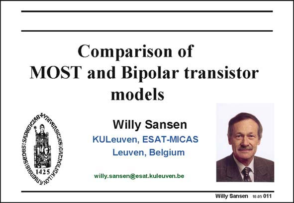

# SANSEN-011 · Slide 011

章节：01 MOS 晶体管与双极型晶体管的比较  
PDF 页：1；书本页：1；幻灯片编号：011  
状态：unreviewed



## 对应教材讲解

### PDF 1 · 书本 1

Analog design is art and science at the same time. It is art because it requires creativity to strike the right compromises between the specifications imposed and the ones forgotten. It is also science because it requires a certain level of methodology to carry out a design, inevitably leading to more insight in the compromises taken. This book is a guide through this wonderful world of art and science. It claims to provide the novice designers with all aspects of analog design, which are essential to this understanding. As teaching is the best way to learn, all slides are added on a CD-ROM, with and without the comments added as notes in the pdf files. The reader is suggested to try to explain parts of this course to his fellow designers. This is the way to experience and to cultivate the circles of art and science embedded in this book. All design is about circuits. All circuits contain transistors. Hand-models are required of these devices in order to be able to predict circuit performance. CAD tools such as SPICE, ELDO, SPECTRE, etc. are then used to verify the predicted performance. This feedback loop is essential to converge to a real design. This loop will be used continuously in this book.

## 公式／性能结论候选摘录

以下为规则截取的原文，尚未逐项判读。

（未由规则找到；不代表原页没有此类内容。）

## 曲线结论候选摘录

以下为规则截取的原文，尚未逐项判读。

（未由规则找到；不代表原页没有此类内容。）

## 原文条件与近似候选摘录

以下为规则截取的原文，尚未逐项判读。

（未由规则找到；不代表原页没有此类内容。）

## 幻灯片 OCR（未校正）

```text
Comparison of
MOST and Bipolar transistor
models
Willy Sansen
KULeuven, ESAT-MICAS
Leuven, Belgium
willy.sansen@esat.kuleuven.be
Willy Sansen 10.05 011
```

数学上下标、分数及正负号以原图为准。电路图已保留；未核对的连接不输出成可仿真 netlist。
