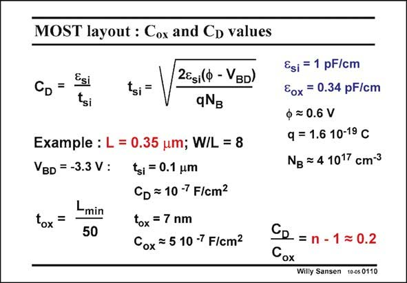

# SANSEN-0110 · MOST layout : Cox and CD values

章节：01 MOS 晶体管与双极型晶体管的比较  
PDF 页：6；书本页：6；幻灯片编号：0110  
状态：unreviewed



## 对应教材讲解

### PDF 6 · 书本 6

The width of the depletion region depends to a large extent on doping levels and the voltage across it. The larger the doping levels on both sides of the junction, the narrower the depletion region is. On the other hand, the larger the voltage is across the depletion region, the wider this region becomes, as shown by the equation. It includes the silicon dielectric constant e , the si junction built-in voltage Q, the charge of an electron q and the bulk doping level N . Values are given in this slide. B For example for a 0.35 mm technology, a drain-bulk voltage V yields a depletion layer BD thickness of about 0.1 nm. It is about 14 times thicker than the gate oxide. This is offset somewhat by the fact that the silicon dielectric constant is three times higher than the oxide one. Silicon is three times more efficient to make capacitors with than oxide. Silicon capacitances are very nonlinear because they depend on the voltage, whereas oxides capacitances do not. The ratio n−1 is then about 0.2. Most values of n are indeed between 1.2 and 1.5, depending on the value of t . Parameter n is thus never known accurately as it depends on biasing voltages. si Note that all capacitances are in F/cm2. For a Gate area of WL of 5×0.35×0.35 mm2 the total Gate oxide capacitance is thus C WL#5 fF, which is quite a small value indeed! ox

## 公式／性能结论候选摘录

以下为规则截取的原文，尚未逐项判读。

- PDF 6: The width of the depletion region depends to a large extent on doping levels and the voltage across it.
- PDF 6: Silicon capacitances are very nonlinear because they depend on the voltage, whereas oxides capacitances do not.
- PDF 6: Most values of n are indeed between 1.2 and 1.5, depending on the value of t .
- PDF 6: Parameter n is thus never known accurately as it depends on biasing voltages. si Note that all capacitances are in F/cm2.
- PDF 6: For a Gate area of WL of 5×0.35×0.35 mm2 the total Gate oxide capacitance is thus C WL#5 fF, which is quite a small value indeed! ox

## 曲线结论候选摘录

以下为规则截取的原文，尚未逐项判读。

（未由规则找到；不代表原页没有此类内容。）

## 原文条件与近似候选摘录

以下为规则截取的原文，尚未逐项判读。

（未由规则找到；不代表原页没有此类内容。）

## 幻灯片 OCR（未校正）

```text
MOST layout : Cox and CD values
CD =
Esi
tsi
tsi =
2Esi(ф - VBD)
qNg
Example : L = 0.35 um; W/L = 8
VBD = -3.3 V : tsi = 0.1 um
CD = 10-7 F/cm2
Lmin
tox =
50
tox = 7 nm
Cox = 5 10-7 F/cm?
Esi = 1 pF/cm
Eox = 0.34 pF/cm
ф = 0.6 V
q = 1.6 10-19 C
Ng = 4 1017 cm-3
=n - 1 = 0.2
Cox
Willy Sansen 10-0s 0110
```

数学上下标、分数及正负号以原图为准。电路图已保留；未核对的连接不输出成可仿真 netlist。
