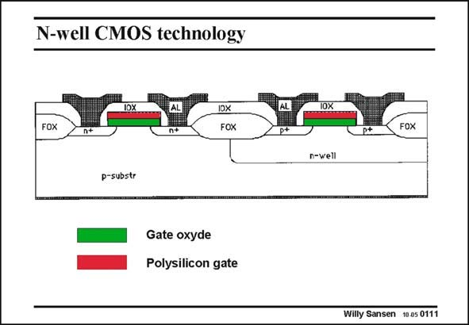

# SANSEN-0111 · N-well CMOS technology

章节：01 MOS 晶体管与双极型晶体管的比较  
PDF 页：7；书本页：7；幻灯片编号：0111  
状态：unreviewed



## 对应教材讲解

### PDF 6 · 书本 6

The bulk doping level N is not the same for a nMOST and a pMOST device. Indeed normally B nMOST devices are implemented directly on the p-substrate. This substrate is thus common to all nMOS transistors on that chip. The pMOS transistor has a p-channel however and has to be implemented in a n-tub or n-well, which is always higher doped than the common p-substrate. The disadvantage is that the bulk doping for a pMOST is always higher than the bulk doping of a nMOST. The pMOST

### PDF 7 · 书本 7

C will be higher and so is D its n factor. The advantage of a pMOST however is that its bulk is isolated from the substrate and can be used to control the transistor current I . Such pMOST DS devices have two gates, i.e. a top gate and a bottom gate. Both can be driven independently. Most technologies are n-well CMOS technologies although some p-well ones are still around.

## 公式／性能结论候选摘录

以下为规则截取的原文，尚未逐项判读。

- PDF 6: This substrate is thus common to all nMOS transistors on that chip.

## 曲线结论候选摘录

以下为规则截取的原文，尚未逐项判读。

（未由规则找到；不代表原页没有此类内容。）

## 原文条件与近似候选摘录

以下为规则截取的原文，尚未逐项判读。

（未由规则找到；不代表原页没有此类内容。）

## 幻灯片 OCR（未校正）

```text
N-well CMOS technology
IOX
FOX
DX
FOX
p-substr
Gate oxyde
Polysilicon gate
p+
p*
FOX
n-well
Willy Sansen 10.05 0111
```

数学上下标、分数及正负号以原图为准。电路图已保留；未核对的连接不输出成可仿真 netlist。
