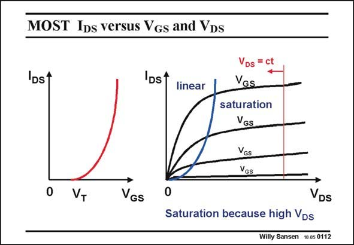

# SANSEN-0112 · MOST Ips versus VGs and VDs

章节：01 MOS 晶体管与双极型晶体管的比较  
PDF 页：7；书本页：7；幻灯片编号：0112  
状态：unreviewed



## 对应教材讲解

### PDF 7 · 书本 7

Application of a positive Gate voltage V causes an GS inversion layer (or channel) which connects Source to Drain. Application of a positive voltage V causes DS some current I to flow DS from Drain to Source. Now we want to find simple expressions for this current, so that we can use them for design purposes. The curve of I versus DS V is sketched on the left. GS The current starts flowing as soon as V exceeds V , GS T called the threshold voltage. For larger values of V , the current increases in a nonlinear way. GS How much we actually exceed V is V −V ; this will be the most important design parameter T GS T later on! The curve of I versus V is sketched on the left. For small values of V , the current DS DS DS increases linearly. Indeed, the transistor behaves as a resistor. This is called the linear region. For larger values of V the current stops increasing but levels off towards nearly constant DS values: the current is said to saturate. This is called the saturation region. Curves are given for four different values of V . GS The linear and saturation regions are separated by a parabola, which is described by V = DS V −V . We will concentrate on the linear region first. GS T

## 公式／性能结论候选摘录

以下为规则截取的原文，尚未逐项判读。

- PDF 7: For larger values of V , the current increases in a nonlinear way.
- PDF 7: For small values of V , the current DS DS DS increases linearly.

## 曲线结论候选摘录

以下为规则截取的原文，尚未逐项判读。

- PDF 7: The curve of I versus DS V is sketched on the left.
- PDF 7: The curve of I versus V is sketched on the left.
- PDF 7: Curves are given for four different values of V .

## 原文条件与近似候选摘录

以下为规则截取的原文，尚未逐项判读。

- PDF 7: For larger values of V the current stops increasing but levels off towards nearly constant DS values: the current is said to saturate.
- PDF 7: This is called the saturation region.
- PDF 7: GS The linear and saturation regions are separated by a parabola, which is described by V = DS V −V .

## 幻灯片 OCR（未校正）

```text
MOST Ips versus VGs and VDs
IDs1
IDs1
linear
VDs = ct
VGs
saturation
VGs
Yos
Yes
VT
VGs
0
VDs
Saturation because high VDs
Willy Sansen 10.05 0112
```

数学上下标、分数及正负号以原图为准。电路图已保留；未核对的连接不输出成可仿真 netlist。
