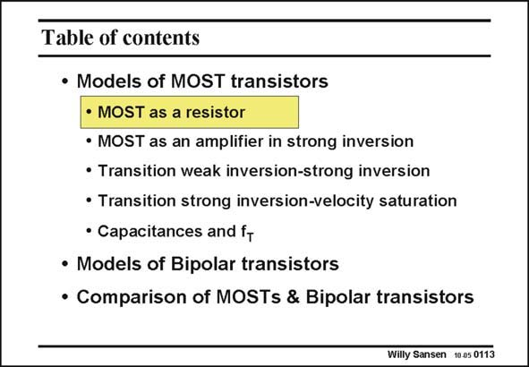

# SANSEN-0113 · Table of contents

章节：01 MOS 晶体管与双极型晶体管的比较  
PDF 页：8；书本页：8；幻灯片编号：0113  
状态：unreviewed



## 对应教材讲解

### PDF 8 · 书本 8

In many applications a MOST is simply used as a switch. Its voltage V is DS then very small. The MOST is then operating in the linear region (sometimes called the ohmic region). In this region the MOST transistor is really a small resistor. It provides a linear voltage-current characteristic. The channel has the same conductivity at both sides – the Source side and the Drain side. Let us investigate what the actual resistance then is.

## 公式／性能结论候选摘录

以下为规则截取的原文，尚未逐项判读。

（未由规则找到；不代表原页没有此类内容。）

## 曲线结论候选摘录

以下为规则截取的原文，尚未逐项判读。

- PDF 8: It provides a linear voltage-current characteristic.

## 原文条件与近似候选摘录

以下为规则截取的原文，尚未逐项判读。

（未由规则找到；不代表原页没有此类内容。）

## 幻灯片 OCR（未校正）

```text
Table of contents
• Models of MOST transistors
• MOST as a resistor
• MOST as an amplifier in strong inversion
• Transition weak inversion-strong inversion
• Transition strong inversion-velocity saturation
• Capacitances and f+
• Models of Bipolar transistors
• Comparison of MOSTs & Bipolar transistors
Willy Sansen 10 05 0113
```

数学上下标、分数及正负号以原图为准。电路图已保留；未核对的连接不输出成可仿真 netlist。
