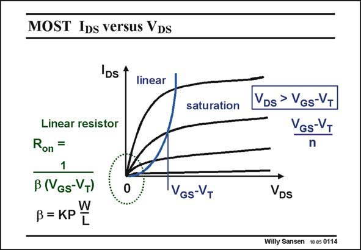

# SANSEN-0114 · MOST IDs versus VDs

章节：01 MOS 晶体管与双极型晶体管的比较  
PDF 页：8；书本页：8；幻灯片编号：0114  
状态：unreviewed



## 对应教材讲解

### PDF 8 · 书本 8

Zooming in on the corner, for very small values of V , DS we find that indeed the I −V curves are very DS DS linear. The MOST behaves as a pure resistor. The resistance value R on is given in this slide. In addition to the dimensions W and L, a technological parameter appears, called KP. This parameter characterizes a certain CMOS technology as will be explained on the next slide. Its dimension is A/V2. It is clear that the transistor turns very nonlinear when we apply larger V voltages. The DS crossover value towards the saturation is reached for V =V −V , or more accurately for DS GS T V =(V −V )/n. We will drop this factor n however, as a kind of safety factor. We will, from DS GS T now on, assume that a transistor is operating in the saturation region provided V >V −V . DS GS T

## 公式／性能结论候选摘录

以下为规则截取的原文，尚未逐项判读。

（未由规则找到；不代表原页没有此类内容。）

## 曲线结论候选摘录

以下为规则截取的原文，尚未逐项判读。

- PDF 8: Zooming in on the corner, for very small values of V , DS we find that indeed the I −V curves are very DS DS linear.

## 原文条件与近似候选摘录

以下为规则截取的原文，尚未逐项判读。

- PDF 8: The DS crossover value towards the saturation is reached for V =V −V , or more accurately for DS GS T V =(V −V )/n.
- PDF 8: We will, from DS GS T now on, assume that a transistor is operating in the saturation region provided V >V −V .

## 幻灯片 OCR（未校正）

```text
MOST IDs versus VDs
DS
linear
saturation
Linear resistor
Ron =
1
B (VGs-VT)
В=КРY
VGs-VT
VDs > VGs-VT
VGs-VT
DS
Willy Sansen 10.05 0114
```

数学上下标、分数及正负号以原图为准。电路图已保留；未核对的连接不输出成可仿真 netlist。
