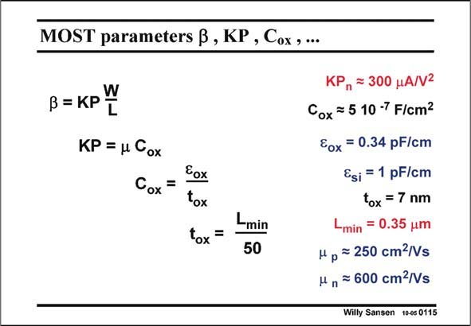

# SANSEN-0115 · MOST parameters B, KP, Cox ,...

章节：01 MOS 晶体管与双极型晶体管的比较  
PDF 页：9；书本页：9；幻灯片编号：0115  
状态：unreviewed



## 对应教材讲解

### PDF 8 · 书本 8

For sake of illustration let us a have a closer look at this resistor ‘‘in the corner’’. For this purpose we have to find an easy approximation for KP. It is given in this slide. Factor b (Greek beta) contains both the parameter KP and the dimensions of the resistor W and L. Actually, KP contains the oxide capacitance C , and the mobility m (Greek mu). This factor ox

### PDF 9 · 书本 9

shows what speed (cm/s) an electron can develop, subject to an electric field (V/cm). It is given in cm2/Vs. Electrons travel about twice as fast as holes. Values for a standard 0.35 mm CMOS technology are given in this slide. Note that the oxide thickness is about L/50, as has been checked on most standard CMOS processes of the last 20 years. As a rule of thumb, the resistor of a square transistor (W/L=1) for a drive voltage V −V =1 V is about 3.4 kV in 0.35 mm CMOS. GS T For deeper submicron CMOS technologies, KP is higher because of C . This square resistor ox now decreases!

## 公式／性能结论候选摘录

以下为规则截取的原文，尚未逐项判读。

- PDF 9: This square resistor ox now decreases!

## 曲线结论候选摘录

以下为规则截取的原文，尚未逐项判读。

（未由规则找到；不代表原页没有此类内容。）

## 原文条件与近似候选摘录

以下为规则截取的原文，尚未逐项判读。

- PDF 8: For this purpose we have to find an easy approximation for KP.

## 幻灯片 OCR（未校正）

```text
MOST parameters B, KP, Cox ,...
В= КР W
KP = u Cox
Cox =
Eox
tox
tox =
Lmin
50
KP„ = 300 HA/N2
Cox = 5 10 -7 F/cm?
EOx
= 0.34 pF/cm
Esi = 1 pF/cm
tox = 7 nm
min = 0.35 um
Mp = 250 cm2/Vs
H n = 600 cm-/Vs
Willy Sansen 10-05 0115
```

数学上下标、分数及正负号以原图为准。电路图已保留；未核对的连接不输出成可仿真 netlist。
