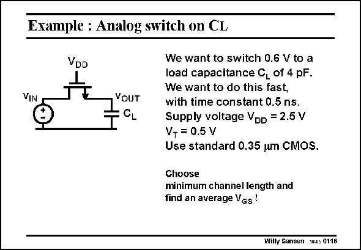

# SANSEN-0116 · Example : Analog switch on CL

章节：01 MOS 晶体管与双极型晶体管的比较  
PDF 页：9；书本页：9；幻灯片编号：0116  
状态：unreviewed



## 对应教材讲解

### PDF 9 · 书本 9

To have a time constant of 0.5 ns with 4 pF we need a switch resistance of 125 V. This will, to a large extent, depend on the value of V −V used. Indeed, as GS T soon as the switch turns on, the output voltage is still at zero Volt and V −V = GS T 2 V. At the end of the switching in, the output voltage has risen to 0.6 V: it has become the same as the input voltage. The V −V GS T has decreased by 0.6 V towards V −V =1.4 V. GS T The average value is now V −V =1.7 V. GS T For a transistor size W/L=1, the on-resistance is thus 2 kV (using KP=300 mA/V2). This is 8× larger than what we can allow. We thus have to take a W/L of 8. Note that we will have great difficulties in switching large input voltages. Indeed, for v = OUT v =2 V, the V has become zero. As a result, the resistor has become infinity: the switch IN GS cannot be switched on any more!! Note also that we have forgotten to take into account the bulk effect. Indeed, V is not zero, BS it is 0.6 V. The parasitic JFET will play as well as we will see later.

## 公式／性能结论候选摘录

以下为规则截取的原文，尚未逐项判读。

- PDF 9: This will, to a large extent, depend on the value of V −V used.
- PDF 9: The V −V GS T has decreased by 0.6 V towards V −V =1.4 V.
- PDF 9: GS T For a transistor size W/L=1, the on-resistance is thus 2 kV (using KP=300 mA/V2).
- PDF 9: We thus have to take a W/L of 8.
- PDF 9: As a result, the resistor has become infinity: the switch IN GS cannot be switched on any more!!

## 曲线结论候选摘录

以下为规则截取的原文，尚未逐项判读。

（未由规则找到；不代表原页没有此类内容。）

## 原文条件与近似候选摘录

以下为规则截取的原文，尚未逐项判读。

（未由规则找到；不代表原页没有此类内容。）

## 幻灯片 OCR（未校正）

```text
Example : Analog switch on CL
VDD
VIN
YOUT
We want to switch 0.6 V to a
load capacitance C, of 4 pF.
We want to do this fast,
with time constant 0.5 ns.
Supply voltage VDD = 2.5 V
V+ = 0.5 V
Use standard 0.35 um CMOS.
Choose
minimum channel length and
find an average VGs!
Wilty Sansen W-s 0116
```

数学上下标、分数及正负号以原图为准。电路图已保留；未核对的连接不输出成可仿真 netlist。
