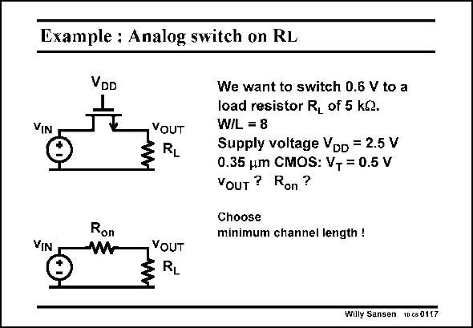

# SANSEN-0117 · Example : Analog switch on RL

章节：01 MOS 晶体管与双极型晶体管的比较  
PDF 页：10；书本页：10；幻灯片编号：0117  
状态：unreviewed



## 对应教材讲解

### PDF 10 · 书本 10

For a transistor size W/L= 8, the KP×W/L product is 2.4×10−3 S (using KP= 300 mA/V2). Taking the switch as a resistor with value R , as shown in this on slide and substitution of R on by its expression, requires an iteration, which yields a value of R of 216 V and an on output voltage of 0.575 V. Note that we have forgotten to take into account the bulk effect. Indeed, V is BS not zero, it is about 0.575 V. The parasitic JFET will become active as well, as we will see next.

## 公式／性能结论候选摘录

以下为规则截取的原文，尚未逐项判读。

（未由规则找到；不代表原页没有此类内容。）

## 曲线结论候选摘录

以下为规则截取的原文，尚未逐项判读。

（未由规则找到；不代表原页没有此类内容。）

## 原文条件与近似候选摘录

以下为规则截取的原文，尚未逐项判读。

（未由规则找到；不代表原页没有此类内容。）

## 幻灯片 OCR（未校正）

```text
Example : Analog switch on RL
VIN
VDD
L
Ron
YOUT
RL
We want to switch 0.6 V to a
load resistor R, of 5 kQ.
W/L = 8
Supply voltage VDD = 2.5 V
0.35 jm CMOS: VT = 0.5 V
Youт ? Ron?
Choose
minimum channel length !
VIN
YOUT
RL
Willy Sansen 10650117
```

数学上下标、分数及正负号以原图为准。电路图已保留；未核对的连接不输出成可仿真 netlist。
