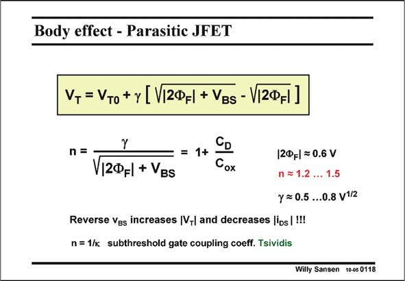

# SANSEN-0118 · Body effect - Parasitic JFET

章节：01 MOS 晶体管与双极型晶体管的比较  
PDF 页：10；书本页：10；幻灯片编号：0118  
状态：unreviewed



## 对应教材讲解

### PDF 10 · 书本 10

The drain-source current I DS and the channel resistance R show the influence of on V in an explicit way, but GS not that of the bulk-source voltage V . Indeed, the BS effect of V is embedded in BS the threshold voltage V . T Increasing the V will BS increase the depletion layer width under the channel and will increase V . More T reverse biasing that junction will increase V in absolute T value and decrease the current. For zero V , V evi- BS T dently equals V . T0 Parameter c (Greek gamma) has to do with the junction depletion region and is linked to parameter n. Actually, factor c depends on the technology used (such as the bulk doping N ) B but is not voltage dependent. The denominator of n now shows explicitly the voltage dependence of n. Some approximate parameter values are given as well for a 0.7 mm CMOS.

## 公式／性能结论候选摘录

以下为规则截取的原文，尚未逐项判读。

- PDF 10: T Increasing the V will BS increase the depletion layer width under the channel and will increase V .
- PDF 10: More T reverse biasing that junction will increase V in absolute T value and decrease the current.
- PDF 10: For zero V , V evi- BS T dently equals V .
- PDF 10: Actually, factor c depends on the technology used (such as the bulk doping N ) B but is not voltage dependent.
- PDF 10: The denominator of n now shows explicitly the voltage dependence of n.

## 曲线结论候选摘录

以下为规则截取的原文，尚未逐项判读。

（未由规则找到；不代表原页没有此类内容。）

## 原文条件与近似候选摘录

以下为规则截取的原文，尚未逐项判读。

- PDF 10: Some approximate parameter values are given as well for a 0.7 mm CMOS.

## 幻灯片 OCR（未校正）

```text
Body effect - Parasitic JFET
V, = VTo + y [V[2@f| + VBs - V[2Фf|]
n=
1+
V|2ФF| + VBS
Cox
|2ФFl = 0.6V
n = 1.2 ... 1.5
y = 0.5 ...0.8 v1/2
Reverse Ves increases |VT| and decreases |ips | !!!
n = 1/к subthreshold gate coupling coeff. Tsividis
Willy Sansen 10-05 0118
```

数学上下标、分数及正负号以原图为准。电路图已保留；未核对的连接不输出成可仿真 netlist。
