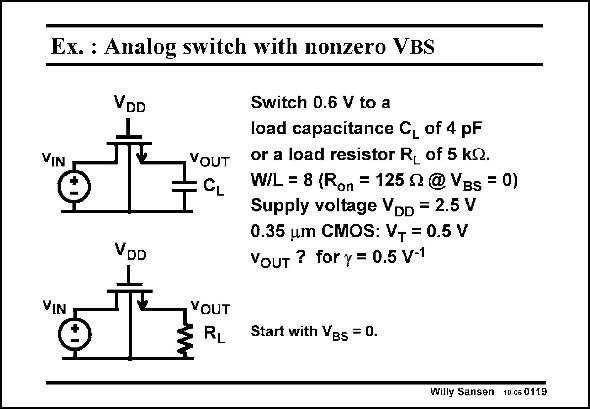

# SANSEN-0119 · Ex. : Analog switch with nonzero VBS

章节：01 MOS 晶体管与双极型晶体管的比较  
PDF 页：11；书本页：11；幻灯片编号：0119  
状态：unreviewed



## 对应教材讲解

### PDF 11 · 书本 11

For a transistor size W/L= 8, the KP×W/L product is again 2.4×10−3 S (using KP=300 mA/V2). Taking the switch as a resistor with value R , as on shown in this slide, and substitution of R by its on expression requires another iteration, as now V T depends on the output voltage. This yields a value of R which is now larger. It on is 291 V, instead of 216 V. Also, the output voltage is a little bit lower. It is 0.567 V instead of 0.575 V. The time constant is now simply the product of 216 V and 4 pF.

## 公式／性能结论候选摘录

以下为规则截取的原文，尚未逐项判读。

- PDF 11: Taking the switch as a resistor with value R , as on shown in this slide, and substitution of R by its on expression requires another iteration, as now V T depends on the output voltage.

## 曲线结论候选摘录

以下为规则截取的原文，尚未逐项判读。

（未由规则找到；不代表原页没有此类内容。）

## 原文条件与近似候选摘录

以下为规则截取的原文，尚未逐项判读。

（未由规则找到；不代表原页没有此类内容。）

## 幻灯片 OCR（未校正）

```text
Ex. : Analog switch with nonzero VBS
VIN
VDD
VDD
YOUT
Switch D.6 V to a
load capacitance C, of 4 pF
or a load resistor R, of 5 kQ.
W/L = 8 (Ron = 125 g @ VBs = 0)
Supply voltage VDD = 2.5 V
0.35 um CMOS: VT = 0.5 V
YouT ? for y = 0.5 V-1
VIN
VOUT
RL
Start with VBs = 0.
Willy Sansen 10650119
```

数学上下标、分数及正负号以原图为准。电路图已保留；未核对的连接不输出成可仿真 netlist。
