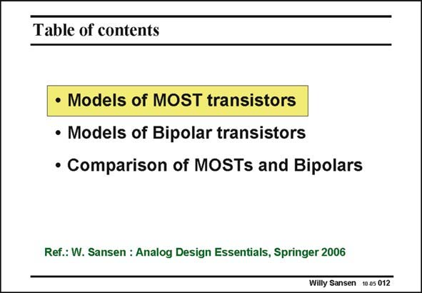

# SANSEN-012 · Table of contents

章节：01 MOS 晶体管与双极型晶体管的比较  
PDF 页：1；书本页：1；幻灯片编号：012  
状态：unreviewed



## 对应教材讲解

### PDF 1 · 书本 1

For the design of analog integrated circuits, we need to be able to predict the performance by means of simple expressions. As a result, simple models are required. This means that the small-signal operation of each transistor must be described by means of as few equations as possible. Clearly the performance of the circuit can then only be described in an approximate way. The main advantage however, is that transistor

### PDF 2 · 书本 2

sizing and current levels can easily be derived from such simple expressions. They can then be used to simulate the circuit performance by means of a conventional circuit simulator such as SPICE or ELDO. In these simulators, models are used which are much more accurate but also much more complicated. These simulations are required afterwards to verify the circuit performance. The initial design with simple models is the first step in the design procedure. They are aimed indeed at the determination of all transistor currents and sizes, according to the specifications imposed. We start with MOST devices, although the bipolar transistor are historically first. Nowadays the number of MOS transistors integrated on chips, vastly outnumber the bipolar ones.

## 公式／性能结论候选摘录

以下为规则截取的原文，尚未逐项判读。

- PDF 1: As a result, simple models are required.

## 曲线结论候选摘录

以下为规则截取的原文，尚未逐项判读。

（未由规则找到；不代表原页没有此类内容。）

## 原文条件与近似候选摘录

以下为规则截取的原文，尚未逐项判读。

- PDF 1: Clearly the performance of the circuit can then only be described in an approximate way.

## 幻灯片 OCR（未校正）

```text
Table of contents
• Models of MOST transistors
• Models of Bipolar transistors
• Comparison of MOSTs and Bipolars
Ref.: W. Sansen : Analog Design Essentials, Springer 2006
Willy Sansen 10.05 012
```

数学上下标、分数及正负号以原图为准。电路图已保留；未核对的连接不输出成可仿真 netlist。
