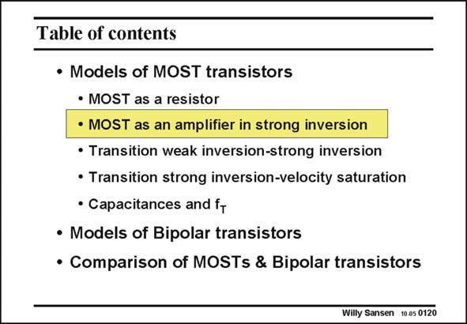

# SANSEN-0120 · Table of contents

章节：01 MOS 晶体管与双极型晶体管的比较  
PDF 页：11；书本页：11；幻灯片编号：0120  
状态：unreviewed



## 对应教材讲解

### PDF 11 · 书本 11

In most applications the MOST is used as an amplifier. This means that its V DS is larger than V −V . Its GS T transconductance is then higher than at low V DS values. It is used to generate gain. The value of V −V GS T itself, however, determines in which region the MOST is operating. For medium currents the MOST is operating in the strong inversion region. This is used most of the time. At lower currents the MOST ends up in weak inversion. This is especially important for portable and low-power applications in general. If we bias the MOST at the highest possible transconductance (for example in RF applications and very-low-noise applications), then the current densities are higher. The transconductance of the NMOST is then limited by velocity saturation. Again, another model is required. All three regions are now discussed.

## 公式／性能结论候选摘录

以下为规则截取的原文，尚未逐项判读。

- PDF 11: It is used to generate gain.
- PDF 11: The transconductance of the NMOST is then limited by velocity saturation.

## 曲线结论候选摘录

以下为规则截取的原文，尚未逐项判读。

（未由规则找到；不代表原页没有此类内容。）

## 原文条件与近似候选摘录

以下为规则截取的原文，尚未逐项判读。

- PDF 11: The transconductance of the NMOST is then limited by velocity saturation.

## 幻灯片 OCR（未校正）

```text
Table of contents
• Models of MOST transistors
• MOST as a resistor
• MOST as an amplifier in strong inversion
• Transition weak inversion-strong inversion
• Transition strong inversion-velocity saturation
• Capacitances and ft
• Models of Bipolar transistors
• Comparison of MOSTs & Bipolar transistors
Willy Sansen 1005 0120
```

数学上下标、分数及正负号以原图为准。电路图已保留；未核对的连接不输出成可仿真 netlist。
