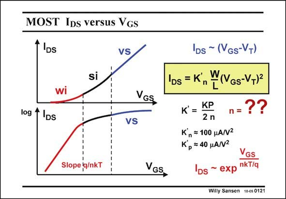

# SANSEN-0121 · MOST Ips versus Vgs

章节：01 MOS 晶体管与双极型晶体管的比较  
PDF 页：12；书本页：12；幻灯片编号：0121  
状态：unreviewed



## 对应教材讲解

### PDF 12 · 书本 12

In most amplifiers the MOST operates in the saturation region, i.e. we maintain V >V −V at all DS GS T times. We obtain the I −V curve shown DS GS before. A closer look however, reveals that this curve has three distinctive regions. The one in the middle is called the strong-inversion region or square-law region as the current expression contains the factor (V −V )2. GS T At lower currents we find the weak-inversion region, or exponential region because the current expression now contains an exponential in V . Indeed a log(I ) curve is linear in that region. GS DS At higher currents the I −V curve becomes linear, because of several physical phenomena. DS GS The most important one is velocity saturation: all electrons reach their maximum speed v . sat Most transistors are biased in the strong-inversion region because this is a good compromise between current efficiency and speed, as explained later. In this region, the current expression is simply proportional to (V −V )2, but includes a technological parameter as well K∞. GS T This parameter K∞ is linked to the one in the linear region KP by the ratio 2n. It is thus always smaller than KP. It is not very accurately known however, because of the mobility (in KP) and especially n. Remember that n depends on biasing voltages and so does K∞.

## 公式／性能结论候选摘录

以下为规则截取的原文，尚未逐项判读。

- PDF 12: In this region, the current expression is simply proportional to (V −V )2, but includes a technological parameter as well K∞.
- PDF 12: It is thus always smaller than KP.
- PDF 12: Remember that n depends on biasing voltages and so does K∞.

## 曲线结论候选摘录

以下为规则截取的原文，尚未逐项判读。

- PDF 12: We obtain the I −V curve shown DS GS before.
- PDF 12: A closer look however, reveals that this curve has three distinctive regions.
- PDF 12: Indeed a log(I ) curve is linear in that region.
- PDF 12: GS DS At higher currents the I −V curve becomes linear, because of several physical phenomena.

## 原文条件与近似候选摘录

以下为规则截取的原文，尚未逐项判读。

- PDF 12: In most amplifiers the MOST operates in the saturation region, i.e. we maintain V >V −V at all DS GS T times.
- PDF 12: DS GS The most important one is velocity saturation: all electrons reach their maximum speed v . sat Most transistors are biased in the strong-inversion region because this is a good compromise between current efficiency and speed, as explained later.

## 幻灯片 OCR（未校正）

```text
MOST Ips versus Vgs
1 IDs
VS
si
wi
VGS
log 4
DS
VS
Slope |q/nkT
VGS
'Ds ~ (VGs-VT)
IDs = K
n
WIVGs-V+12
KP
K =
2 n
n=??
K, = 100 HANZ
Kp =40 HANZ
VGS
lDs ~ exp nkT/q
Willy Sansen 10-05 0121
```

数学上下标、分数及正负号以原图为准。电路图已保留；未核对的连接不输出成可仿真 netlist。
