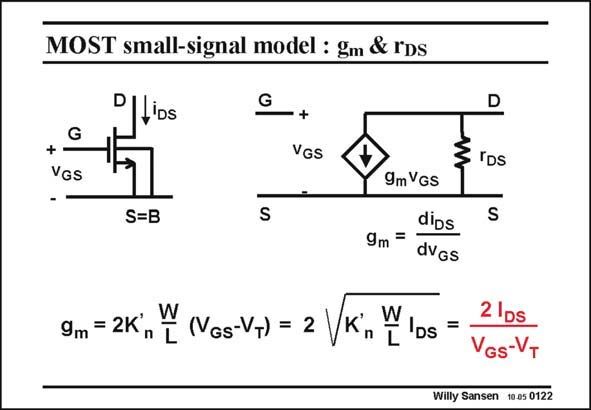

# SANSEN-0122 · MOST small-signal model : gm & rDs

章节：01 MOS 晶体管与双极型晶体管的比较  
PDF 页：12；书本页：12；幻灯片编号：0122  
状态：unreviewed



## 对应教材讲解

### PDF 12 · 书本 12

Let us now make an amplifier using one single nMOST. We assume that transistor is biased at some DC current I . We want to know DS now what is the small-signal or AC current i superim- DS posed on it by application of a small-signal input voltage v . GS For this purpose we have to find the transistor transconductance g . This is m nothing else than the derivative of the drain current to the Gate-Source voltage, as shown by the expression on the left.

### PDF 13 · 书本 13

However substitution of V −V from the current expression provides another expression GS T for g . m Finally, substitution of W/L from the current expression provides a third expression for g . m The last one is the best known. It does not contain any technological parameter such as K∞ and is the most precise one. This is why it is highlighted.

## 公式／性能结论候选摘录

以下为规则截取的原文，尚未逐项判读。

（未由规则找到；不代表原页没有此类内容。）

## 曲线结论候选摘录

以下为规则截取的原文，尚未逐项判读。

（未由规则找到；不代表原页没有此类内容。）

## 原文条件与近似候选摘录

以下为规则截取的原文，尚未逐项判读。

- PDF 12: We assume that transistor is biased at some DC current I .

## 幻灯片 OCR（未校正）

```text
MOST small-signal model : gm & rDs
G
+•
VGS
Ollios
1
S=B
G
+
VGS
D
§IDs
S
9m VGs
dips
9m =
dvGs
9m = 2K, F (Vas-V+) = 2
Vк„ї
TIDs
=
2 IDs
VGs-VT
Willy Sansen 1005 0122
```

数学上下标、分数及正负号以原图为准。电路图已保留；未核对的连接不输出成可仿真 netlist。
