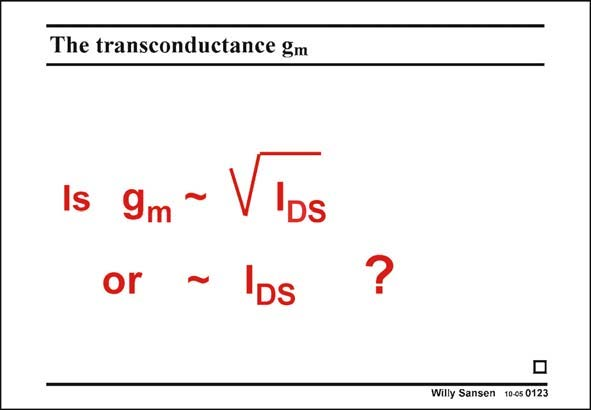

# SANSEN-0123 · The transconductance gm

章节：01 MOS 晶体管与双极型晶体管的比较  
PDF 页：13；书本页：13；幻灯片编号：0123  
状态：unreviewed



## 对应教材讲解

### PDF 13 · 书本 13

Having three expression for only one single parameter g causes some ambiguity. m The question asked is whether g is proportional m to the square root of the current or to the current itself. The expressions show that both seem to be possible. The answer becomes clear by checking the other parameters involved. During measurements, when the transistor size W/L is obviously constant, the middle expression prevails. Then g is proportional to the square root of the current. Doubling the biasing current will m increase the g only by 41%. m However, during the design procedure, the designer will fix the V −V at a certain value, GS T for example at 0.2 V. Then g is proportional to the current itself. Doubling the biasing current m will double the g as well. m

## 公式／性能结论候选摘录

以下为规则截取的原文，尚未逐项判读。

- PDF 13: Having three expression for only one single parameter g causes some ambiguity. m The question asked is whether g is proportional m to the square root of the current or to the current itself.
- PDF 13: Then g is proportional to the square root of the current.
- PDF 13: Doubling the biasing current will m increase the g only by 41%. m However, during the design procedure, the designer will fix the V −V at a certain value, GS T for example at 0.2 V.
- PDF 13: Then g is proportional to the current itself.

## 曲线结论候选摘录

以下为规则截取的原文，尚未逐项判读。

（未由规则找到；不代表原页没有此类内容。）

## 原文条件与近似候选摘录

以下为规则截取的原文，尚未逐项判读。

（未由规则找到；不代表原页没有此类内容。）

## 幻灯片 OCR（未校正）

```text
The transconductance gm
1s gm ~ Vlbs
or
'DS
?
Willy Sansen 10-05 0123
```

数学上下标、分数及正负号以原图为准。电路图已保留；未核对的连接不输出成可仿真 netlist。
