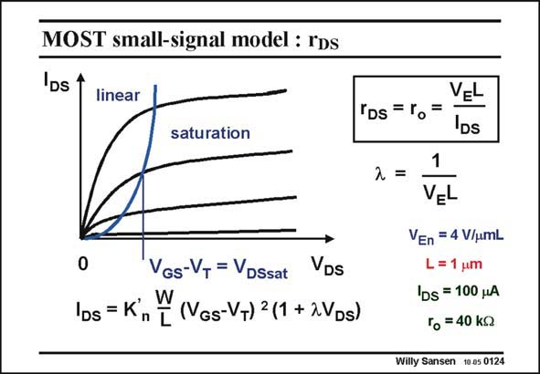

# SANSEN-0124 · MOST small-signal model : rDs

章节：01 MOS 晶体管与双极型晶体管的比较  
PDF 页：13；书本页：13；幻灯片编号：0124  
状态：unreviewed



## 对应教材讲解

### PDF 13 · 书本 13

The small-signal model of a MOST also contains a finite output resistance r . DS Indeed the i −v curves DS DS in saturation are not quite flat. They exhibit thus a finite output resistance denoted by r or r . DS o An additional parameter l has to be included in the current expression to show that the current rises somewhat for increasing v . DS Unfortunately, this parameter is not a constant. It depends on the channel

### PDF 14 · 书本 14

length. Therefore, we prefer to use instead another parameter V . It is constant for a certain E technology. It is different for a nMOST and a pMOST. Its dimension is V/mm. The output resistance is then easily described. An example is given. In models used for simulators (such as SPICE) several parameters are required to describe the output resistance. This model based on parameter V , is the simplest one and is only used E for hand calculations. It only provides limited accuracy. Parameter V is the fourth technological parameter that we find: we have had up till now n, E V , KP and V . T E Design parameters up till now are L and V −V . GS T

## 公式／性能结论候选摘录

以下为规则截取的原文，尚未逐项判读。

- PDF 13: They exhibit thus a finite output resistance denoted by r or r .
- PDF 13: It depends on the channel
- PDF 14: Therefore, we prefer to use instead another parameter V .
- PDF 14: It only provides limited accuracy.

## 曲线结论候选摘录

以下为规则截取的原文，尚未逐项判读。

- PDF 13: DS Indeed the i −v curves DS DS in saturation are not quite flat.

## 原文条件与近似候选摘录

以下为规则截取的原文，尚未逐项判读。

- PDF 13: DS Indeed the i −v curves DS DS in saturation are not quite flat.

## 幻灯片 OCR（未校正）

```text
MOST small-signal model : rDs
IDS
linear
saturation
IDs = K
n
VGs-VT = VDSsat
VDs
(VGs-VT) 2 (1 + 2VDs)
'Ds = lo
=
VEL
DS
2=
1
VEL
VEn = 4 V/umL
L= 1 um
IDs = 100 HA
To = 40 Kg
Willy Sansen 10.05 0124
```

数学上下标、分数及正负号以原图为准。电路图已保留；未核对的连接不输出成可仿真 netlist。
