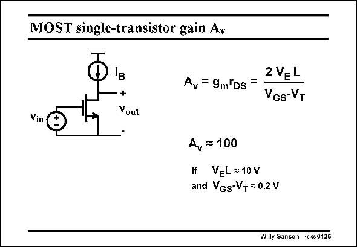

# SANSEN-0125 · MOST single-transistor gain Ay

章节：01 MOS 晶体管与双极型晶体管的比较  
PDF 页：14；书本页：14；幻灯片编号：0125  
状态：unreviewed



## 对应教材讲解

### PDF 14 · 书本 14

Let us now investigate how much gain can be provided by a single-transistor amplifier, biased by a current source with value I . B The voltage gain is simply given by g r or the m DS expression in this slide. Note that the current drops out as both parameters are current dependent. It is clear that if we are interested in large gain, we will have to choose a large channel length, normally much larger than the minimum channel length of the technology used. Also we have to choose a value of V −V which GS T is as small as possible. A reasonable value is 0.2 V. Reasons for this choice will be given later. In order to obtain a voltage gain of 100, relatively large channel lengths are now necessary. If for some other reason we want to use the minimum channel length (for example for speed) then we will have to use circuit techniques to enhance the gain. Examples are cascodes, gain boosting, current starving, bootstrapping, etc. Deep submicron CMOS technologies only provide very limited gain. All possible circuit techniques will have to be used to provide large gain. Finally, note that such an amplifier (as most amplifiers are inverting), the output voltage increases when the input voltage decreases. This is why some authors add a minus sign to the expression of the gain.

## 公式／性能结论候选摘录

以下为规则截取的原文，尚未逐项判读。

- PDF 14: Let us now investigate how much gain can be provided by a single-transistor amplifier, biased by a current source with value I .
- PDF 14: B The voltage gain is simply given by g r or the m DS expression in this slide.
- PDF 14: Note that the current drops out as both parameters are current dependent.
- PDF 14: It is clear that if we are interested in large gain, we will have to choose a large channel length, normally much larger than the minimum channel length of the technology used.
- PDF 14: In order to obtain a voltage gain of 100, relatively large channel lengths are now necessary.
- PDF 14: If for some other reason we want to use the minimum channel length (for example for speed) then we will have to use circuit techniques to enhance the gain.
- PDF 14: Examples are cascodes, gain boosting, current starving, bootstrapping, etc.
- PDF 14: Deep submicron CMOS technologies only provide very limited gain.

## 曲线结论候选摘录

以下为规则截取的原文，尚未逐项判读。

（未由规则找到；不代表原页没有此类内容。）

## 原文条件与近似候选摘录

以下为规则截取的原文，尚未逐项判读。

- PDF 14: Let us now investigate how much gain can be provided by a single-transistor amplifier, biased by a current source with value I .
- PDF 14: It is clear that if we are interested in large gain, we will have to choose a large channel length, normally much larger than the minimum channel length of the technology used.

## 幻灯片 OCR（未校正）

```text
MOST single-transistor gain Ay
Iв
+
Vout
2 VEL
A, = 9m"Ds =
VGs-VT
Vin
A, ≥ 100
H VEL = 10V
and Vgs-V+ = 0.2 V
Willy Sansen 10.x60125
```

数学上下标、分数及正负号以原图为准。电路图已保留；未核对的连接不输出成可仿真 netlist。
