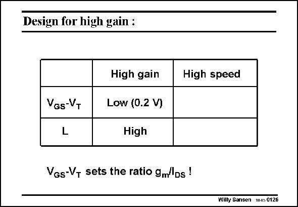

# SANSEN-0126 · Design for high gain :

章节：01 MOS 晶体管与双极型晶体管的比较  
PDF 页：15；书本页：15；幻灯片编号：0126  
状态：unreviewed



## 对应教材讲解

### PDF 14 · 书本 14

Indeed, for each transistor in the signal path, two independent choices will have to be made in the design procedure. They are the values of L and V −V . A single-transistor amplifier can GS T give a large amount of gain provided its L is large and its V −V is small. This will apply to GS T all applications where high gain, low noise and low offset are most important, such as in operational amplifiers.

### PDF 15 · 书本 15

Expressions cannot be used to establish these values. They have to be chosen at the very start of the design procedure. Unfortunately, for high speed, we will see that exactly the opposite conclusions will have to be drawn. For high speed, a transistor in the signal path requires the L to be small and the V −V large. This will GS T apply to all RF circuits such as Low Noise Amplifiers (LNA’s), Voltage Controlled Oscillators (VCO’s), Mixers, etc. This compromise is one of the most basic compromises in analog CMOS design. After all it is gain versus speed! Finally, note that the value of V −V sets the ratio g /I . However, we need to have a GS T m DS look at weak inversion first. Choosing the value of V −V or choosing the value of g /I , GS T m DS will ultimately be the same choice.

## 公式／性能结论候选摘录

以下为规则截取的原文，尚未逐项判读。

- PDF 14: Indeed, for each transistor in the signal path, two independent choices will have to be made in the design procedure.
- PDF 14: A single-transistor amplifier can GS T give a large amount of gain provided its L is large and its V −V is small.
- PDF 14: This will apply to GS T all applications where high gain, low noise and low offset are most important, such as in operational amplifiers.
- PDF 15: After all it is gain versus speed!

## 曲线结论候选摘录

以下为规则截取的原文，尚未逐项判读。

（未由规则找到；不代表原页没有此类内容。）

## 原文条件与近似候选摘录

以下为规则截取的原文，尚未逐项判读。

- PDF 14: A single-transistor amplifier can GS T give a large amount of gain provided its L is large and its V −V is small.

## 幻灯片 OCR（未校正）

```text
Design for high gain :
VGs-VT
L
High gain
Low (0.2 V)
High
VGs-V, sets the ratio gm'Ds !
High speed
Wilty Sansen W.s 0126
```

数学上下标、分数及正负号以原图为准。电路图已保留；未核对的连接不输出成可仿真 netlist。
