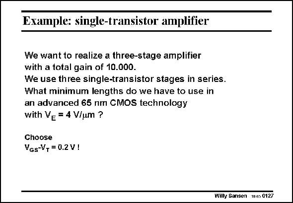

# SANSEN-0127 · Example: single-transistor amplifier

章节：01 MOS 晶体管与双极型晶体管的比较  
PDF 页：15；书本页：15；幻灯片编号：0127  
状态：unreviewed



## 对应教材讲解

### PDF 15 · 书本 15

There is no reason to allocate more gain to one amplifier compared to the other. The gain per amplifier is thus 21.5 since 21.5× 21.5×21.5#10 000. As a result we need a V L pro- E duct of 2.15 V. For this technology, we will need a channel length of L#0.5 mm. If we used the minimum channel length of 65 nm, the gain would only be about 2.6!! Deep submicron CMOS only provides very low voltage gains!!

## 公式／性能结论候选摘录

以下为规则截取的原文，尚未逐项判读。

- PDF 15: There is no reason to allocate more gain to one amplifier compared to the other.
- PDF 15: The gain per amplifier is thus 21.5 since 21.5× 21.5×21.5#10 000.
- PDF 15: As a result we need a V L pro- E duct of 2.15 V.
- PDF 15: If we used the minimum channel length of 65 nm, the gain would only be about 2.6!!

## 曲线结论候选摘录

以下为规则截取的原文，尚未逐项判读。

（未由规则找到；不代表原页没有此类内容。）

## 原文条件与近似候选摘录

以下为规则截取的原文，尚未逐项判读。

（未由规则找到；不代表原页没有此类内容。）

## 幻灯片 OCR（未校正）

```text
Example: single-transistor amplifier
We want to realize a three-stage amplifier
with a total gain of 10.000.
We use three single-transistor stages in series.
What minimum lengths do we have to use in
an advanced 65 nm CMOS technology
with Ve = 4 V/um ?
Choose
VGs-V, = 0.2V !
Wilty Sansen W.s 0127
```

数学上下标、分数及正负号以原图为准。电路图已保留；未核对的连接不输出成可仿真 netlist。
