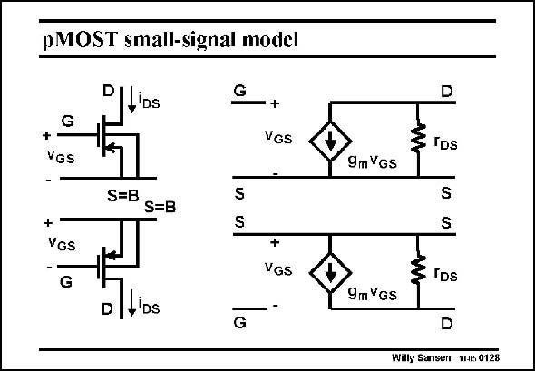

# SANSEN-0128 · pMOST small-signal model

章节：01 MOS 晶体管与双极型晶体管的比较  
PDF 页：16；书本页：16；幻灯片编号：0128  
状态：unreviewed



## 对应教材讲解

### PDF 16 · 书本 16

The small-signal model of a pMOST is exactly the same as for a nMOST. For the same biasing current and the same V −V , it also GS T provides the same transconductance g . The output m resistance may be different, depending somewhat on the values of parameter V . E Care must be taken however, on how to represent this small-signal model. Normally a nMOST device requires a positive V , DS whereas a pMOST device a negative V . This is why pMOST devices are usually shown inverted, i.e. with its Source on DS top. Indeed, only positive supply voltages are used nowadays. pMOS transistors are usually shown inverted. In this case we have to be careful how to include the signs and the current direction. It is shown in this slide.

## 公式／性能结论候选摘录

以下为规则截取的原文，尚未逐项判读。

- PDF 16: The output m resistance may be different, depending somewhat on the values of parameter V .

## 曲线结论候选摘录

以下为规则截取的原文，尚未逐项判读。

（未由规则找到；不代表原页没有此类内容。）

## 原文条件与近似候选摘录

以下为规则截取的原文，尚未逐项判读。

（未由规则找到；不代表原页没有此类内容。）

## 幻灯片 OCR（未校正）

```text
pMOST small-signal model
Pll'os
G
G
+
Vas
+
VGs
-
+
VGS
G
S=B
S=B
+
VGS
D|L'Ds
G
D
9m Vgs
TDs
9m VGs
S
IDs
D
Wilty Sansen M.s 0128
```

数学上下标、分数及正负号以原图为准。电路图已保留；未核对的连接不输出成可仿真 netlist。
