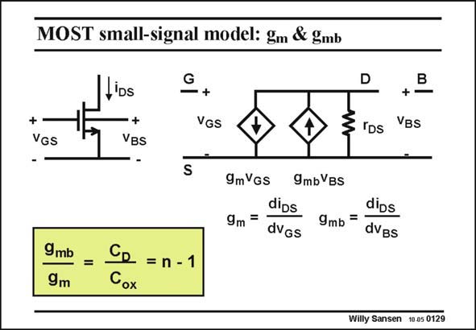

# SANSEN-0129 · MOST small-signal model: gm & gmb

章节：01 MOS 晶体管与双极型晶体管的比较  
PDF 页：16；书本页：16；幻灯片编号：0129  
状态：unreviewed



## 对应教材讲解

### PDF 16 · 书本 16

pMOST devices in a n-well CMOS technology can also be driven at the Bulk. The Bulk is then used as an input instead of the Gate. This is much more dangerous as there is always a risk to forward that channel-bulk pn junction by incident. This must be avoided at all times and may probably require extra protection circuitry. For a bulk input voltage, another transconductance must be added g . Its value mb is proportional to the channel-bulk junction capacitance, in exactly the same way as the g is proportional to the gate m oxide capacitance. In other words, the ratio of transconductances equals the ratio of the controlling capacitances, which equals n−1. This is a very powerful relationship, but it never provides an accurate value, as n depends on some biasing voltages.

## 公式／性能结论候选摘录

以下为规则截取的原文，尚未逐项判读。

- PDF 16: Its value mb is proportional to the channel-bulk junction capacitance, in exactly the same way as the g is proportional to the gate m oxide capacitance.
- PDF 16: In other words, the ratio of transconductances equals the ratio of the controlling capacitances, which equals n−1.
- PDF 16: This is a very powerful relationship, but it never provides an accurate value, as n depends on some biasing voltages.

## 曲线结论候选摘录

以下为规则截取的原文，尚未逐项判读。

（未由规则找到；不代表原页没有此类内容。）

## 原文条件与近似候选摘录

以下为规则截取的原文，尚未逐项判读。

（未由规则找到；不代表原页没有此类内容。）

## 幻灯片 OCR（未校正）

```text
MOST small-signal model: gm & gmb
+
VGS
.ios
VBs
-
G
VGS
D
3 IDs
B
+
VBs
S
9mVGs 9mbVBs
dips
9m =
dVGs
dips
9mb =
dVgs
9mb
9m
=
= n - 1
Cox
Willy Sansen 10.05 0129
```

数学上下标、分数及正负号以原图为准。电路图已保留；未核对的连接不输出成可仿真 netlist。
