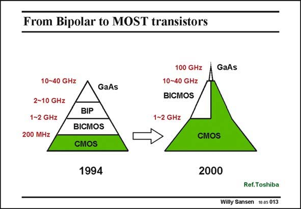

# SANSEN-013 · From Bipolar to MOST transistors

章节：01 MOS 晶体管与双极型晶体管的比较  
PDF 页：2；书本页：2；幻灯片编号：013  
状态：unreviewed



## 对应教材讲解

### PDF 2 · 书本 2

Indeed, previously CMOS devices were reserved for logic as they offer the highest density (in gates/mm2). Most high-frequency circuitry was carried out in bipolar technology. As a result, a lot of analog functions were realized in bipolar technology. The highestfrequency circuits have been realized in exotic technologies such as GaAs and now InP technologies. They are quite expensive however and really reserved for the high frequency end. The channel length of CMOS transistors shrinks continuously however. In 2004, a channel length of 0.13 micrometer is standard but several circuits using 90 nm have already been published (see ISSCC). This ever decreasing channel length gives rise to ever increasing speeds. As a result, CMOS devices are capable of gain at ever higher frequencies. Today CMOS and bipolar technologies are in competition over a wide frequency region, extending all the way to 10 and even 40 GHz, as predicted in this slide. For these frequencies the question is indeed, which technology fulfills best the system and circuit requirements at a reasonable cost. BICMOS is always more expensive than standard CMOS technology. The question is, whether the increase in cost compensates the increase in performance?

## 公式／性能结论候选摘录

以下为规则截取的原文，尚未逐项判读。

- PDF 2: As a result, a lot of analog functions were realized in bipolar technology.
- PDF 2: As a result, CMOS devices are capable of gain at ever higher frequencies.
- PDF 2: The question is, whether the increase in cost compensates the increase in performance?

## 曲线结论候选摘录

以下为规则截取的原文，尚未逐项判读。

（未由规则找到；不代表原页没有此类内容。）

## 原文条件与近似候选摘录

以下为规则截取的原文，尚未逐项判读。

（未由规则找到；不代表原页没有此类内容。）

## 幻灯片 OCR（未校正）

```text
From Bipolar to MOST transistors
10~40 GHz
2~10 GHz
1~2 GHz
200 MHz
GaAs
BIP
BICMOS
CMOS
1994
100 GHz
10~40 GHz
BICMOS
1-2 GHz
→
GaAs
CMOS
2000
Ref.Toshiba
Willy Sansen 10.05 013
```

数学上下标、分数及正负号以原图为准。电路图已保留；未核对的连接不输出成可仿真 netlist。
