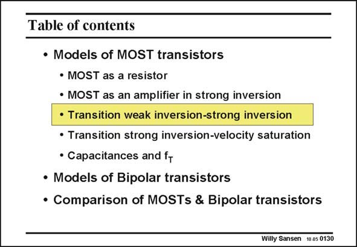

# SANSEN-0130 · Table of contents

章节：01 MOS 晶体管与双极型晶体管的比较  
PDF 页：17；书本页：17；幻灯片编号：0130  
状态：unreviewed



## 对应教材讲解

### PDF 17 · 书本 17

At low currents, the MOST operates in the weak-inversion region. This means that the channel conductivity has become very small. Actually the channel has ceased to exist. The channel has vanished. The drift current, which flowed through the channel in strong inversion, is now replaced by a diffusion current (Ref. Tsividis). As a result the model is very different. It contains an exponential rather than a square-law characteristic. Even more important is to know where exactly the strong-inversion region is substituted by the weak inversion region. Actually this region is quite wide. It is also called the moderateinversion region. For the designer it is essential to know what is the V −V at which this GS T transition occurs and especially what the current level is. This is why considerable attention is paid to this cross-over point.

## 公式／性能结论候选摘录

以下为规则截取的原文，尚未逐项判读。

- PDF 17: As a result the model is very different.

## 曲线结论候选摘录

以下为规则截取的原文，尚未逐项判读。

- PDF 17: It contains an exponential rather than a square-law characteristic.

## 原文条件与近似候选摘录

以下为规则截取的原文，尚未逐项判读。

（未由规则找到；不代表原页没有此类内容。）

## 幻灯片 OCR（未校正）

```text
Table of contents
• Models of MOST transistors
• MOST as a resistor
• MOST as an amplifier in strong inversion
• Transition weak inversion-strong inversion
• Transition strong inversion-velocity saturation
• Capacitances and ft
• Models of Bipolar transistors
• Comparison of MOSTs & Bipolar transistors
Willy Sansen 1005 0130
```

数学上下标、分数及正负号以原图为准。电路图已保留；未核对的连接不输出成可仿真 netlist。
