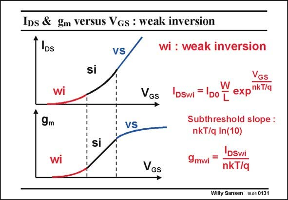

# SANSEN-0131 · IDs & gm versus Vgs : weak inversion

章节：01 MOS 晶体管与双极型晶体管的比较  
PDF 页：17；书本页：17；幻灯片编号：0131  
状态：unreviewed



## 对应教材讲解

### PDF 17 · 书本 17

Now that we know how to describe the current of a MOST in the middle-current region (or strong inversion region), we have to focus on the low-current region (weak inversion) and then at the high-current region (velocity saturation). We are especially interested to figure out where the crossover values of V are GS between these regions. At low currents we have the weak-inversion region, also called the sub-threshold region as most of it occurs below V . It is also called the exponential region as we have an T exponential current-voltage relationship. The scaling factor is nkT/q, which is very close to the one of a bipolar transistor where it is kT/q. The factor is the Boltzmann factor and q the charge of an electron such that kT/q is about 26 mV at room temperature (actually at 300 K or 27°C). The difference is factor n however, the same n as before. We remember that this n depends on biasing voltages and is thus never accurately known. This is a considerable disadvantage of a MOST compared to a bipolar device.

### PDF 18 · 书本 18

In this region, the transconductance is again the derivative of the current with respect to V , GS which is also exponential. Again the only difference with the g of a bipolar transistor is this m factor n. It is now always lower.

## 公式／性能结论候选摘录

以下为规则截取的原文，尚未逐项判读。

- PDF 17: We remember that this n depends on biasing voltages and is thus never accurately known.

## 曲线结论候选摘录

以下为规则截取的原文，尚未逐项判读。

（未由规则找到；不代表原页没有此类内容。）

## 原文条件与近似候选摘录

以下为规则截取的原文，尚未逐项判读。

- PDF 17: Now that we know how to describe the current of a MOST in the middle-current region (or strong inversion region), we have to focus on the low-current region (weak inversion) and then at the high-current region (velocity saturation).

## 幻灯片 OCR（未校正）

```text
IDs & gm versus Vgs : weak inversion
DS
wi
9m
si
VS
VGs
VS
si
wi
VGs
wi : weak inversion
DSwi
W
VGs
DO
expnkT/q
L
Subthreshold slope :
nkT/q In(10)
9mwi
=
DSWi
nkT/q
Willy Sansen 10.05 0131
```

数学上下标、分数及正负号以原图为准。电路图已保留；未核对的连接不输出成可仿真 netlist。
