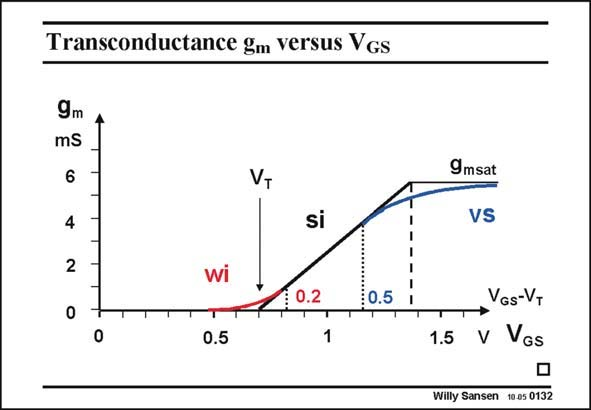

# SANSEN-0132 · Transconductance gm Versus VGs

章节：01 MOS 晶体管与双极型晶体管的比较  
PDF 页：18；书本页：18；幻灯片编号：0132  
状态：unreviewed



## 对应教材讲解

### PDF 18 · 书本 18

What values of V are com- GS monly used? At the higher end, we know that we never want to enter the high-current or velocity-saturation region. We stay away from the transition point to velocity saturation. The approximate value will be calculated further. It is about 0.5 V however, for present day technologies. At the low-current end, we do not want to use the weak-inversion current region either. The absolute values of the currents and of the transconductances become so small that the noise becomes exceedingly large. Moreover, only low speeds can be obtained. There are some applications where low signal-to-noise ratios and low speed are no problem. Examples are biomedical applications and biotelemetry. In most other applications however, we need better noise performance and higher speeds. Therefore, we do want to work close to weak inversion but not in it. Typical values are V −V values between 0.15 and 0.2 V. GS T The reason why, is explained next.

## 公式／性能结论候选摘录

以下为规则截取的原文，尚未逐项判读。

- PDF 18: Therefore, we do want to work close to weak inversion but not in it.

## 曲线结论候选摘录

以下为规则截取的原文，尚未逐项判读。

（未由规则找到；不代表原页没有此类内容。）

## 原文条件与近似候选摘录

以下为规则截取的原文，尚未逐项判读。

- PDF 18: At the higher end, we know that we never want to enter the high-current or velocity-saturation region.
- PDF 18: We stay away from the transition point to velocity saturation.
- PDF 18: The approximate value will be calculated further.

## 幻灯片 OCR（未校正）

```text
Transconductance gm Versus VGs
9m
mS
6
4
2
VT
si
T
0
T
0.5
0.5
1
9msat
VS
VGs-VT
1.5 V VGs
Willy Sansen 10.05 0132
```

数学上下标、分数及正负号以原图为准。电路图已保留；未核对的连接不输出成可仿真 netlist。
