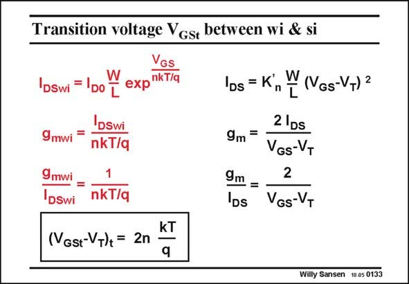

# SANSEN-0133 · Transition voltage Vgst between wi & si

章节：01 MOS 晶体管与双极型晶体管的比较  
PDF 页：18；书本页：18；幻灯片编号：0133  
状态：unreviewed



## 对应教材讲解

### PDF 18 · 书本 18

Let us now explore where the actual crossover or transition point is between the middle- and low-current regions. We will denote this value of V by V . GS GSt The transition between strong and weak inversion is reached by simply equating the expressions of the current and their first derivatives, or transconductances. Indeed, equating their g /I ratios we obtain m DS the transition value of V −V . It is simply GSt T 2nkT/q.

### PDF 19 · 书本 19

Because of n, we cannot obtain an accurate value for this V −V . An approximate value of GSt T 70–80 mV is taken. This means that the transistor model changes from weak inversion to strong inversion at a value of V of about V +70 mV. For a V of 0.6 V, this would be a V of GS T T GS about 0.67 V.

## 公式／性能结论候选摘录

以下为规则截取的原文，尚未逐项判读。

（未由规则找到；不代表原页没有此类内容。）

## 曲线结论候选摘录

以下为规则截取的原文，尚未逐项判读。

（未由规则找到；不代表原页没有此类内容。）

## 原文条件与近似候选摘录

以下为规则截取的原文，尚未逐项判读。

- PDF 19: An approximate value of GSt T 70–80 mV is taken.

## 幻灯片 OCR（未校正）

```text
Transition voltage Vgst between wi & si
VGS
DSwi
IDo I expiklla
IDs = K
n
9mwi
=
Dswi
nkT/q
9 mwi
DSwi
1
nkT/q
(VGst-VT)+ = 2n
kT
9
W
(VGs-VT) 2
9m =
21ps
VGs-VT
2
9m =
lbs VGs-VT
Willy Sansen 10.05 0133
```

数学上下标、分数及正负号以原图为准。电路图已保留；未核对的连接不输出成可仿真 netlist。
