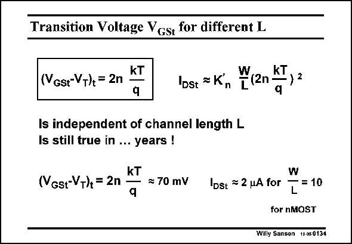

# SANSEN-0134 · Transition Voltage Vest for different L

章节：01 MOS 晶体管与双极型晶体管的比较  
PDF 页：19；书本页：19；幻灯片编号：0134  
状态：unreviewed



## 对应教材讲解

### PDF 19 · 书本 19

Much more important than the absolute value of V is GSt the fact that V does not GSt depend on the channel length. As a result, this transition value 2nkT/q will not change for future CMOS technologies. Consequently, the value of V #0.2 V, GS chosen before, to stay out of weak inversion will remain the same for the years to come. This is a very comforting thought indeed! The current obtained at the transition point is now easily calculated. Substitution of V by V in the current expression in the square-law region, GS GSt provides I . It is the transition current. DSt Obviously it depends on W/L. For a W/L=10, a current is reached in the mA region. Clearly nA’s can only be reached in the weak inversion region.

## 公式／性能结论候选摘录

以下为规则截取的原文，尚未逐项判读。

- PDF 19: Much more important than the absolute value of V is GSt the fact that V does not GSt depend on the channel length.
- PDF 19: As a result, this transition value 2nkT/q will not change for future CMOS technologies.
- PDF 19: DSt Obviously it depends on W/L.

## 曲线结论候选摘录

以下为规则截取的原文，尚未逐项判读。

（未由规则找到；不代表原页没有此类内容。）

## 原文条件与近似候选摘录

以下为规则截取的原文，尚未逐项判读。

（未由规则找到；不代表原页没有此类内容。）

## 幻灯片 OCR（未校正）

```text
Transition Voltage Vest for different L
kT
(Vgst-VT)+ = 2n
Ibst = K
Is independent of channel length L
Is still true in ... years !
kT
(NGst-VT) = 2n
≥ 70 mV
kT
(2n
9
2
Ibst ~ 2 HA for
W
[=10
for nMOST
Willy Sansen 10.080134
```

数学上下标、分数及正负号以原图为准。电路图已保留；未核对的连接不输出成可仿真 netlist。
