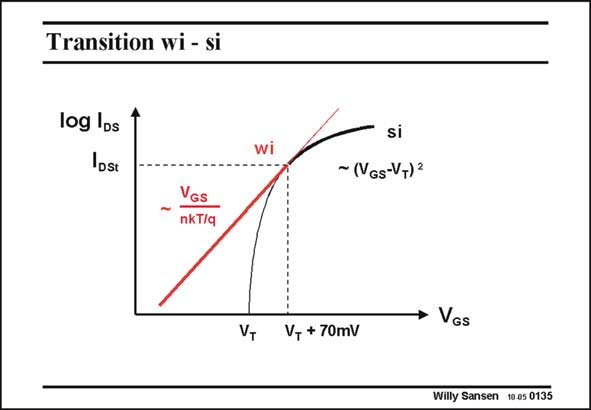

# SANSEN-0135 · Transition wi - si

章节：01 MOS 晶体管与双极型晶体管的比较  
PDF 页：19；书本页：19；幻灯片编号：0135  
状态：unreviewed



## 对应教材讲解

### PDF 19 · 书本 19

How both models are connected is even better illustrated on a logarithmic scale for the current. The exponential relationship in weak inversion (wi) is then a straight line. The square-law characteristic of the strong inversion region (si) on the other hand is very nonlinear. It goes to minus infinity where V =V . GS T Both curves touch at the transition point of V #V +70 mV. At this GSt T point the transistor jumps from the wi curve to the si curve.

### PDF 20 · 书本 20

Even if both curves are not quite touching each other, so that the transistor has to ‘‘jump’’ from one to the other, this is still a fairly accurate representation of the transition region.

## 公式／性能结论候选摘录

以下为规则截取的原文，尚未逐项判读。

（未由规则找到；不代表原页没有此类内容。）

## 曲线结论候选摘录

以下为规则截取的原文，尚未逐项判读。

- PDF 19: The square-law characteristic of the strong inversion region (si) on the other hand is very nonlinear.
- PDF 19: GS T Both curves touch at the transition point of V #V +70 mV.
- PDF 19: At this GSt T point the transistor jumps from the wi curve to the si curve.
- PDF 20: Even if both curves are not quite touching each other, so that the transistor has to ‘‘jump’’ from one to the other, this is still a fairly accurate representation of the transition region.

## 原文条件与近似候选摘录

以下为规则截取的原文，尚未逐项判读。

（未由规则找到；不代表原页没有此类内容。）

## 幻灯片 OCR（未校正）

```text
Transition wi - si
log IDs
IDst
VGs
nkT/q
V,
si
~(VGs-VT) =
→ VGs
V, + 70mV
Willy Sansen 10.05 0135
```

数学上下标、分数及正负号以原图为准。电路图已保留；未核对的连接不输出成可仿真 netlist。
