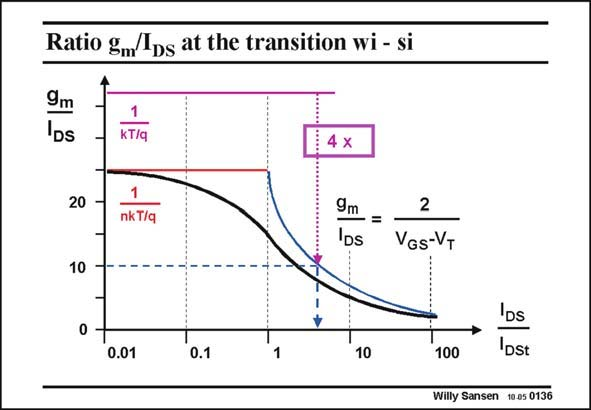

# SANSEN-0136 · Ratio gm/Ips at the transition wi - si

章节：01 MOS 晶体管与双极型晶体管的比较  
PDF 页：20；书本页：20；幻灯片编号：0136  
状态：unreviewed



## 对应教材讲解

### PDF 20 · 书本 20

This transition region is clearly visible when we plot g /I . This ratio is nearly m DS as important as the g itself, m as it explains what the current efficiency is of a MOST. This ratio is plotted versus current, normalized with respect to the transition current I . As a DSt result for unity I /I both DS DSt models provide the same g /I ratio, as expected. m DS At lower currents this ratio is constant and is given by 1/(nkT/q). This value is about 1/40mV or 25 V−1. It is always smaller than for a Bipolar transistor where it is 1/26mV or 38 V−1 or about 40 V−1. At higher currents this g /I ratio decreases as it is inversely proportional to V −V . For m DS GS T example, at V =0.2 V, this ratio is about 10. More accurate descriptions will follow. GS It is already clear however, that a MOST provides much less transconducance than a bipolar transistor at the same current. The ratio is a factor of about four. In other words, for the same transconductance, a bipolar transistor only needs four times less current than the MOST. Portable applications will now consume less current if they are realized by means of bipolar transistors! Finally, note that a real MOST does not follow the two models: it follows a smooth line from one to the other, as explained next.

## 公式／性能结论候选摘录

以下为规则截取的原文，尚未逐项判读。

- PDF 20: At higher currents this g /I ratio decreases as it is inversely proportional to V −V .

## 曲线结论候选摘录

以下为规则截取的原文，尚未逐项判读。

- PDF 20: This transition region is clearly visible when we plot g /I .
- PDF 20: This ratio is plotted versus current, normalized with respect to the transition current I .

## 原文条件与近似候选摘录

以下为规则截取的原文，尚未逐项判读。

（未由规则找到；不代表原页没有此类内容。）

## 幻灯片 OCR（未校正）

```text
Ratio gm/Ips at the transition wi - si
9m
DS
1
kT/q
20
nk T/q
9m =
DS
2
VGS-VT
10
0.01
0.1
1
10
100
IDs
Dst
Willy Sansen 10.05 0136
```

数学上下标、分数及正负号以原图为准。电路图已保留；未核对的连接不输出成可仿真 netlist。
