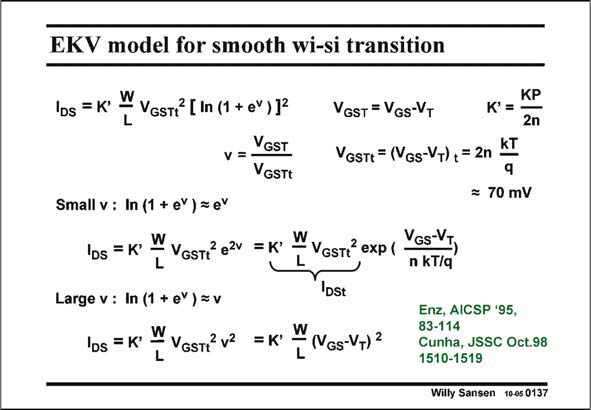

# SANSEN-0137 · EKV model for smooth wi-si transition

章节：01 MOS 晶体管与双极型晶体管的比较  
PDF 页：20；书本页：20；幻灯片编号：0137  
状态：unreviewed



## 对应教材讲解

### PDF 20 · 书本 20

This smooth transition between weak and strong inversion is best described by the EKV model [Enz], explained in this slide. It uses a function which contains the square of a natural log function of an exponential. The variable is v, which is V −V , nor- GS T malized to a quantity V GSTt or simply 2nkT/q. This includes factor n, which depends on some biasing voltages, which is usually between 70 and 80 mV.

### PDF 21 · 书本 21

In weak inversion, or for small v, the log function is approximated by a power series, and limited to its first term. The exponential function emerges, which is typical for the weak inversion region. The subthreshold slope is nkT/q. Also, the current for V =V , or zero V −V is GS T GS T called I . It is called the transition current, as already found before. DSt In strong inversion, or large v, the log function cancels the exponential and v emerges by itself. The square-law expression is found, describing the current-voltage characteristic of a MOST in strong inversion.

## 公式／性能结论候选摘录

以下为规则截取的原文，尚未逐项判读。

- PDF 20: This includes factor n, which depends on some biasing voltages, which is usually between 70 and 80 mV.
- PDF 21: In weak inversion, or for small v, the log function is approximated by a power series, and limited to its first term.

## 曲线结论候选摘录

以下为规则截取的原文，尚未逐项判读。

- PDF 21: The subthreshold slope is nkT/q.
- PDF 21: The square-law expression is found, describing the current-voltage characteristic of a MOST in strong inversion.

## 原文条件与近似候选摘录

以下为规则截取的原文，尚未逐项判读。

- PDF 21: In weak inversion, or for small v, the log function is approximated by a power series, and limited to its first term.

## 幻灯片 OCR（未校正）

```text
EKV model for smooth wi-si transition
IDs = K'
W VGsTr [In (1 + e") 12
v=VGST
VGSTt
VGST = VGs-VT
VGSTE = (VGs-VT),+ = 2n KI
KP
K'=
2n
÷ 70 mV
Small v : In (1 + eY ) = eY
IDs =K' W Vestr ezr
= K'
VGSTt exp (
VGs-VJ,
n kT/q
Large v : In (1 + eY ) = v
DSt
Ios = K: WVGsT7 v2
=K*
Nos-Vn1=
Enz, AICSP '95,
83-114
Cunha, JSSC Oct.98
1510-1519
Willy Sansen 10-05 0137
```

数学上下标、分数及正负号以原图为准。电路图已保留；未核对的连接不输出成可仿真 netlist。
