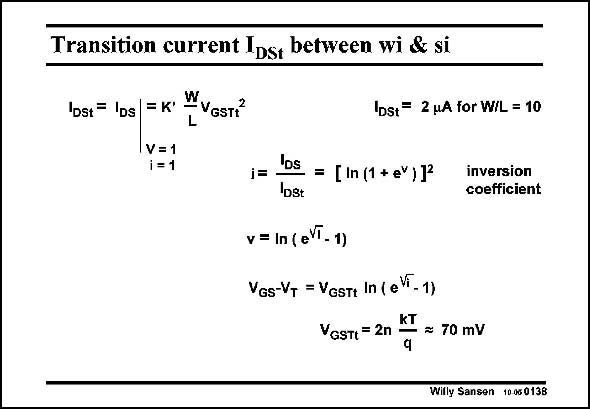

# SANSEN-0138 · Transition current Ips, between wi & si

章节：01 MOS 晶体管与双极型晶体管的比较  
PDF 页：21；书本页：21；幻灯片编号：0138  
状态：unreviewed



## 对应教材讲解

### PDF 21 · 书本 21

This transition current I DSt is the current at which both MOST models coincide, i.e. at which the currents are equal and also the transconductances. This current I DSt can be used to normalize the current I . This ratio DS is denoted by i and is called inversion coefficient. Remember that this current I is about 2 mA for W/L= DSt 10 for a nMOST. It is now about 0.2 mA per unit W/L. At this current i=1 and v= 0.54. For a V of 70 mV GSt the value of V −V is about 38 mV. GS T The normalized voltage v, or the voltage V −V itself can now easily be described in terms GS T of the inversion coefficient i. A plot of this relationship is given next.

## 公式／性能结论候选摘录

以下为规则截取的原文，尚未逐项判读。

- PDF 21: This transition current I DSt is the current at which both MOST models coincide, i.e. at which the currents are equal and also the transconductances.

## 曲线结论候选摘录

以下为规则截取的原文，尚未逐项判读。

- PDF 21: A plot of this relationship is given next.

## 原文条件与近似候选摘录

以下为规则截取的原文，尚未逐项判读。

（未由规则找到；不代表原页没有此类内容。）

## 幻灯片 OCR（未校正）

```text
Transition current Ips, between wi & si
Dst = IDs| =K'
-VGST?
L
IDst= 2 pA for W/L = 10
IV= 1
1=1
i=
Los = [in (1 *eY)1ª
Ibst
inversion
coefficient
v = In (eVT- 1)
VGs-VT = VGsT+ In ( eVi - 1)
KT
VGSTt = 2n
— = 70 mV
Willy Sansen 10.08 0138
```

数学上下标、分数及正负号以原图为准。电路图已保留；未核对的连接不输出成可仿真 netlist。
