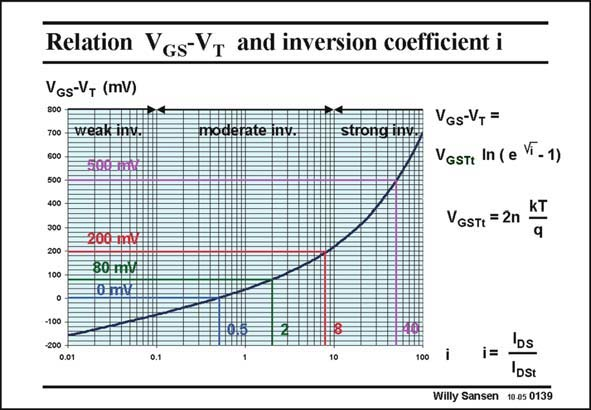

# SANSEN-0139 · Relation Vgs-Vr and inversion coefficient i

章节：01 MOS 晶体管与双极型晶体管的比较  
PDF 页：21；书本页：21；幻灯片编号：0139  
状态：unreviewed



## 对应教材讲解

### PDF 21 · 书本 21

This plot shows the relationship between the voltage drive V −V of a MOST GS T and its normalized current i. The strength about this relationship is that the transistor size is completely hidden by the transition current I . This curve is indepen- DSt dent of transistor sizes. Moreover, it is easy to find out what exactly happens at the weak-inversion transition. For large currents (i >10), the transistor obviously operates in strong

### PDF 22 · 书本 22

inversion. This is true for values of V −V larger than about 0.2 V, corresponding to inversion GS T coefficients larger than 8. This corresponds to currents of 1.6 mA per unit W/L for a nMOST. This current is multiplied by five if a V −V is used of 0.5 V. GS T For very small currents (i<0.1), the transistor is clearly in the weak-inversion region. Its characteristic is a straight line because of the semilog scales. The region between (0.1<i<10) is called the moderate-inversion region. It provides a smooth transition between both regions. An interesting point is at V −V =0 V. This is the point where the input voltage V equals GS T GS the threshold voltage V . At this point the current is half of the transition current I . It is T DSt about 0.1 mA per unit W/L. This is an often used way to measure the threshold voltage V . It is T the voltage V at a current of 0.1 mA per unit W/L. GS Another interesting point is at V −V =80 V. This is the point where the actual crossover GS T occurs from weak to strong inversion. At this point the current is about twice the current I . DSt

## 公式／性能结论候选摘录

以下为规则截取的原文，尚未逐项判读。

- PDF 22: This is the point where the input voltage V equals GS T GS the threshold voltage V .

## 曲线结论候选摘录

以下为规则截取的原文，尚未逐项判读。

- PDF 21: This plot shows the relationship between the voltage drive V −V of a MOST GS T and its normalized current i.
- PDF 21: This curve is indepen- DSt dent of transistor sizes.
- PDF 22: Its characteristic is a straight line because of the semilog scales.

## 原文条件与近似候选摘录

以下为规则截取的原文，尚未逐项判读。

（未由规则找到；不代表原页没有此类内容。）

## 幻灯片 OCR（未校正）

```text
Relation Vgs-Vr and inversion coefficient i
VGs-VT (mV)
700
weak inv.
600
д00E pne
500
moderate inv.
strong inve
VGs-V, =
VGstI In ( e Vi -1)
VGSTt = 2n
KT
q
300
200
100
200 mv
80 mv
10 mt
-100
0.5
8:
0.01
0.1
100
IDs
j=
DSt
Willy Sansen 10.05 0139
```

数学上下标、分数及正负号以原图为准。电路图已保留；未核对的连接不输出成可仿真 netlist。
