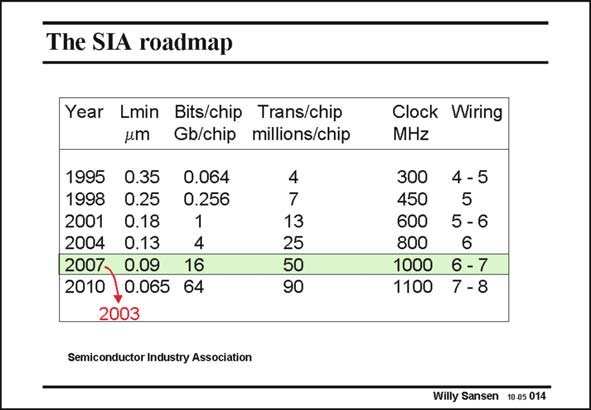

# SANSEN-014 · The SIA roadmap

章节：01 MOS 晶体管与双极型晶体管的比较  
PDF 页：3；书本页：3；幻灯片编号：014  
状态：unreviewed



## 对应教材讲解

### PDF 3 · 书本 3

This ever decreasing channel length has been predicted by the SIA roadmap. It tries to predict what the channel length will be in a few years, by extrapolating the past evolution. It is clear however, that the shrinking of the channel length has been carried out much faster than predicted. For example, the 90 nm technology was originally expected only in 2007, but was already offered in 2003. This technology was expected to allow 50 million transistors to be integrated on one single chip. Present day processors and memories offer double that amount. Moreover, this technology was expected to give rise to clock speeds around 1 GHz. High end PC’s already clock speeds beyond 3 GHz!

## 公式／性能结论候选摘录

以下为规则截取的原文，尚未逐项判读。

（未由规则找到；不代表原页没有此类内容。）

## 曲线结论候选摘录

以下为规则截取的原文，尚未逐项判读。

（未由规则找到；不代表原页没有此类内容。）

## 原文条件与近似候选摘录

以下为规则截取的原文，尚未逐项判读。

（未由规则找到；不代表原页没有此类内容。）

## 幻灯片 OCR（未校正）

```text
The SIA roadmap
Year Lmin Bits/chip Trans/chip
um
Gb/chip
millions/chip
1995
0.35
1998
0.25
0.064
2001
2004
0.18
0.256
0.13
4
2007-
0.09
16
2010 ,0.065 64
4
7
13
25
50
90
2003
Semiconductor Industry Association
Clock Wiring
MHZ
300
450
4-5
5
600
5-6
800
6
1000
6 - 7
1100 7 -8
Wiily Sansen 10.05 014
```

数学上下标、分数及正负号以原图为准。电路图已保留；未核对的连接不输出成可仿真 netlist。
