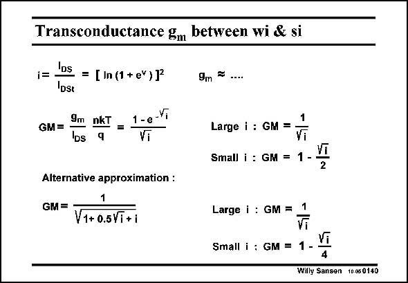

# SANSEN-0140 · Transconductance gm between wi & si

章节：01 MOS 晶体管与双极型晶体管的比较  
PDF 页：22；书本页：22；幻灯片编号：0140  
状态：unreviewed



## 对应教材讲解

### PDF 22 · 书本 22

The transconductance g is m now easily calculated, as it is the derivative of the current. Instead the ratio g /I is taken and normalm DS ized to nkT/q. It is denoted by GM. The approximations for strong inversion (i >10) and weak inversion (i <0.1) are easily obtained. The full expression is plotted in the next slide. Sometimes an alternative function is used to describe the transition region. It is a little closer to measured data. It involves square roots however, instead of exponentials. For strong inversion, it provides the same approximation. However, for weak inversion, it is slightly smaller. Both functions are plotted in the next slide.

## 公式／性能结论候选摘录

以下为规则截取的原文，尚未逐项判读。

（未由规则找到；不代表原页没有此类内容。）

## 曲线结论候选摘录

以下为规则截取的原文，尚未逐项判读。

- PDF 22: The full expression is plotted in the next slide.
- PDF 22: Both functions are plotted in the next slide.

## 原文条件与近似候选摘录

以下为规则截取的原文，尚未逐项判读。

- PDF 22: The approximations for strong inversion (i >10) and weak inversion (i <0.1) are easily obtained.
- PDF 22: For strong inversion, it provides the same approximation.

## 幻灯片 OCR（未校正）

```text
Transconductance gm between wi & si
1=
= [ In (1 + eY)]
9m =
GM =
DSt
9m nkT
=
DS
1-e-Vi
Large i : GM
=
Small i : GM =
1
Vi
2
Alternative approximation :
GM =
1
V1+ 0.5Vi+i
Large i : GM = 1
Small i : GM =
1 --
Vi
4
Willy Sansen 10.080140
```

数学上下标、分数及正负号以原图为准。电路图已保留；未核对的连接不输出成可仿真 netlist。
