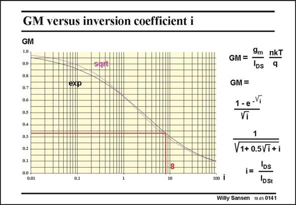

# SANSEN-0141 · GM versus inversion coefficient i

章节：01 MOS 晶体管与双极型晶体管的比较  
PDF 页：23；书本页：23；幻灯片编号：0141  
状态：unreviewed



## 对应教材讲解

### PDF 22 · 书本 22

Both models for the normalized transconductance to current ratio are plotted versus the inversion coefficient in this slide. Both go through the same point at i=1. The difference is small. This is why the expression with the exponential will be used further. Note that, at an inversion coefficient of 8, where the V −V is 0.2 V, the normalized GM is GS T about 1/3 of the maximum value in weak inversion. The corresponding g /I is about 4.2 V−1. m DS This is nearly ten times less than for a bipolar transistor. In order to boost this ratio, we must choose a smaller V −V . For a value of 0.15 V, the ratio g /I is already 5.4 V−1 and for GS T m DS 0.1 V close to 7 V−1.

### PDF 23 · 书本 23

Note that around a V −V of 0.2 V the g /I GS T m DS is 4.2 V−1, which is less than half of what is predicted by the expression of g /I = m DS 2/(V −V ) in strong inver- GS T sion, which gives 10 V−1. Values around 0.2 V are a good compromise between high transconductance and high current. They will be used in many design examples later on.

## 公式／性能结论候选摘录

以下为规则截取的原文，尚未逐项判读。

（未由规则找到；不代表原页没有此类内容。）

## 曲线结论候选摘录

以下为规则截取的原文，尚未逐项判读。

- PDF 22: Both models for the normalized transconductance to current ratio are plotted versus the inversion coefficient in this slide.

## 原文条件与近似候选摘录

以下为规则截取的原文，尚未逐项判读。

（未由规则找到；不代表原页没有此类内容。）

## 幻灯片 OCR（未校正）

```text
GM versus inversion coefficient i
GM
10
0.9
san
GM=
9m nkT
DS
q
0.7
exp
GM =
1 -e-V
Vi
0.5
0.4
0.3
0.2
0.01
0.1
100l
V1+ 0.5Vi+i
IDs
i=
IDst
Willy Sansen 10.05 0141
```

数学上下标、分数及正负号以原图为准。电路图已保留；未核对的连接不输出成可仿真 netlist。
