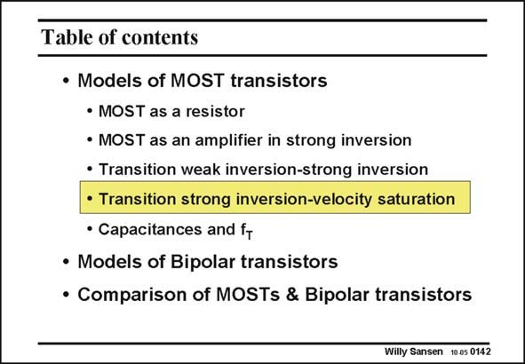

# SANSEN-0142 · Table of contents

章节：01 MOS 晶体管与双极型晶体管的比较  
PDF 页：23；书本页：23；幻灯片编号：0142  
状态：unreviewed



## 对应教材讲解

### PDF 23 · 书本 23

At high currents however, the MOST transistor changes region again. This time velocity saturation emerges. Most electrons now move through the channel at maximum speed. The result is that the current increases linearly with the voltage drive and the transconductance levels off. Again, a different model is required. We are especially interested in finding out where the transition point is between strong inversion and velocity saturation. This is explained next.

## 公式／性能结论候选摘录

以下为规则截取的原文，尚未逐项判读。

- PDF 23: The result is that the current increases linearly with the voltage drive and the transconductance levels off.

## 曲线结论候选摘录

以下为规则截取的原文，尚未逐项判读。

（未由规则找到；不代表原页没有此类内容。）

## 原文条件与近似候选摘录

以下为规则截取的原文，尚未逐项判读。

- PDF 23: This time velocity saturation emerges.
- PDF 23: We are especially interested in finding out where the transition point is between strong inversion and velocity saturation.

## 幻灯片 OCR（未校正）

```text
Table of contents
• Models of MOST transistors
• MOST as a resistor
• MOST as an amplifier in strong inversion
• Transition weak inversion-strong inversion
• Transition strong inversion-velocity saturation
• Capacitances and fr
• Models of Bipolar transistors
• Comparison of MOSTs & Bipolar transistors
Willy Sansen 10.05 0142
```

数学上下标、分数及正负号以原图为准。电路图已保留；未核对的连接不输出成可仿真 netlist。
