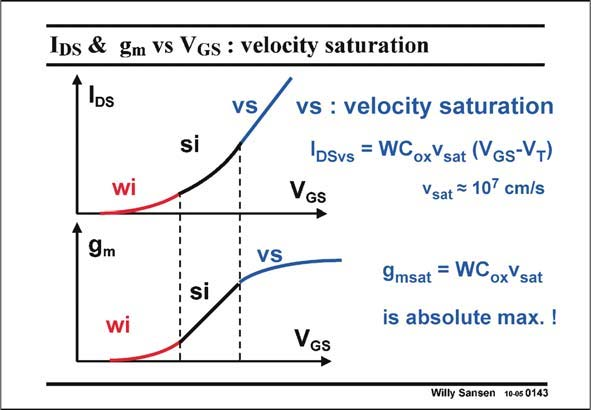

# SANSEN-0143 · IDs & gm vs Vgs : velocity saturation

章节：01 MOS 晶体管与双极型晶体管的比较  
PDF 页：24；书本页：24；幻灯片编号：0143  
状态：unreviewed



## 对应教材讲解

### PDF 23 · 书本 23

At the higher current end, several phenomena cause the current to become more linear versus V . One of the most important ones is velocity saturation. This means that because of the high GS electric fields in the channel, all electrons move at maximum speed v . This speed is a result of sat a collision process of the electrons in the channel. Its average value is about 107 cm/s. The resulting expression of the current shows a linear dependence now of the current versus V . The transconductance g , which is again the derivative, becomes very simple now. It does GS m not include the channel length any more! It is the highest transconductance that this MOST can

### PDF 24 · 书本 24

ever achieve. Its g /W msat ratio only depends on technology (C ) and physics ox (v ). sat Note however, that this g does not depend any msat more on V either. It has GS become a constant. This is why this region is never used by analog designers. The transconductance does not increase any more but the current consumption does!! This is why the highest values of V used are the GS ones in the middle current region, close to the velocity saturation region.

## 公式／性能结论候选摘录

以下为规则截取的原文，尚未逐项判读。

- PDF 23: The resulting expression of the current shows a linear dependence now of the current versus V .
- PDF 24: Its g /W msat ratio only depends on technology (C ) and physics ox (v ). sat Note however, that this g does not depend any msat more on V either.
- PDF 24: The transconductance does not increase any more but the current consumption does!!

## 曲线结论候选摘录

以下为规则截取的原文，尚未逐项判读。

（未由规则找到；不代表原页没有此类内容。）

## 原文条件与近似候选摘录

以下为规则截取的原文，尚未逐项判读。

- PDF 23: One of the most important ones is velocity saturation.
- PDF 24: This is why the highest values of V used are the GS ones in the middle current region, close to the velocity saturation region.

## 幻灯片 OCR（未校正）

```text
IDs & gm vs Vgs : velocity saturation
IDs
si
VS
vs : velocity saturation
IDSvs = WCoxYsat (Vgs-VT)
VGs
Vsat ™ 10' cm/s
9m
VS
si
9msat = WCoxVsat
is absolute max. !
VGs
Willy Sansen 10-05 0143
```

数学上下标、分数及正负号以原图为准。电路图已保留；未核对的连接不输出成可仿真 netlist。
