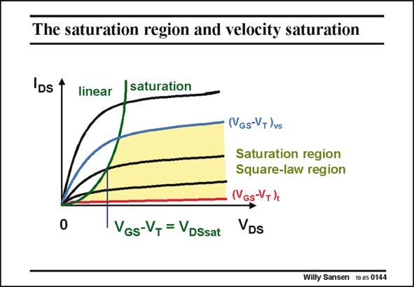

# SANSEN-0144 · The saturation region and velocity saturation

章节：01 MOS 晶体管与双极型晶体管的比较  
PDF 页：24；书本页：24；幻灯片编号：0144  
状态：unreviewed



## 对应教材讲解

### PDF 24 · 书本 24

At this point, it is important to distinguish saturation from saturation velocity. A MOST is in saturation when its V is sufficiently DS large or when V is larger DS than V , which equals DSsat V −V . Any operating GS T point to the right of the parabola, separating the saturation region from the linear region is in the saturation region of that transistor. In that region the lower currents correspond to the weak inversion region. The highest currents on the other hand correspond to the velocity saturation region. These transistors operate in saturation and are in the velocity saturation region. The middle current region, which is shaded, corresponds to the region, which is characterized by the square-law model. These transistors operate in saturation and are in the square-law region.

## 公式／性能结论候选摘录

以下为规则截取的原文，尚未逐项判读。

- PDF 24: A MOST is in saturation when its V is sufficiently DS large or when V is larger DS than V , which equals DSsat V −V .

## 曲线结论候选摘录

以下为规则截取的原文，尚未逐项判读。

（未由规则找到；不代表原页没有此类内容。）

## 原文条件与近似候选摘录

以下为规则截取的原文，尚未逐项判读。

- PDF 24: At this point, it is important to distinguish saturation from saturation velocity.
- PDF 24: A MOST is in saturation when its V is sufficiently DS large or when V is larger DS than V , which equals DSsat V −V .
- PDF 24: Any operating GS T point to the right of the parabola, separating the saturation region from the linear region is in the saturation region of that transistor.
- PDF 24: The highest currents on the other hand correspond to the velocity saturation region.
- PDF 24: These transistors operate in saturation and are in the velocity saturation region.
- PDF 24: These transistors operate in saturation and are in the square-law region.

## 幻灯片 OCR（未校正）

```text
The saturation region and velocity saturation
IDs 1
linear
saturation
0
GS-T =DSsat
Gs-VT /vs
Saturation region
Square-law region
(VGs-V+)
VDS
Willy Sansen 10.05 0144
```

数学上下标、分数及正负号以原图为准。电路图已保留；未核对的连接不输出成可仿真 netlist。
