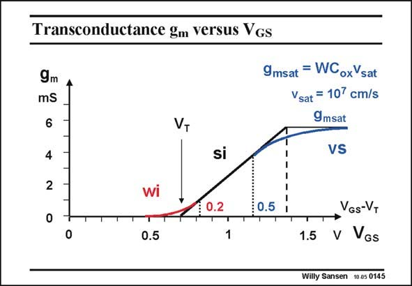

# SANSEN-0145 · Transconductance gm versus VGs

章节：01 MOS 晶体管与双极型晶体管的比较  
PDF 页：25；书本页：25；幻灯片编号：0145  
状态：unreviewed



## 对应教材讲解

### PDF 25 · 书本 25

Remember that we never want to enter the high-current or velocity-saturation region. As a designer we want to stay away from the transition point to velocity saturation. We want to calculate now the value of this transition point. It will come out to be about 0.5 V for present day technologies. Typical values for V −V are now between GS T 0.15–0.2 V at the low end and about 0.5 V at the high end. The reason is explained next.

## 公式／性能结论候选摘录

以下为规则截取的原文，尚未逐项判读。

（未由规则找到；不代表原页没有此类内容。）

## 曲线结论候选摘录

以下为规则截取的原文，尚未逐项判读。

（未由规则找到；不代表原页没有此类内容。）

## 原文条件与近似候选摘录

以下为规则截取的原文，尚未逐项判读。

- PDF 25: Remember that we never want to enter the high-current or velocity-saturation region.
- PDF 25: As a designer we want to stay away from the transition point to velocity saturation.

## 幻灯片 OCR（未校正）

```text
Transconductance gm versus VGs
9m
mS
6
4
2
VT
si
9msat = WCoxVsat
Vsat = 107 cm/s
9msat
VS
F 0.2
0.5
0
0.5
VGs-VT
1.5
• v VGs
Willy Sansen 10.05 0145
```

数学上下标、分数及正负号以原图为准。电路图已保留；未核对的连接不输出成可仿真 netlist。
