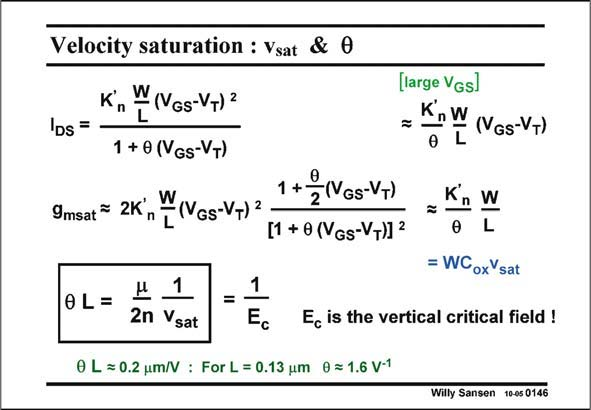

# SANSEN-0146 · Velocity saturation : Vsat & 0 (large VGs]

章节：01 MOS 晶体管与双极型晶体管的比较  
PDF 页：25；书本页：25；幻灯片编号：0146  
状态：unreviewed



## 对应教材讲解

### PDF 25 · 书本 25

The linearization of the current and the reduction of the transconductance because of velocity saturation can also be described by parameter h (Greek theta). It introduces a term in the denominator of the current expression in strong inversion, as shown in this slide. Indeed for high V −V , GS T the 1 drops out and the expression of the current becomes linear in V , as GS shown at the right. This parameter h has the advantage that it lumps all physical phenomena which cause linearization of the current. One of these phenomena is the effect of the vertical electric field E across the oxide. It is used mainly c by designers, not by technologists. The transconductance g in velocity saturation, can be obtained by taking the derivative of msat the current again. For large V −V , a simple expression is found for g . This must obviously GS T msat equal the original expression of g with v in it. msat sat Equation of both expressions of g shows that this parameter h depends on the channel msat length. The smaller L, the larger h. It depends here on technology. It becomes quite large for nanometer CMOS.

## 公式／性能结论候选摘录

以下为规则截取的原文，尚未逐项判读。

- PDF 25: This must obviously GS T msat equal the original expression of g with v in it. msat sat Equation of both expressions of g shows that this parameter h depends on the channel msat length.
- PDF 25: It depends here on technology.

## 曲线结论候选摘录

以下为规则截取的原文，尚未逐项判读。

（未由规则找到；不代表原页没有此类内容。）

## 原文条件与近似候选摘录

以下为规则截取的原文，尚未逐项判读。

- PDF 25: The linearization of the current and the reduction of the transconductance because of velocity saturation can also be described by parameter h (Greek theta).
- PDF 25: The transconductance g in velocity saturation, can be obtained by taking the derivative of msat the current again.

## 幻灯片 OCR（未校正）

```text
Velocity saturation : Vsat & 0
Kn
W(VGs-VT)2
IDs =
1 + 0 (VGs-VT)
W
1+ 2(VGs-VT)
9msat™
2K,
(VGs-V+) 2
[1 + 0 (VGs-VT)] 2
0L=
1
2n Vsat
0 L ≥ 0.2 um/V : For L = 0.13 um 0 = 1.6 V-1
(large VGs]
= KnW (Ves-V+)
0 L
Kn W
L
= WCoxVsat
Ec is the vertical critical field !
Willy Sansen 10-05 0146
```

数学上下标、分数及正负号以原图为准。电路图已保留；未核对的连接不输出成可仿真 netlist。
