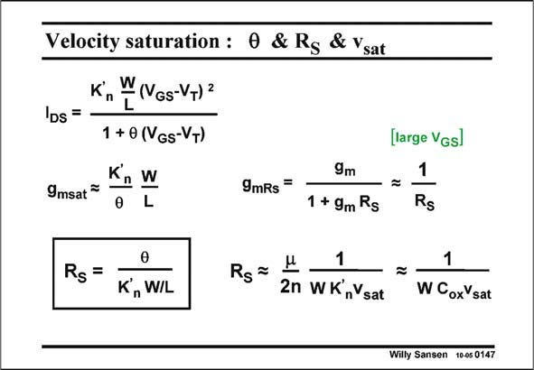

# SANSEN-0147 · Velocity saturation : 0 & Rg & Ysat

章节：01 MOS 晶体管与双极型晶体管的比较  
PDF 页：26；书本页：26；幻灯片编号：0147  
状态：unreviewed



## 对应教材讲解

### PDF 26 · 书本 26

There is a third way to model the linearization of the current and the reduction of the transconductance, because of velocity saturation, by simply inserting a small resistor R is S series with the Source. Indeed this reduces the transconductance g by a m factor 1+g R . m S For large values of V −V , or for large values GS T of g , the resulting g m mRS becomes simply 1/R . S Equation of this g to the m one with h yield the relationship between h and R . It is clear that the required value of R S S depends on the dimensions of the MOST and on K∞. It is also obviously easy to find the relationship between v and R . Elimination of parameter sat S h between the two bottom expressions yields an expression in which only the transistor width W occurs, together with several technological parameters. It is a well known expression indeed.

## 公式／性能结论候选摘录

以下为规则截取的原文，尚未逐项判读。

- PDF 26: It is clear that the required value of R S S depends on the dimensions of the MOST and on K∞.

## 曲线结论候选摘录

以下为规则截取的原文，尚未逐项判读。

（未由规则找到；不代表原页没有此类内容。）

## 原文条件与近似候选摘录

以下为规则截取的原文，尚未逐项判读。

- PDF 26: There is a third way to model the linearization of the current and the reduction of the transconductance, because of velocity saturation, by simply inserting a small resistor R is S series with the Source.

## 幻灯片 OCR（未校正）

```text
Velocity saturation : 0 & Rg & Ysat
Kn
W(VGs-VT)2
IDs =
1 + 0 (VGs-VT)
K, W
9msat ™
L
9mRs*
Rg =
K, WIL
Rs=
9m
1 + 9m Rs
1
2n WK,Ysat
[large Vgsl
1
Rs
1
W CoxVsat
Wiily Sansen 10-05 0147
```

数学上下标、分数及正负号以原图为准。电路图已保留；未核对的连接不输出成可仿真 netlist。
