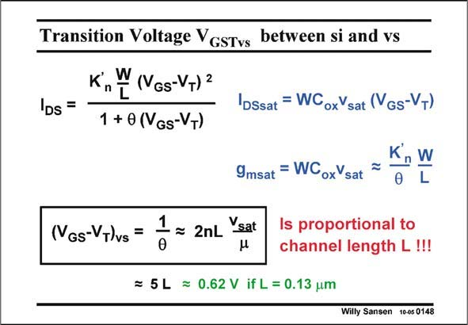

# SANSEN-0148 · Transition Voltage VGsTvs between si and vs

章节：01 MOS 晶体管与双极型晶体管的比较  
PDF 页：26；书本页：26；幻灯片编号：0148  
状态：unreviewed



## 对应教材讲解

### PDF 26 · 书本 26

In order to find the transition voltage drive (V −V ) V , we have GS T GSTvs to equate the expression of the transconductance g msat in velocity saturation to the one in strong inversion. The resulting value V is GSTvs simply 1/h which is also 2nLv /m, as shown on the sat previous slide. For typical values, this V is just about 5L Volt GSTvs with L in micrometer. It is clear that this transition voltage V is not con- GSTvs stant, it decreases with decreasing channel length. For a 0.13 mm CMOS technology, it is only about 0.62 V. It is only a matter of time and it will also be 0.2 V! Parameter h or the inverse of this transition voltage 1/V can also be called the velocity GSTvs saturation coefficient, although it includes several other phenomena associated with the high electric fields.

## 公式／性能结论候选摘录

以下为规则截取的原文，尚未逐项判读。

- PDF 26: It is clear that this transition voltage V is not con- GSTvs stant, it decreases with decreasing channel length.

## 曲线结论候选摘录

以下为规则截取的原文，尚未逐项判读。

（未由规则找到；不代表原页没有此类内容。）

## 原文条件与近似候选摘录

以下为规则截取的原文，尚未逐项判读。

- PDF 26: In order to find the transition voltage drive (V −V ) V , we have GS T GSTvs to equate the expression of the transconductance g msat in velocity saturation to the one in strong inversion.
- PDF 26: Parameter h or the inverse of this transition voltage 1/V can also be called the velocity GSTvs saturation coefficient, although it includes several other phenomena associated with the high electric fields.

## 幻灯片 OCR（未校正）

```text
Transition Voltage VGsTvs between si and vs
K,W (NGs-V+) 2
DS =
DSsat = WCoxVsat (Gs-VT)
1 + 0 (VGs-V+)
(GS-VT)vs =
9msat = WCoxVsat =
L
1
= 2nL
Vsat
0
Is proportional to
channel length L !!!
= 5L = 0.62 V if L = 0.13 um
Willy Sansen 10-05 0148
```

数学上下标、分数及正负号以原图为准。电路图已保留；未核对的连接不输出成可仿真 netlist。
