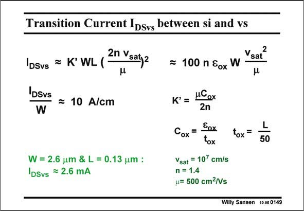

# SANSEN-0149 · Transition Current IDsvs between si and vs

章节：01 MOS 晶体管与双极型晶体管的比较  
PDF 页：27；书本页：27；幻灯片编号：0149  
状态：unreviewed



## 对应教材讲解

### PDF 27 · 书本 27

The transition current I DSvs is easily obtained by means of the transition voltage V . It seems to contain GSTvs both W and L, in addition to some technological parameters. Remember, however, that K∞ contains C , which ox depends on the oxide thickness t , which is actually ox about L/50. The expression of I can be simplified DSvs even further, provided the minimum channel length L is used. This clearly evidences the influence of the technology, but also contains transistor width W. Substitution of the technological parameters for a nMOST (n#1.4, m=500 cm2/Vs) yields a very simple expression for the transition current density I /W. Obviously, its value also DSvs depends on the dimensions used, but now through W the minimum value of which is actually linked to L.

## 公式／性能结论候选摘录

以下为规则截取的原文，尚未逐项判读。

- PDF 27: Remember, however, that K∞ contains C , which ox depends on the oxide thickness t , which is actually ox about L/50.
- PDF 27: Obviously, its value also DSvs depends on the dimensions used, but now through W the minimum value of which is actually linked to L.

## 曲线结论候选摘录

以下为规则截取的原文，尚未逐项判读。

（未由规则找到；不代表原页没有此类内容。）

## 原文条件与近似候选摘录

以下为规则截取的原文，尚未逐项判读。

- PDF 27: The expression of I can be simplified DSvs even further, provided the minimum channel length L is used.

## 幻灯片 OCR（未校正）

```text
Transition Current IDsvs between si and vs
= K'WL(
2n Vsaty2
DSvs
IDSvs
W
= 10 A/cm
W = 2.6 um & L = 0.13 um :
DSvs = 2.6 mA
Vsaỉ
= 100 n &ox W -
K' = MCex
2n
Cox =
Eox
tox
Vsat = 107 cm/s
n = 1.4
= 500 cm2/Vs
tox=
L
50
Wiily Sansen 10-05 0149
```

数学上下标、分数及正负号以原图为准。电路图已保留；未核对的连接不输出成可仿真 netlist。
