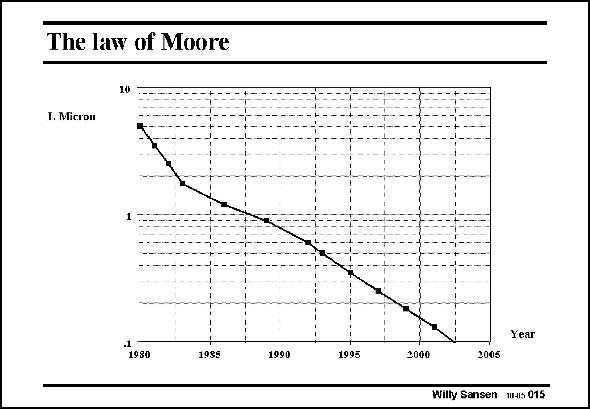

# SANSEN-015 · The law of Moore

章节：01 MOS 晶体管与双极型晶体管的比较  
PDF 页：3；书本页：3；幻灯片编号：015  
状态：unreviewed



## 对应教材讲解

### PDF 3 · 书本 3

This ever decreasing channel length has also been predicted by the curve of Moore. This is simply a sketch of channel length versus time. It is a graphic representation of the numbers of the SIA road map. Indeed 90 nm is reached in 2003! The slope of that curve has not always been the same. Indeed, the slope was higher in the early eighties, but has declined a bit as a result of economic recessions. Also, the cost of the production equipment and the mask making grows exponentially, delaying the introduction of ever newer technologies somewhat.

## 公式／性能结论候选摘录

以下为规则截取的原文，尚未逐项判读。

- PDF 3: Indeed, the slope was higher in the early eighties, but has declined a bit as a result of economic recessions.

## 曲线结论候选摘录

以下为规则截取的原文，尚未逐项判读。

- PDF 3: This ever decreasing channel length has also been predicted by the curve of Moore.
- PDF 3: The slope of that curve has not always been the same.
- PDF 3: Indeed, the slope was higher in the early eighties, but has declined a bit as a result of economic recessions.

## 原文条件与近似候选摘录

以下为规则截取的原文，尚未逐项判读。

（未由规则找到；不代表原页没有此类内容。）

## 幻灯片 OCR（未校正）

```text
The law of Moore
10
T. Micron
Year
1980
1995
1990
1995
2000
2005
Willy Sansen W-s 015
```

数学上下标、分数及正负号以原图为准。电路图已保留；未核对的连接不输出成可仿真 netlist。
